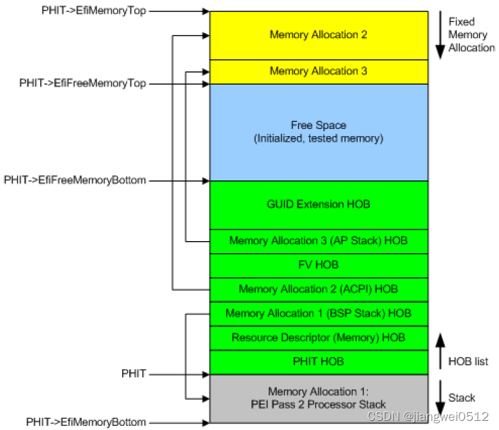
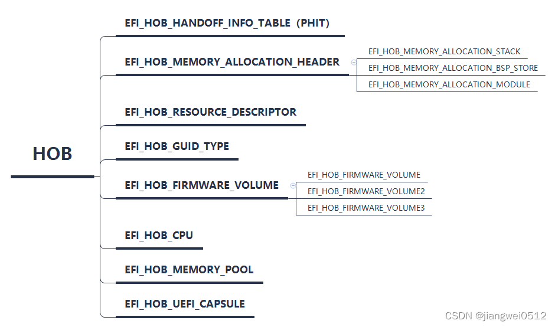

### Note

This `README.md` documents the process of creating a `Virtual Hackintosh`
system.

Note: All blobs and resources included in this repository are re-derivable (all
instructions are included!).

:green_heart: Looking for **commercial** support with this stuff? I am [available
over email](mailto:dhiru.kholia@gmail.com?subject=[GitHub]%20OSX-KVM%20Commercial%20Support%20Request&body=Hi%20-%20We%20are%20interested%20in%20purchasing%20commercial%20support%20options%20for%20your%20project.) for a chat for **commercial support options only**. Note: Project sponsors get access to the `Private OSX-KVM` repository, and direct support.

Struggling with `Content Caching` stuff? We can help.

Working with `Proxmox` and macOS? See [Nick's blog for sure](https://www.nicksherlock.com/).

Yes, we support offline macOS installations now - see [this document](./run_offline.md) 🎉


### Contributing Back

This project can always use your help, time and attention. I am looking for
help (pull-requests!) with the following work items:

* Documentation around running macOS on popular cloud providers (Hetzner, GCP,
  AWS). See the `Is This Legal?` section and associated references.

* Document (share) how you use this project to build + test open-source
  projects / get your stuff done.

* Document how to use this project for XNU kernel debugging and development.

* Document the process to launch a bunch of headless macOS VMs (build farm).

* Document usage of [munki](https://github.com/munki/munki) to deploy software
  to such a `build farm`.

* Enable VNC + SSH support out of the box or more easily.

* Robustness improvements are always welcome!

* (Not so) crazy idea - automate the macOS installation via OpenCV.


### Requirements

* A modern Linux distribution. E.g. Ubuntu 22.04 LTS 64-bit or later.

* QEMU >= 6.2.0

* A CPU with Intel VT-x / AMD SVM support is required (`grep -e vmx -e svm /proc/cpuinfo`)

* A CPU with SSE4.1 support is required for >= macOS Sierra

* A CPU with AVX2 support is required for >= macOS Mojave

Note: Older AMD CPU(s) are known to be problematic but modern AMD Ryzen
processors work just fine.


### Installation Preparation

* Install QEMU and other packages.

  ```
  sudo apt-get install qemu uml-utilities virt-manager git \
      wget libguestfs-tools p7zip-full make dmg2img tesseract-ocr \
      tesseract-ocr-eng genisoimage -y
  ```

  This step may need to be adapted for your Linux distribution.

* Clone this repository on your QEMU system. Files from this repository are
  used in the following steps.

  ```
  cd ~

  git clone --depth 1 --recursive https://github.com/kholia/OSX-KVM.git

  cd OSX-KVM
  ```

  Repository updates can be pulled via the following command:

  ```
  git pull --rebase
  ```

  This repository uses rebase based workflows heavily.

* KVM may need the following tweak on the host machine to work.

  ```
  sudo modprobe kvm; echo 1 | sudo tee /sys/module/kvm/parameters/ignore_msrs
  ```

  To make this change permanent, you may use the following command.

  ```
  sudo cp kvm.conf /etc/modprobe.d/kvm.conf  # for intel boxes only

  sudo cp kvm_amd.conf /etc/modprobe.d/kvm.conf  # for amd boxes only
  ```

* Add user to the `kvm` and `libvirt` groups (might be needed).

  ```
  sudo usermod -aG kvm $(whoami)
  sudo usermod -aG libvirt $(whoami)
  sudo usermod -aG input $(whoami)
  ```

  Note: Re-login after executing this command.

* Fetch macOS installer.

  ```
  ./fetch-macOS-v2.py
  ```

  You can choose your desired macOS version here. After executing this step,
  you should have the `BaseSystem.dmg` file in the current folder.

  ATTENTION: Let `>= Big Sur` setup sit at the `Country Selection` screen, and
  other similar places for a while if things are being slow. The initial macOS
  setup wizard will eventually succeed.

  Sample run:

  ```
  $ ./fetch-macOS-v2.py
  1. High Sierra (10.13)
  2. Mojave (10.14)
  3. Catalina (10.15)
  4. Big Sur (11.7)
  5. Monterey (12.6)
  6. Ventura (13) - RECOMMENDED
  7. Sonoma (14)

  Choose a product to download (1-6): 6
  ```

  Note: Modern NVIDIA GPUs are supported on HighSierra but not on later
  versions of macOS.

* Convert the downloaded `BaseSystem.dmg` file into the `BaseSystem.img` file.

  ```
  dmg2img -i BaseSystem.dmg BaseSystem.img
  ```

* Create a virtual HDD image where macOS will be installed. If you change the
  name of the disk image from `mac_hdd_ng.img` to something else, the boot scripts
  will need to be updated to point to the new image name.

  ```
  qemu-img create -f qcow2 mac_hdd_ng.img 256G
  ```

  NOTE: Create this HDD image file on a fast SSD/NVMe disk for best results.

* Now you are ready to install macOS 🚀


### Installation

- CLI method (primary). Just run the `OpenCore-Boot.sh` script to start the
  installation process.

  ```
  ./OpenCore-Boot.sh
  ```

  Note: This same script works for all recent macOS versions.

- Use the `Disk Utility` tool within the macOS installer to partition, and
  format the virtual disk attached to the macOS VM.

- Go ahead, and install macOS 🙌

- TIP: Using a non-APFS filesystem is recommended.

- (OPTIONAL) Use this macOS VM disk with libvirt (virt-manager / virsh stuff).

  - Edit `macOS-libvirt-Catalina.xml` file and change the various file paths (search
    for `CHANGEME` strings in that file). The following command should do the
    trick usually.

    ```
    sed "s/CHANGEME/$USER/g" macOS-libvirt-Catalina.xml > macOS.xml

    virt-xml-validate macOS.xml
    ```

  - Create a VM by running the following command.

    ```bash
    virsh --connect qemu:///system define macOS.xml
    ```

  - If needed, grant necessary permissions to libvirt-qemu user,

    ```
    sudo setfacl -m u:libvirt-qemu:rx /home/$USER
    sudo setfacl -R -m u:libvirt-qemu:rx /home/$USER/OSX-KVM
    ```

  - Launch `virt-manager` and start the `macOS` virtual machine.


### Headless macOS

- Use the provided [boot-macOS-headless.sh](./boot-macOS-headless.sh) script.

  ```
  ./boot-macOS-headless.sh
  ```


### Setting Expectations Right

Nice job on setting up a `Virtual Hackintosh` system! Such a system can be used
for a variety of purposes (e.g. software builds, testing, reversing work), and
it may be all you need, along with some tweaks documented in this repository.

However, such a system lacks graphical acceleration, a reliable sound sub-system,
USB 3 functionality and other similar things. To enable these things, take a
look at our [notes](notes.md). We would like to resume our testing and
documentation work around this area. Please [reach out to us](mailto:dhiru.kholia@gmail.com?subject=[GitHub]%20OSX-KVM%20Funding%20Support)
if you are able to fund this area of work.

It is possible to have 'beyond-native-apple-hw' performance but it does require
work, patience, and a bit of luck (perhaps?).


### Post-Installation

* See [networking notes](networking-qemu-kvm-howto.txt) on how to setup networking in your VM, outbound and also inbound for remote access to your VM via SSH, VNC, etc.

* To passthrough GPUs and other devices, see [these notes](notes.md#gpu-passthrough-notes).

* Need a different resolution? Check out the [notes](notes.md#change-resolution-in-opencore) included in this repository.

* Trouble with iMessage? Check out the [notes](notes.md#trouble-with-imessage) included in this repository.

* Highly recommended macOS tweaks - https://github.com/sickcodes/osx-optimizer


### Is This Legal?

The "secret" Apple OSK string is widely available on the Internet. It is also included in a public court document [available here](http://www.rcfp.org/sites/default/files/docs/20120105_202426_apple_sealing.pdf). I am not a lawyer but it seems that Apple's attempt(s) to get the OSK string treated as a trade secret did not work out. Due to these reasons, the OSK string is freely included in this repository.

Please review the ['Legality of Hackintoshing' documentation bits from Dortania's OpenCore Install Guide](https://dortania.github.io/OpenCore-Install-Guide/why-oc.html#legality-of-hackintoshing).

Gabriel Somlo also has [some thoughts](http://www.contrib.andrew.cmu.edu/~somlo/OSXKVM/) on the legal aspects involved in running macOS under QEMU/KVM.

You may also find [this 'Announcing Amazon EC2 Mac instances for macOS' article](https://aws.amazon.com/about-aws/whats-new/2020/11/announcing-amazon-ec2-mac-instances-for-macos/
) interesting.

Note: It is your responsibility to understand, and accept (or not accept) the
Apple EULA.

Note: This is not legal advice, so please make the proper assessments yourself
and discuss with your lawyers if you have any concerns (Text credit: Dortania)


### Motivation

My aim is to enable macOS based educational tasks, builds + testing, kernel
debugging, reversing, and macOS security research in an easy, reproducible
manner without getting 'invested' in Apple's closed ecosystem (too heavily).

These `Virtual Hackintosh` systems are not intended to replace the genuine
physical macOS systems.

Personally speaking, this repository has been a way for me to 'exit' the Apple
ecosystem. It has helped me to test and compare the interoperability of `Canon
CanoScan LiDE 120` scanner, and `Brother HL-2250DN` laser printer. And these
devices now work decently enough on modern versions of Ubuntu (Yay for free
software). Also, a long time back, I had to completely wipe my (then) brand new
`MacBook Pro (Retina, 15-inch, Late 2013)` and install Xubuntu on it - as the
`OS X` kernel kept crashing on it!

Backstory: I was a (poor) student in Canada in a previous life and Apple made [my work on cracking Apple Keychains](https://github.com/openwall/john/blob/bleeding-jumbo/src/keychain_fmt_plug.c) a lot harder than it needed to be. This is how I got interested in Hackintosh systems.


# 自定义开发

## 1.生成自己的固件文件夹 BaseSystem


1.使用 fetch-macOS-v2.py -v 下载 dmg
fetch-macOS-v2.py -v


2.将 /Volumes/macOS Base System 内容复制到 BaseSystem 文件夹


hdiutil attach BaseSystem.dmg

cd /Volumes/

sudo cp -aRLH macOS\ Base\ System /Users/lee/Desktop/Computer_Systems/Macos/OSX-KVM

cd /Users/lee/Desktop/Computer_Systems/Macos/OSX-KVM

sudo rm -rf BaseSystem

sudo mv macOS\ Base\ System BaseSystem


## 2.使用 ./OpenCore-Boot.sh 1 命令 将 BaseSystem 文件夹内容生成 dmg


./OpenCore-Boot.sh 1


the command logs:


rm -rf BaseSystem1.dmg
hdiutil create -size 2.1g -srcfolder BaseSystem -fs HFS+ -volname BaseSystem1 -format UDRW   BaseSystem1.dmg
/Users/lee/Desktop/Computer_Systems/Macos/OSX-KVM/BaseSystem: Authentication error
..............................................................
created: /Users/lee/Desktop/Computer_Systems/Macos/OSX-KVM/BaseSystem1.dmg
hdiutil detach /Volumes/BaseSystem1
hdiutil: detach failed - No such file or directory
hdiutil attach BaseSystem1.dmg
/dev/disk4          	GUID_partition_scheme
/dev/disk4s1        	EFI
/dev/disk4s2        	Apple_HFS                      	/Volumes/BaseSystem1
bless --folder /Volumes/BaseSystem1/System/Library/CoreServices --file /Volumes/BaseSystem1/System/Library/CoreServices/boot.efi
hdiutil detach /Volumes/BaseSystem1
"disk4" ejected.
rm -rf BaseSystem_tmp.dmg
hdiutil convert -format UDZO BaseSystem1.dmg -o BaseSystem_tmp.dmg
Preparing imaging engine…
Reading Protective Master Boot Record (MBR : 0)…
   (CRC32 $58370188: Protective Master Boot Record (MBR : 0))
Reading GPT Header (Primary GPT Header : 1)…
   (CRC32 $02D26567: GPT Header (Primary GPT Header : 1))
Reading GPT Partition Data (Primary GPT Table : 2)…
   (CRC32 $0AD3C4C4: GPT Partition Data (Primary GPT Table : 2))
Reading  (Apple_Free : 3)…
   (CRC32 $00000000:  (Apple_Free : 3))
Reading EFI System Partition (C12A7328-F81F-11D2-BA4B-00A0C93EC93B : 4)…
......
   (CRC32 $B54B659C: EFI System Partition (C12A7328-F81F-11D2-BA4B-00A0C93EC93B : 4))
Reading disk image (Apple_HFS : 5)…
.............................................................
   (CRC32 $160A8AD4: disk image (Apple_HFS : 5))
Reading  (Apple_Free : 6)…
.................................................................
   (CRC32 $00000000:  (Apple_Free : 6))
Reading GPT Partition Data (Backup GPT Table : 7)…
.................................................................
   (CRC32 $0AD3C4C4: GPT Partition Data (Backup GPT Table : 7))
Reading GPT Header (Backup GPT Header : 8)…
.................................................................
   (CRC32 $2241E421: GPT Header (Backup GPT Header : 8))
Adding resources…
.................................................................
Elapsed Time: 31.848s
File size: 718319927 bytes, Checksum: CRC32 $059DAA0F
Sectors processed: 4404019, 3946156 compressed
Speed: 60.5MB/s
Savings: 68.1%
created: /Users/lee/Desktop/Computer_Systems/Macos/OSX-KVM/BaseSystem_tmp.dmg
rm -rf BaseSystem1.dmg
mv BaseSystem_tmp.dmg BaseSystem1.dmg
dmg2img -i BaseSystem1.dmg BaseSystem.img

dmg2img v1.6.7 (c) vu1tur (to@vu1tur.eu.org)

BaseSystem1.dmg --> BaseSystem.img


decompressing:
opening partition 0 ...             100.00%  ok
opening partition 1 ...             100.00%  ok
opening partition 2 ...             100.00%  ok
opening partition 3 ...             100.00%  ok
opening partition 4 ...             100.00%  ok
opening partition 5 ...             100.00%  ok
opening partition 6 ...             100.00%  ok
opening partition 7 ...             100.00%  ok
opening partition 8 ...             100.00%  ok

Archive successfully decompressed as BaseSystem.img
qemu-system-x86_64: warning: host doesn't support requested feature: CPUID.80000007H:EDX.invtsc [bit 8]
qemu-system-x86_64: warning: host doesn't support requested feature: CPUID.80000007H:EDX.invtsc [bit 8]
qemu-system-x86_64: warning: host doesn't support requested feature: CPUID.80000007H:EDX.invtsc [bit 8]
qemu-system-x86_64: warning: host doesn't support requested feature: CPUID.80000007H:EDX.invtsc [bit 8]
audio: Could not create a backend for voice `adc'
qemu-system-x86_64: warning: netdev net0 has no peer
BdsDxe: loading Boot0001 "UEFI QEMU HARDDISK QM00017 " from PciRoot(0x0)/Pci(0x4,0x0)/Sata(0x2,0xFFFF,0x0)
BdsDxe: starting Boot0001 "UEFI QEMU HARDDISK QM00017 " from PciRoot(0x0)/Pci(0x4,0x0)/Sata(0x2,0xFFFF,0x0)
BS: Starting OpenCore application...
BS: Booter path - \EFI\BOOT\BOOTX64.EFI
OCFS: Trying to locate filesystem on 7E3C8E98 7E763C98
OCFS: Filesystem DP - \EFI\BOOT\BOOTX64.EFI
BS: Trying to load OpenCore image...
BS: Relative path - EFI
BS: Startup path - EFI\OpenCore.efi (0)
BS: Fallback to absolute path - EFI\OC\OpenCore.efi
BS: Read OpenCore image of 839680 bytes
OCM: Loaded image at 7D838E98 handle
OCM: Loaded image has DeviceHandle 7E3C8E98 FilePath 7D838F18 ours DevicePath 7D839618
OC: Starting OpenCore...
OC: Booter path - EFI\OC\OpenCore.efi
OCFS: Trying to locate filesystem on 7E3C8E98 7D838F18
OCFS: Filesystem DP - EFI\OC\OpenCore.efi
OC: Absolute booter path - EFI\OC\OpenCore.efi
OC: Storage root EFI\OC\OpenCore.efi
OCST: Missing vault data, ignoring...
OC: OcMiscEarlyInit...
OC: Loaded configuration of 43485 bytes
OC: Got 32 drivers
OC: Watchdog status is 1
#[EB|LOG:EXITBS:END] _
#[EB.BST.FBS|-]
#[EB|B:BOOT]
#[EB|LOG:HANDOFF TO XNU] _
======== End of efiboot serial output. ========


## 3. 通过 gAppleBootPolicyPredefinedPaths 添加 #define APPLE_BOOTER_DEFAULT_FILE_NAME  L"\\System\\Library\\CoreServices\\boot.efi" 作为启动项

```
    //
    // No entries, or only entry pre-created from boot entry protocol,
    // so process this directory with Apple Bless.
    //
    if (IsDefaultEntryProtocolPartition || IsListEmpty (&FileSystem->BootEntries)) {
      AddBootEntryFromBless (
        BootContext,
        FileSystem,
        gAppleBootPolicyPredefinedPaths,
        gAppleBootPolicyNumPredefinedPaths,
        FALSE,
        FALSE
        );
    }
```


## 4.查看硬盘信息

```
 hdiutil imageinfo BaseSystem.dmg
```

```
diskutil info /Volumes/BaseSystem1/
```

```
 dmg2img -l -v /Users/lee/Desktop/Computer_Systems/Macos/OSX-KVM/BaseSystem.dmg
```


## 5.使用LLDB  分析 OVMF_CODE.fd 在qemu中运行的第一行代码

```
003ffff0  0f 20 c0 a8 01 74 05 e9  2c ff ff ff e9 11 ff 90  |. ...t..,.......|
```
对应源码是

/Users/lee/Desktop/Computer_Systems/UEFI/KVM-Opencore/src/OpenCorePkg/UDK/OvmfPkg/ResetVector/Ia16/ResetVectorVtf0.asm

```

%ifdef ARCH_IA32
    nop
    nop
    jmp     EarlyBspInitReal16

%else

    mov     eax, cr0
    test    al, 1
    jz      .Real
BITS 32
    jmp     Main32
BITS 16
.Real:
    jmp     EarlyBspInitReal16

%endif


```

启动流程1： 0xfffffff0 -> EarlyBspInitReal16 -> Main16-> EarlyInit16、TransitionFromReal16To32BitFlat -> jumpTo32BitAndLandHere-> 
    mov     eax, SEC_DEFAULT_CR4
    mov     cr4, eax

启动流程2： 0xfffffff0 -> Main32 -> InitTdx-> ReloadFlat32


### 1.从 0xfffffffc 跳转到 0xffffff10


```

(lldb)  
Process 1 stopped
* thread #1, stop reason = instruction step into
    frame #0: 0x000000000000fffc
->  0xfffc: addb   %al, (%rax)
    0xfffe: addb   %al, (%rax)
    0x10000: addb   %al, (%rax)
    0x10002: addb   %al, (%rax)
Target 0: (Bootstrap.dll) stopped.
(lldb)  
Process 1 stopped
* thread #1, stop reason = instruction step into
    frame #0: 0x000000000000ff10
->  0xff10: addb   %al, (%rax)
    0xff12: addb   %al, (%rax)
    0xff14: addb   %al, (%rax)
    0xff16: addb   %al, (%rax)
Target 0: (Bootstrap.dll) stopped.
(lldb)  

```

对应地址hex
```
003fff10  bf 42 50 eb 05 66 89 c4  eb 02 eb f9 e9 71 ff c6  |.BP..f.......q..|

```

源代码是

```

BITS    16

;
; @param[out] DI    'BP' to indicate boot-strap processor
;
EarlyBspInitReal16:
    mov     di, 'BP'
    jmp     short Main16

```
### 2.从 0xffffff13 跳转到 0xffffff1a
```

(lldb)  
Process 1 stopped
* thread #1, stop reason = instruction step into
    frame #0: 0x000000000000ff13
->  0xff13: addb   %al, (%rax)
    0xff15: addb   %al, (%rax)
    0xff17: addb   %al, (%rax)
    0xff19: addb   %al, (%rax)
Target 0: (Bootstrap.dll) stopped.
(lldb)  
Process 1 stopped
* thread #1, stop reason = instruction step into
    frame #0: 0x000000000000ff1a
->  0xff1a: addb   %al, (%rax)
    0xff1c: addb   %al, (%rax)
    0xff1e: addb   %al, (%rax)
    0xff20: addb   %al, (%rax)
Target 0: (Bootstrap.dll) stopped.
(lldb)  
```

对应地址hex

```

003fff10  bf 42 50 eb 05 66 89 c4  eb 02 eb f9 e9 71 ff c6  |.BP..f.......q..|

```

汇编是

16 位

```
0xffffff10:  BF 42 50    mov di, 0x5042
0xffffff13:  EB 05       jmp 0xa
0xffffff15:  66 89 C4    mov esp, eax
0xffffff18:  EB 02       jmp 0xc
0xffffff1a:  EB F9       jmp 5
0xffffff1c:  E9 71 FF    jmp 0xff80

```

对应源码是 jmp     short Main16

```

EarlyBspInitReal16:
    mov     di, 'BP'
    jmp     short Main16

```

### 3.从 0xffffff1a 到 0xffffff15
```

(lldb)  
Process 1 stopped
* thread #1, stop reason = instruction step into
    frame #0: 0x000000000000ff1a
->  0xff1a: addb   %al, (%rax)
    0xff1c: addb   %al, (%rax)
    0xff1e: addb   %al, (%rax)
    0xff20: addb   %al, (%rax)
Target 0: (Bootstrap.dll) stopped.
(lldb)  
Process 1 stopped
* thread #1, stop reason = instruction step into
    frame #0: 0x000000000000ff15
->  0xff15: addb   %al, (%rax)
    0xff17: addb   %al, (%rax)
    0xff19: addb   %al, (%rax)
    0xff1b: addb   %al, (%rax)
Target 0: (Bootstrap.dll) stopped.

```


对应地址hex

```

003fff10  bf 42 50 eb 05 66 89 c4  eb 02 eb f9 e9 71 ff c6  |.BP..f.......q..|

```

汇编是

16 位

```
0xffffff10:  BF 42 50    mov di, 0x5042
0xffffff13:  EB 05       jmp 0xa
0xffffff15:  66 89 C4    mov esp, eax
0xffffff18:  EB 02       jmp 0xc
0xffffff1a:  EB F9       jmp 5
0xffffff1c:  E9 71 FF    jmp 0xff80

```

对应源码是

```
Main16:
    OneTimeCall EarlyInit16

```


```
;
; Modified:  EAX
;
; @param[in]  EAX   Initial value of the EAX register (BIST: Built-in Self Test)
; @param[out] ESP   Initial value of the EAX register (BIST: Built-in Self Test)
;
EarlyInit16:
    ;
    ; ESP -  Initial value of the EAX register (BIST: Built-in Self Test)
    ;
    mov     esp, eax

    debugInitialize

    OneTimeCallRet EarlyInit16

```

### 4.从 0xffffff18 到 0xffffff1c
```

(lldb)  
Process 1 stopped
* thread #1, stop reason = instruction step into
    frame #0: 0x000000000000ff18
->  0xff18: addb   %al, (%rax)
    0xff1a: addb   %al, (%rax)
    0xff1c: addb   %al, (%rax)
    0xff1e: addb   %al, (%rax)
Target 0: (Bootstrap.dll) stopped.
(lldb)  
Process 1 stopped
* thread #1, stop reason = instruction step into
    frame #0: 0x000000000000ff1c
->  0xff1c: addb   %al, (%rax)
    0xff1e: addb   %al, (%rax)
    0xff20: addb   %al, (%rax)
    0xff22: addb   %al, (%rax)
Target 0: (Bootstrap.dll) stopped.
(lldb) 

```

对应地址hex

```

003fff10  bf 42 50 eb 05 66 89 c4  eb 02 eb f9 e9 71 ff c6  |.BP..f.......q..|

```

汇编是

16 位

```
0xffffff10:  BF 42 50    mov di, 0x5042
0xffffff13:  EB 05       jmp 0xa
0xffffff15:  66 89 C4    mov esp, eax
0xffffff18:  EB 02       jmp 0xc
0xffffff1a:  EB F9       jmp 5
0xffffff1c:  E9 71 FF    jmp 0xff80

```

对应源码是

```
    OneTimeCallRet EarlyInit16

```
往回跳到 TransitionFromReal16To32BitFlat 
```
Main16:
    OneTimeCall EarlyInit16

    ;
    ; Transition the processor from 16-bit real mode to 32-bit flat mode
    ;
    OneTimeCall TransitionFromReal16To32BitFlat

```

### 5.从 0xffffff1c 到 0xfffffe90
```
(lldb)  
Process 1 stopped
* thread #1, stop reason = instruction step into
    frame #0: 0x000000000000ff1c
->  0xff1c: addb   %al, (%rax)
    0xff1e: addb   %al, (%rax)
    0xff20: addb   %al, (%rax)
    0xff22: addb   %al, (%rax)
Target 0: (Bootstrap.dll) stopped.
(lldb)  
Process 1 stopped
* thread #1, stop reason = instruction step into
    frame #0: 0x000000000000fe90
->  0xfe90: addb   %al, (%rax)
    0xfe92: addb   %al, (%rax)
    0xfe94: addb   %al, (%rax)
    0xfe96: addb   %al, (%rax)
Target 0: (Bootstrap.dll) stopped.

```


对应地址hex

```

003fff10  bf 42 50 eb 05 66 89 c4  eb 02 eb f9 e9 71 ff c6  |.BP..f.......q..|

```

汇编是

16 位

```
0xffffff10:  BF 42 50    mov di, 0x5042
0xffffff13:  EB 05       jmp 0xa
0xffffff15:  66 89 C4    mov esp, eax
0xffffff18:  EB 02       jmp 0xc
0xffffff1a:  EB F9       jmp 5
0xffffff1c:  E9 71 FF    jmp 0xff80

```

对应源码是

```
    OneTimeCall TransitionFromReal16To32BitFlat
```


```

TransitionFromReal16To32BitFlat:

    debugShowPostCode POSTCODE_16BIT_MODE

    cli

    mov     bx, 0xf000
    mov     ds, bx

    mov     bx, ADDR16_OF(gdtr)

o32 lgdt    [cs:bx]

    mov     eax, SEC_DEFAULT_CR0
    mov     cr0, eax

    jmp     LINEAR_CODE_SEL:dword ADDR_OF(jumpTo32BitAndLandHere)
BITS    32
jumpTo32BitAndLandHere:

```

### 6.从 0xfffffea7 跳到 0xfffffeaf
```
(lldb)  
Process 1 stopped
* thread #1, stop reason = instruction step into
    frame #0: 0x000000000000fea7
->  0xfea7: addb   %al, (%rax)
    0xfea9: addb   %al, (%rax)
    0xfeab: addb   %al, (%rax)
    0xfead: addb   %al, (%rax)
Target 0: (Bootstrap.dll) stopped.
(lldb)  
Process 1 stopped
* thread #1, stop reason = instruction step into
    frame #0: 0x00000000fffffeaf
->  0xfffffeaf: movl   $0x640, %eax              ; imm = 0x640 
    0xfffffeb4: movq   %rax, %cr4
    0xfffffeb7: movw   $0x18, %ax
    0xfffffebb: movl   %eax, %ds
Target 0: (Bootstrap.dll) stopped.
(lldb)  

```


对应地址hex

16位
```

003ffea0  23 00 00 00 0f 22 c0 66  ea af fe ff ff 10 00 b8  |#....".f........|

```

32位
```
003ffea0  --------------------------------------------- b8  |#....".f........|

003ffeb0  40 06 00 00 0f 22 e0 66  b8 18 00 8e d8 8e c0 8e  |@....".f........|

```
汇编是

16 位
```
0x0000000000000000:  23 00                      and  ax, word ptr [bx + si]
0x0000000000000002:  00 00                      add  byte ptr [bx + si], al
0x0000000000000004:  0F 22 C0                   mov  cr0, eax
0x0000000000000007:  66 EA AF FE FF FF 10 00    ljmp 0x10:0xfffffeaf

```

32 位

```
0x0000000000000000:  B8 40 06 00 00    mov eax, 0x640
0x0000000000000005:  0F 22 E0          mov cr4, eax
0x0000000000000008:  66 B8 18 00       mov ax, 0x18
0x000000000000000c:  8E D8             mov ds, eax
0x000000000000000e:  8E C0             mov es, eax
```

对应源码是

```
    jmp     LINEAR_CODE_SEL:dword ADDR_OF(jumpTo32BitAndLandHere)

```

```
BITS    32
jumpTo32BitAndLandHere:

    mov     eax, SEC_DEFAULT_CR4
    mov     cr4, eax

    debugShowPostCode POSTCODE_32BIT_MODE

    mov     ax, LINEAR_SEL
    mov     ds, ax
    mov     es, ax
    mov     fs, ax
    mov     gs, ax
    mov     ss, ax

    OneTimeCallRet TransitionFromReal16To32BitFlat


```

### 7.从 0xfffffec5 跳转到 0xffffff1f

```

(lldb)  
Process 1 stopped
* thread #1, stop reason = instruction step into
    frame #0: 0x00000000fffffec5
->  0xfffffec5: jmp    0xffffff1f
    0xfffffec7: nop    
Target 0: (Bootstrap.dll) stopped.
(lldb)  
Process 1 stopped
* thread #1, stop reason = instruction step into
    frame #0: 0x00000000ffffff1f
->  0xffffff1f: movb   $0x0, 0x80b000(%rip)
    0xffffff26: jmp    0xffffff2d
    0xffffff28: jmp    0xfffffa64
    0xffffff2d: jmp    0xfffff4f0
Target 0: (Bootstrap.dll) stopped.

```

对应地址hex

```
003ffeb0  --------------------------------------------- 8e  |@....".f........|
003ffec0  e0 8e e8 8e d0 eb 58 90  3f 00 d0 fe ff ff 90 90  |......X.?.......|
```


```
003fff10  bf 42 50 eb 05 66 89 c4  eb 02 eb f9 e9 71 ff c6  |.BP..f.......q..|

```

汇编是

32 位
```
0xfffffebf:  8E E0    mov fs, eax
0xfffffec1:  8E E8    mov gs, eax
0xfffffec3:  8E D0    mov ss, eax
0xfffffec5:  EB 58    jmp 0x60
0xfffffec7:  90       nop 

```


16 位

```
0xffffff10:  BF 42 50    mov di, 0x5042
0xffffff13:  EB 05       jmp 0xa
0xffffff15:  66 89 C4    mov esp, eax
0xffffff18:  EB 02       jmp 0xc
0xffffff1a:  EB F9       jmp 5
0xffffff1c:  E9 71 FF    jmp 0xff80

```


源代码是

```

BITS    16

;
; @param[out] DI    'BP' to indicate boot-strap processor
;
EarlyBspInitReal16:
    mov     di, 'BP'
    jmp     short Main16

```

```

EarlyBspInitReal16:
    mov     di, 'BP'
    jmp     short Main16

```


```

BITS    16

;
; Modified:  EBX, ECX, EDX, EBP
;
; @param[in,out]  RAX/EAX  Initial value of the EAX register
;                          (BIST: Built-in Self Test)
; @param[in,out]  DI       'BP': boot-strap processor, or
;                          'AP': application processor
; @param[out]     RBP/EBP  Address of Boot Firmware Volume (BFV)
; @param[out]     DS       Selector allowing flat access to all addresses
; @param[out]     ES       Selector allowing flat access to all addresses
; @param[out]     FS       Selector allowing flat access to all addresses
; @param[out]     GS       Selector allowing flat access to all addresses
; @param[out]     SS       Selector allowing flat access to all addresses
;
; @return         None  This routine jumps to SEC and does not return
;
Main16:
    OneTimeCall EarlyInit16

    ;
    ; Transition the processor from 16-bit real mode to 32-bit flat mode
    ;
    OneTimeCall TransitionFromReal16To32BitFlat

BITS    32

    ; Clear the WorkArea header. The SEV probe routines will populate the
    ; work area when detected.
    mov     byte[WORK_AREA_GUEST_TYPE], 0

%ifdef ARCH_X64

    jmp SearchBfv

;
; Entry point of Main32
;
Main32:
    OneTimeCall InitTdx

SearchBfv:

```

### 7.从 0xffffff26 跳转到 0xffffff2d


```
(lldb) si
Process 1 stopped
* thread #1, stop reason = instruction step into
    frame #0: 0x00000000ffffff26
->  0xffffff26: jmp    0xffffff2d
    0xffffff28: jmp    0xfffffa73
    0xffffff2d: jmp    0xfffff670
    0xffffff32: jmp    0xfffff6e7
Target 0: (Bootstrap.dll) stopped.
(lldb)  
Process 1 stopped
* thread #1, stop reason = instruction step into
    frame #0: 0x00000000ffffff2d
->  0xffffff2d: jmp    0xfffff670
    0xffffff32: jmp    0xfffff6e7
    0xffffff37: jmp    0xfffff880
    0xffffff3c: movl   $0xffffffff, %eax         ; imm = 0xFFFFFFFF 
Target 0: (Bootstrap.dll) stopped.

```

即 jmp SearchBfv

对应源代码是

```
%ifdef ARCH_X64

    jmp SearchBfv

;
; Entry point of Main32
;
Main32:
    OneTimeCall InitTdx

SearchBfv:

%endif

    ;
    ; Search for the Boot Firmware Volume (BFV)
    ;
    OneTimeCall Flat32SearchForBfvBase

```

### 8.从0xffffff2d跳到 0xfffff670

```
(lldb)  
Process 1 stopped
* thread #1, stop reason = instruction step into
    frame #0: 0x00000000ffffff2d
->  0xffffff2d: jmp    0xfffff670
    0xffffff32: jmp    0xfffff6e7
    0xffffff37: jmp    0xfffff880
    0xffffff3c: movl   $0xffffffff, %eax         ; imm = 0xFFFFFFFF 
Target 0: (Bootstrap.dll) stopped.
(lldb)  
Process 1 stopped
* thread #1, stop reason = instruction step into
    frame #0: 0x00000000fffff670
->  0xfffff670: xorl   %eax, %eax
    0xfffff672: subl   $0x1000, %eax             ; imm = 0x1000 
    0xfffff677: cmpl   $0xff000000, %eax         ; imm = 0xFF000000 
    0xfffff67c: jb     0xfffff6d7
Target 0: (Bootstrap.dll) stopped.
(lldb)  

```

对应源代码是

```

    OneTimeCall Flat32SearchForBfvBase


```

/Users/lee/Desktop/Computer_Systems/UEFI/KVM-Opencore/src/OpenCorePkg/UDK/UefiCpuPkg/ResetVector/Vtf0/Ia32/SearchForBfvBase.asm

```

BITS    32

;
; Modified:  EAX, EBX
; Preserved: EDI, ESP
;
; @param[out]  EBP  Address of Boot Firmware Volume (BFV)
;
Flat32SearchForBfvBase:

    xor     eax, eax
searchingForBfvHeaderLoop:
    ;
    ; We check for a firmware volume at every 4KB address in the top 16MB
    ; just below 4GB.  (Addresses at 0xffHHH000 where H is any hex digit.)
    ;
    sub     eax, 0x1000
    cmp     eax, 0xff000000
    jb      searchedForBfvHeaderButNotFound

    ;
    ; Check FFS3 GUID
    ;
    cmp     dword [eax + 0x10], FFS3_GUID_DWORD0
    jne     searchingForFfs2Guid
    cmp     dword [eax + 0x14], FFS3_GUID_DWORD1
    jne     searchingForFfs2Guid
    cmp     dword [eax + 0x18], FFS3_GUID_DWORD2
    jne     searchingForFfs2Guid
    cmp     dword [eax + 0x1c], FFS3_GUID_DWORD3
    jne     searchingForFfs2Guid
    jmp     checkingFvLength

```

```
003ff500  10 7a c0 73 54 75 1d 81  78 14 cb 3d ca 4d 75 14  |.z.sTu..x..=.Mu.|
003ff510  81 78 18 bd 6f 1e 96 75  0b 81 78 1c 89 e7 34 9a  |.x..o..u..x...4.|
```


Flat32SearchForBfvBase 从 0x00000000fffff000 每次减去 0x1000,一直寻找，一直找到了
0xfffc6000，找到了 Address of Boot Firmware Volume (BFV)，即 BootFv=0x00000000fffc6000

```

(lldb) x/100 $rax
0xfffc6000: 0x00000000 0x00000000 0x00000000 0x00000000
0xfffc6010: 0x8c8ce578 0x4f1c8a3d 0x61893599 0xd32dc385
0xfffc6020: 0x0003a000 0x00000000 0x4856465f 0x0004feff
0xfffc6030: 0x46320048 0x02000060 0x0000003a 0x00001000
0xfffc6040: 0x00000000 0x00000000 0xffffffff 0xffffffff
0xfffc6050: 0xffffffff 0xffffffff 0x00f0aaf4 0xf800002c
0xfffc6060: 0x763bed0d 0x48f5de9f 0x903ef181 0x15a0b1e1
0xfffc6070: 0x00000014 0xffffffff 0xdf1ccef6 0x4a63f301
0xfffc6080: 0x60fc6196 0x80c8dc30 0x0003aafc 0xf8014faa
0xfffc6090: 0x19000f6c 0x00000000 0x00000000 0x00000000
0xfffc60a0: 0x00000000 0x00000000 0x00000000 0x00000000
0xfffc60b0: 0x00000000 0x00000000 0x00000000 0x00000000
0xfffc60c0: 0x00000000 0x00000000 0x00000000 0x00000000
0xfffc60d0: 0x00000000 0x00000000 0x00000000 0x00000000
0xfffc60e0: 0x00000000 0x00000000 0x00000000 0x00000000
0xfffc60f0: 0x00000000 0x00000000 0x00000000 0x00000000
0xfffc6100: 0x00000000 0x00000000 0x00000000 0x00000000
0xfffc6110: 0x00000000 0x00000000 0x00000000 0x00000000
0xfffc6120: 0x00000000 0x00000000 0x00000000 0x00000000
0xfffc6130: 0x00000000 0x00000000 0x00000000 0x00000000
0xfffc6140: 0x00000000 0x00000000 0x00000000 0x00000000
0xfffc6150: 0x00000000 0x00000000 0x00000000 0x00000000
0xfffc6160: 0x00000000 0x00000000 0x00000000 0x00000000
0xfffc6170: 0x00000000 0x00000000 0x00000000 0x00000000
0xfffc6180: 0x00000000 0x00000000 0x00000000 0x00000000

```

### 9. 从 0xfffff6c6 跳转到 0xfffff6c8
```
(lldb) si
Process 1 stopped
* thread #1, stop reason = instruction step into
    frame #0: 0x00000000fffff6bf
->  0xfffff6bf: cmpl   $0xd32dc385, 0x1c(%rax)   ; imm = 0xD32DC385 
    0xfffff6c6: jne    0xfffff672
    0xfffff6c8: cmpl   $0x0, 0x24(%rax)
    0xfffff6cc: jne    0xfffff672
Target 0: (Bootstrap.dll) stopped.
(lldb) c
Process 1 resuming
Process 1 stopped
* thread #1, stop reason = breakpoint 3.1
    frame #0: 0x00000000fffff6c6
->  0xfffff6c6: jne    0xfffff672
    0xfffff6c8: cmpl   $0x0, 0x24(%rax)
    0xfffff6cc: jne    0xfffff672
    0xfffff6ce: movl   %eax, %ebx
Target 0: (Bootstrap.dll) stopped.
(lldb) si
Process 1 stopped
* thread #1, stop reason = instruction step into
    frame #0: 0x00000000fffff6c8
->  0xfffff6c8: cmpl   $0x0, 0x24(%rax)
    0xfffff6cc: jne    0xfffff672
    0xfffff6ce: movl   %eax, %ebx
    0xfffff6d0: addl   0x20(%rax), %ebx
Target 0: (Bootstrap.dll) stopped.
(lldb)  


```

对应源代码是  checkingFvLength:
 

```

searchingForFfs2Guid:
    ;
    ; Check FFS2 GUID
    ;
    cmp     dword [eax + 0x10], FFS2_GUID_DWORD0
    jne     searchingForBfvHeaderLoop
    cmp     dword [eax + 0x14], FFS2_GUID_DWORD1
    jne     searchingForBfvHeaderLoop
    cmp     dword [eax + 0x18], FFS2_GUID_DWORD2
    jne     searchingForBfvHeaderLoop
    cmp     dword [eax + 0x1c], FFS2_GUID_DWORD3
    jne     searchingForBfvHeaderLoop

checkingFvLength:
    ;
    ; Check FV Length
    ;
    cmp     dword [eax + 0x24], 0
    jne     searchingForBfvHeaderLoop
    mov     ebx, eax
    add     ebx, dword [eax + 0x20]
    jnz     searchingForBfvHeaderLoop

    jmp     searchedForBfvHeaderAndItWasFound


```

```
003cc000  00 00 00 00 00 00 00 00  00 00 00 00 00 00 00 00  |................|
003cc010  78 e5 8c 8c 3d 8a 1c 4f  99 35 89 61 85 c3 2d d3  |x...=..O.5.a..-.|
003cc020  00 40 03 00 00 00 00 00  5f 46 56 48 ff fe 04 00  |.@......_FVH....|
```

### 10.0xfffff6e2 跳到 0xffffff32,返回到     OneTimeCall Flat32SearchForSecEntryPoint 的下一条指令

```

(lldb)  
Process 1 stopped
* thread #1, stop reason = instruction step into
    frame #0: 0x00000000fffff6e0
->  0xfffff6e0: movl   %eax, %ebp
    0xfffff6e2: jmp    0xffffff32
    0xfffff6e7: xorl   %ebx, %ebx
    0xfffff6e9: movl   %ebx, %esi
Target 0: (Bootstrap.dll) stopped.
(lldb)  
Process 1 stopped
* thread #1, stop reason = instruction step into
    frame #0: 0x00000000fffff6e2
->  0xfffff6e2: jmp    0xffffff32
    0xfffff6e7: xorl   %ebx, %ebx
    0xfffff6e9: movl   %ebx, %esi
    0xfffff6eb: movl   %ebp, %eax
Target 0: (Bootstrap.dll) stopped.
(lldb)  
Process 1 stopped
* thread #1, stop reason = instruction step into
    frame #0: 0x00000000ffffff32
->  0xffffff32: jmp    0xfffff6e7
    0xffffff37: jmp    0xfffff880
    0xffffff3c: movl   $0xffffffff, %eax         ; imm = 0xFFFFFFFF 
    0xffffff41: andq   %rax, %rsi
Target 0: (Bootstrap.dll) stopped.
(lldb) si
Process 1 stopped
* thread #1, stop reason = instruction step into
    frame #0: 0x00000000fffff6e7
->  0xfffff6e7: xorl   %ebx, %ebx
    0xfffff6e9: movl   %ebx, %esi
    0xfffff6eb: movl   %ebp, %eax
    0xfffff6ed: movw   0x30(%rbp), %bx
Target 0: (Bootstrap.dll) stopped.
(lldb)  

```

```
(lldb)  
Process 1 stopped
* thread #1, stop reason = instruction step into
    frame #0: 0x00000000ffffff2d
->  0xffffff2d: jmp    0xfffff4f0
    0xffffff32: jmp    0xfffff567
    0xffffff37: jmp    0xfffff710
    0xffffff3c: movl   $0xffffffff, %eax         ; imm = 0xFFFFFFFF 
Target 0: (Bootstrap.dll) stopped.
(lldb)  
Process 1 stopped
* thread #1, stop reason = instruction step into
    frame #0: 0x00000000fffff4f0
->  0xfffff4f0: xorl   %eax, %eax
    0xfffff4f2: subl   $0x1000, %eax             ; imm = 0x1000 
    0xfffff4f7: cmpl   $0xff000000, %eax         ; imm = 0xFF000000 
    0xfffff4fc: jb     0xfffff557
Target 0: (Bootstrap.dll) stopped.


```

对应源代码是 OneTimeCall Flat32SearchForBfvBase 的下一条指令

```

BITS    32

    ;
    ; Search for the Boot Firmware Volume (BFV)
    ;
    OneTimeCall Flat32SearchForBfvBase

    ;
    ; EBP - Start of BFV
    ;

    ;
    ; Search for the SEC entry point
    ;
    OneTimeCall Flat32SearchForSecEntryPoint

    ;
    ; ESI - SEC Core entry point
    ; EBP - Start of BFV
    ;


```

```

BITS    32

%define EFI_FV_FILETYPE_SECURITY_CORE         0x03

;
; Modified:  EAX, EBX, ECX, EDX
; Preserved: EDI, EBP, ESP
;
; @param[in]   EBP  Address of Boot Firmware Volume (BFV)
; @param[out]  ESI  SEC Core Entry Point Address
;
Flat32SearchForSecEntryPoint:

    ;
    ; Initialize EBP and ESI to 0
    ;
    xor     ebx, ebx
    mov     esi, ebx

    ;
    ; Pass over the BFV header
    ;
    mov     eax, ebp
    mov     bx, [ebp + 0x30]
    add     eax, ebx
    jc      secEntryPointWasNotFound

    jmp     searchingForFfsFileHeaderLoop

```


### 11.从 0xfffff4fe 跳转到  0xfffff524

```

(lldb)  
Process 1 stopped
* thread #1, stop reason = instruction step into
    frame #0: 0x00000000fffff4fe
->  0xfffff4fe: cmpl   $0x5473c07a, 0x10(%rax)   ; imm = 0x5473C07A 
    0xfffff505: jne    0xfffff524
    0xfffff507: cmpl   $0x4dca3dcb, 0x14(%rax)   ; imm = 0x4DCA3DCB 
    0xfffff50e: jne    0xfffff524
Target 0: (Bootstrap.dll) stopped.
(lldb)  
Process 1 stopped
* thread #1, stop reason = instruction step into
    frame #0: 0x00000000fffff505
->  0xfffff505: jne    0xfffff524
    0xfffff507: cmpl   $0x4dca3dcb, 0x14(%rax)   ; imm = 0x4DCA3DCB 
    0xfffff50e: jne    0xfffff524
    0xfffff510: cmpl   $0x961e6fbd, 0x18(%rax)   ; imm = 0x961E6FBD 
Target 0: (Bootstrap.dll) stopped.
(lldb)  
Process 1 stopped
* thread #1, stop reason = instruction step into
    frame #0: 0x00000000fffff524
->  0xfffff524: cmpl   $0x8c8ce578, 0x10(%rax)   ; imm = 0x8C8CE578 
    0xfffff52b: jne    0xfffff4f2
    0xfffff52d: cmpl   $0x4f1c8a3d, 0x14(%rax)   ; imm = 0x4F1C8A3D 
    0xfffff534: jne    0xfffff4f2
Target 0: (Bootstrap.dll) stopped.
(lldb)  
Process 1 stopped
* thread #1, stop reason = instruction step into
    frame #0: 0x00000000fffff52b
->  0xfffff52b: jne    0xfffff4f2
    0xfffff52d: cmpl   $0x4f1c8a3d, 0x14(%rax)   ; imm = 0x4F1C8A3D 
    0xfffff534: jne    0xfffff4f2
    0xfffff536: cmpl   $0x61893599, 0x18(%rax)   ; imm = 0x61893599 
Target 0: (Bootstrap.dll) stopped.
(lldb)  
Process 1 stopped
* thread #1, stop reason = instruction step into
    frame #0: 0x00000000fffff52d
->  0xfffff52d: cmpl   $0x4f1c8a3d, 0x14(%rax)   ; imm = 0x4F1C8A3D 
    0xfffff534: jne    0xfffff4f2
    0xfffff536: cmpl   $0x61893599, 0x18(%rax)   ; imm = 0x61893599 
    0xfffff53d: jne    0xfffff4f2
Target 0: (Bootstrap.dll) stopped.
```

对应源代码是 jne     searchingForFfs2Guid


```
    cmp     dword [eax + 0x10], FFS3_GUID_DWORD0
    jne     searchingForFfs2Guid

```

```

searchingForBfvHeaderLoop:
    ;
    ; We check for a firmware volume at every 4KB address in the top 16MB
    ; just below 4GB.  (Addresses at 0xffHHH000 where H is any hex digit.)
    ;
    sub     eax, 0x1000
    cmp     eax, 0xff000000
    jb      searchedForBfvHeaderButNotFound

    ;
    ; Check FFS3 GUID
    ;
    cmp     dword [eax + 0x10], FFS3_GUID_DWORD0
    jne     searchingForFfs2Guid
    cmp     dword [eax + 0x14], FFS3_GUID_DWORD1
    jne     searchingForFfs2Guid
    cmp     dword [eax + 0x18], FFS3_GUID_DWORD2
    jne     searchingForFfs2Guid
    cmp     dword [eax + 0x1c], FFS3_GUID_DWORD3
    jne     searchingForFfs2Guid
    jmp     checkingFvLength

searchingForFfs2Guid:
    ;
    ; Check FFS2 GUID
    ;
    cmp     dword [eax + 0x10], FFS2_GUID_DWORD0
    jne     searchingForBfvHeaderLoop
    cmp     dword [eax + 0x14], FFS2_GUID_DWORD1
    jne     searchingForBfvHeaderLoop
    cmp     dword [eax + 0x18], FFS2_GUID_DWORD2
    jne     searchingForBfvHeaderLoop
    cmp     dword [eax + 0x1c], FFS2_GUID_DWORD3
    jne     searchingForBfvHeaderLoop


```

### 12.在 Flat32SearchForSecEntryPoint 方法中，在 0xfffff72c 找到了  readyToTryFfsFileAtEcx

```
(lldb)  
Process 1 stopped
* thread #1, stop reason = instruction step into
    frame #0: 0x00000000fffff720
->  0xfffff720: cmpb   $0x3, 0x12(%rax)
    0xfffff724: jne    0xfffff72c
    0xfffff726: jmp    0xfffff73f
    0xfffff728: testl  %eax, %eax
Target 0: (Bootstrap.dll) stopped.
(lldb)  
Process 1 stopped
* thread #1, stop reason = instruction step into
    frame #0: 0x00000000fffff724
->  0xfffff724: jne    0xfffff72c
    0xfffff726: jmp    0xfffff73f
    0xfffff728: testl  %eax, %eax
    0xfffff72a: jne    0xfffff732
Target 0: (Bootstrap.dll) stopped.
(lldb)  
Process 1 stopped
* thread #1, stop reason = instruction step into
    frame #0: 0x00000000fffff72c
->  0xfffff72c: movl   %ecx, %eax
    0xfffff72e: jmp    0xfffff6fa
    0xfffff730: xorl   %eax, %eax
    0xfffff732: movl   %eax, %esi
Target 0: (Bootstrap.dll) stopped.
(lldb)  
```

对应源码是

```

jumpSinceWeFoundTheLastFfsFile:

    ;
    ; There seems to be a valid file at eax
    ;
    cmp     byte [eax + 0x12], EFI_FV_FILETYPE_SECURITY_CORE ; Check File Type
    jne     readyToTryFfsFileAtEcx

fileTypeIsSecCore:
    OneTimeCall GetEntryPointOfFfsFile
    test    eax, eax
    jnz     doneSeachingForSecEntryPoint

readyToTryFfsFileAtEcx:
    ;
    ; Try the next FFS file at ECX
    ;
    mov     eax, ecx
    jmp     searchingForFfsFileHeaderLoop


```

### 13.从 0xfffff726 跳转到 0xfffff73f

```
(lldb)  
Process 1 stopped
* thread #1, stop reason = instruction step into
    frame #0: 0x00000000fffff72c
->  0xfffff72c: movl   %ecx, %eax
    0xfffff72e: jmp    0xfffff6fa
    0xfffff730: xorl   %eax, %eax
    0xfffff732: movl   %eax, %esi
Target 0: (Bootstrap.dll) stopped.
(lldb) b 0xfffff726
Breakpoint 4: address = 0x00000000fffff726
(lldb) c
Process 1 resuming
Process 1 stopped
* thread #1, stop reason = breakpoint 4.1
    frame #0: 0x00000000fffff726
->  0xfffff726: jmp    0xfffff73f
    0xfffff728: testl  %eax, %eax
    0xfffff72a: jne    0xfffff732
    0xfffff72c: movl   %ecx, %eax
Target 0: (Bootstrap.dll) stopped.
(lldb) si
Process 1 stopped
* thread #1, stop reason = instruction step into
    frame #0: 0x00000000fffff73f
->  0xfffff73f: testl  %eax, %eax
    0xfffff741: je     0xfffff790
    0xfffff743: addl   $0x18, %eax
    0xfffff746: cmpl   %ecx, %eax
Target 0: (Bootstrap.dll) stopped.
(lldb)  

```

对应源码是     OneTimeCall GetEntryPointOfFfsFile

```

jumpSinceWeFoundTheLastFfsFile:

    ;
    ; There seems to be a valid file at eax
    ;
    cmp     byte [eax + 0x12], EFI_FV_FILETYPE_SECURITY_CORE ; Check File Type
    jne     readyToTryFfsFileAtEcx

fileTypeIsSecCore:
    OneTimeCall GetEntryPointOfFfsFile
    test    eax, eax
    jnz     doneSeachingForSecEntryPoint

```

```
GetEntryPointOfFfsFile:
    test    eax, eax
    jz      getEntryPointOfFfsFileErrorReturn
    add     eax, 0x18       ; EAX = Start of section

```

### 14.从 0xfffff765 -> 0xfffff795 -> 0xfffff795 -> 0xfffff728

```

(lldb) b 0xfffff765
Breakpoint 1: address = 0x00000000fffff765
(lldb) c
Process 1 resuming
Process 1 stopped
* thread #1, stop reason = breakpoint 1.1
    frame #0: 0x00000000fffff765
->  0xfffff765: addl   $0x4, %eax
    0xfffff768: cmpw   $0x5a4d, (%rax)           ; imm = 0x5A4D 
    0xfffff76d: je     0xfffff77d
    0xfffff76f: cmpw   $0x4555, (%rax)           ; imm = 0x4555 
Target 0: (Bootstrap.dll) stopped.
(lldb) si
Process 1 stopped
* thread #1, stop reason = instruction step into
    frame #0: 0x00000000fffff768
->  0xfffff768: cmpw   $0x5a4d, (%rax)           ; imm = 0x5A4D 
    0xfffff76d: je     0xfffff77d
    0xfffff76f: cmpw   $0x4555, (%rax)           ; imm = 0x4555 
    0xfffff774: jne    0xfffff790
Target 0: (Bootstrap.dll) stopped.
(lldb)  
Process 1 stopped
* thread #1, stop reason = instruction step into
    frame #0: 0x00000000fffff76d
->  0xfffff76d: je     0xfffff77d
    0xfffff76f: cmpw   $0x4555, (%rax)           ; imm = 0x4555 
    0xfffff774: jne    0xfffff790
    0xfffff776: movl   0x4(%rax), %ebx
Target 0: (Bootstrap.dll) stopped.
(lldb)  
Process 1 stopped
* thread #1, stop reason = instruction step into
    frame #0: 0x00000000fffff76f
->  0xfffff76f: cmpw   $0x4555, (%rax)           ; imm = 0x4555 
    0xfffff774: jne    0xfffff790
    0xfffff776: movl   0x4(%rax), %ebx
    0xfffff779: addl   %ebx, %eax
Target 0: (Bootstrap.dll) stopped.
(lldb)  
Process 1 stopped
* thread #1, stop reason = instruction step into
    frame #0: 0x00000000fffff774
->  0xfffff774: jne    0xfffff790
    0xfffff776: movl   0x4(%rax), %ebx
    0xfffff779: addl   %ebx, %eax
    0xfffff77b: jmp    0xfffff795
Target 0: (Bootstrap.dll) stopped.
(lldb)  
Process 1 stopped
* thread #1, stop reason = instruction step into
    frame #0: 0x00000000fffff776
->  0xfffff776: movl   0x4(%rax), %ebx
    0xfffff779: addl   %ebx, %eax
    0xfffff77b: jmp    0xfffff795
    0xfffff77d: movzwl 0x3c(%rax), %ebx
Target 0: (Bootstrap.dll) stopped.
(lldb) si
Process 1 stopped
* thread #1, stop reason = instruction step into
    frame #0: 0x00000000fffff779
->  0xfffff779: addl   %ebx, %eax
    0xfffff77b: jmp    0xfffff795
    0xfffff77d: movzwl 0x3c(%rax), %ebx
    0xfffff781: addl   %eax, %ebx
Target 0: (Bootstrap.dll) stopped.
(lldb)  
Process 1 stopped
* thread #1, stop reason = instruction step into
    frame #0: 0x00000000fffff77b
->  0xfffff77b: jmp    0xfffff795
    0xfffff77d: movzwl 0x3c(%rax), %ebx
    0xfffff781: addl   %eax, %ebx
    0xfffff783: cmpl   $0x4550, (%rbx)           ; imm = 0x4550 
Target 0: (Bootstrap.dll) stopped.
(lldb)  
Process 1 stopped
* thread #1, stop reason = instruction step into
    frame #0: 0x00000000fffff795
->  0xfffff795: jmp    0xfffff728
    0xfffff797: nop    
    0xfffff798: nop    
    0xfffff799: nop    
Target 0: (Bootstrap.dll) stopped.
(lldb) si
Process 1 stopped
* thread #1, stop reason = instruction step into
    frame #0: 0x00000000fffff728
->  0xfffff728: testl  %eax, %eax
    0xfffff72a: jne    0xfffff732
    0xfffff72c: movl   %ecx, %eax
    0xfffff72e: jmp    0xfffff6fa
Target 0: (Bootstrap.dll) stopped.
(lldb)  


```

对应源代码是  getEntryPointOfFfsFileFoundPe32Section->getEntryPointOfFfsFileReturn->    OneTimeCallRet GetEntryPointOfFfsFile ->fileTypeIsSecCore


```

getEntryPointOfFfsFileFoundPe32Section:
    add     eax, 4       ; EAX = Start of PE or UE image

    cmp     word [eax], 'MZ'
    je      getEntryPointOfFfsFileFoundPeFile

    cmp     word [eax], 'UE'
    jne     getEntryPointOfFfsFileErrorReturn
    
    ; *EntryPoint = (VOID *)((UINTN)UeData + UeHdr.EntryPointAddress)
    mov     ebx, dword [eax + 0x4]
    add     eax, ebx
    jmp     getEntryPointOfFfsFileReturn

getEntryPointOfFfsFileFoundPeFile:
    movzx   ebx, word [eax + 0x3c]
    add     ebx, eax

    ; if (Hdr.Pe32->Signature == EFI_IMAGE_NT_SIGNATURE)
    cmp     dword [ebx], `PE\x00\x00`
    jne     getEntryPointOfFfsFileErrorReturn

    ; *EntryPoint = (VOID *)((UINTN)Pe32Data +
    ;   (UINTN)(Hdr.Pe32->OptionalHeader.AddressOfEntryPoint & 0x0ffffffff));
    add     eax, [ebx + 0x4 + 0x14 + 0x10]
    jmp     getEntryPointOfFfsFileReturn

getEntryPointOfFfsFileErrorReturn:
    mov     eax, 0

getEntryPointOfFfsFileReturn:
    OneTimeCallRet GetEntryPointOfFfsFile

```

```

fileTypeIsSecCore:
    OneTimeCall GetEntryPointOfFfsFile
    test    eax, eax
    jnz     doneSeachingForSecEntryPoint

```


通过 rax : 0xfffc6000 -> 0xfffc6048-> 0x00000000fffc6074->  add     eax, 7
   ; jc      secEntryPointWasNotFound ;and     al, 0xf8-> 0xfffc6078 ->add     eax, 0x18   -> 0xfffc6090->   mov     ebx, dword [eax]  and     ebx, 0x00ffffff  add     eax, ebx -> 0x00000000fffc6ffc -> add     eax, 4 ->0xfffc7000 -> rax:0x00000000fffc8000


```
(lldb) x/100b 0xfffc6048
0xfffc6048: 0xff 0xff 0xff 0xff 0xff 0xff 0xff 0xff
0xfffc6050: 0xff 0xff 0xff 0xff 0xff 0xff 0xff 0xff
0xfffc6058: 0xf4 0xaa 0xf0 0x00 0x2c 0x00 0x00 0xf8
0xfffc6060: 0x0d 0xed 0x3b 0x76 0x9f 0xde 0xf5 0x48
0xfffc6068: 0x81 0xf1 0x3e 0x90 0xe1 0xb1 0xa0 0x15
0xfffc6070: 0x14 0x00 0x00 0x00 0xff 0xff 0xff 0xff
0xfffc6078: 0xf6 0xce 0x1c 0xdf 0x01 0xf3 0x63 0x4a
0xfffc6080: 0x96 0x61 0xfc 0x60 0x30 0xdc 0xc8 0x80
0xfffc6088: 0xfc 0xaa 0x03 0x00 0xaa 0x4f 0x01 0xf8
0xfffc6090: 0x6c 0x0f 0x00 0x19 0x00 0x00 0x00 0x00
0xfffc6098: 0x00 0x00 0x00 0x00 0x00 0x00 0x00 0x00
```

```

    mov     ebx, dword [eax]
    and     ebx, 0x00ffffff
    add     eax, ebx

```

```
(lldb) p/x $rax
(unsigned long) 0x00000000fffc6ffc
(lldb) p/x 0xfffc6090 + 0xf6c
(unsigned int) 0xfffc6ffc

```

```
(lldb) x/100 $rax
0xfffc6ffc: 0x10014004 0x10094555 0x00001000 0x000fffc7
```

```

(lldb) x/100 $rax
0xfffc7000: 0x10094555 0x00001000 0x000fffc7 0x05000000
0xfffc7010: 0x0010000d 0x0000d000 0x00300004 0x00004000
0xfffc7020: 0x00200002 0x00002000 0x00000000 0x00000000

```

```
    ; *EntryPoint = (VOID *)((UINTN)UeData + UeHdr.EntryPointAddress)
    mov     ebx, dword [eax + 0x4]
    add     eax, ebx

```


```
(lldb) p/x $rax
(unsigned long) 0x00000000fffc8000

```


### 15.从 0xfffff736 -> 0xfffff73a -> 0xffffff37 -> 0xfffff880 -> 0xfffff90e -> 0xfffffa7c

```
(lldb)  
Process 1 stopped
* thread #1, stop reason = instruction step into
    frame #0: 0x00000000fffff732
->  0xfffff732: movl   %eax, %esi
    0xfffff734: testl  %esi, %esi
    0xfffff736: jne    0xfffff73a
    0xfffff738: je     0xfffff738
Target 0: (Bootstrap.dll) stopped.
(lldb)  
Process 1 stopped
* thread #1, stop reason = instruction step into
    frame #0: 0x00000000fffff734
->  0xfffff734: testl  %esi, %esi
    0xfffff736: jne    0xfffff73a
    0xfffff738: je     0xfffff738
    0xfffff73a: jmp    0xffffff37
Target 0: (Bootstrap.dll) stopped.
(lldb)  
Process 1 stopped
* thread #1, stop reason = instruction step into
    frame #0: 0x00000000fffff736
->  0xfffff736: jne    0xfffff73a
    0xfffff738: je     0xfffff738
    0xfffff73a: jmp    0xffffff37
    0xfffff73f: testl  %eax, %eax
Target 0: (Bootstrap.dll) stopped.
(lldb)  
Process 1 stopped
* thread #1, stop reason = instruction step into
    frame #0: 0x00000000fffff73a
->  0xfffff73a: jmp    0xffffff37
    0xfffff73f: testl  %eax, %eax
    0xfffff741: je     0xfffff790
    0xfffff743: addl   $0x18, %eax
Target 0: (Bootstrap.dll) stopped.
(lldb) si
Process 1 stopped
* thread #1, stop reason = instruction step into
    frame #0: 0x00000000ffffff37
->  0xffffff37: jmp    0xfffff880
    0xffffff3c: movl   $0xffffffff, %eax         ; imm = 0xFFFFFFFF 
    0xffffff41: andq   %rax, %rsi
    0xffffff44: andq   %rax, %rbp
Target 0: (Bootstrap.dll) stopped.
(lldb) si
Process 1 stopped
* thread #1, stop reason = instruction step into
    frame #0: 0x00000000fffff880
->  0xfffff880: jmp    0xfffff90e
    0xfffff885: movq   %cr4, %rax
    0xfffff888: btsl   $0x5, %eax
    0xfffff88c: movq   %rax, %cr4
Target 0: (Bootstrap.dll) stopped.
(lldb) si
Process 1 stopped
* thread #1, stop reason = instruction step into
    frame #0: 0x00000000fffff90e
->  0xfffff90e: jmp    0xfffffa7c
    0xfffff913: cmpl   $0x1, %eax
    0xfffff916: je     0xfffff92b
    0xfffff918: cmpl   $0x2, %eax
Target 0: (Bootstrap.dll) stopped.
(lldb) si
Process 1 stopped
* thread #1, stop reason = instruction step into
    frame #0: 0x00000000fffffa7c
->  0xfffffa7c: xorl   %eax, %eax
    0xfffffa7e: cmpb   $0x2, 0x80b000(%rip)
    0xfffffa85: jne    0xfffffa8f
    0xfffffa87: xorl   %edx, %edx
Target 0: (Bootstrap.dll) stopped.
(lldb)  

```

对应源码是 jnz     doneSeachingForSecEntryPoint ->     jnz     secCoreEntryPointWasFound ->   OneTimeCallRet Flat32SearchForSecEntryPoint
->    OneTimeCall Transition32FlatTo64Flat ->     OneTimeCall SetCr3ForPageTables64->     OneTimeCall   CheckTdxFeaturesBeforeBuildPagetables


```
doneSeachingForSecEntryPoint:
    mov     esi, eax

    test    esi, esi
    jnz     secCoreEntryPointWasFound

secCoreEntryPointWasNotFound:
    ;
    ; Hang if the SEC entry point was not found
    ;
    debugShowPostCode POSTCODE_SEC_NOT_FOUND
    jz      $

secCoreEntryPointWasFound:
    debugShowPostCode POSTCODE_SEC_FOUND

    OneTimeCallRet Flat32SearchForSecEntryPoint

```


```
BITS    32

    ;
    ; Search for the Boot Firmware Volume (BFV)
    ;
    OneTimeCall Flat32SearchForBfvBase

    ;
    ; EBP - Start of BFV
    ;

    ;
    ; Search for the SEC entry point
    ;
    OneTimeCall Flat32SearchForSecEntryPoint

    ;
    ; ESI - SEC Core entry point
    ; EBP - Start of BFV
    ;

%ifdef ARCH_IA32

    ;
    ; Restore initial EAX value into the EAX register
    ;
    mov     eax, esp

    ;
    ; Jump to the 32-bit SEC entry point
    ;
    jmp     esi

%else

    ;
    ; Transition the processor from 32-bit flat mode to 64-bit flat mode
    ;
    OneTimeCall Transition32FlatTo64Flat

BITS    64

    ;
    ; Some values were calculated in 32-bit mode.  Make sure the upper
    ; 32-bits of 64-bit registers are zero for these values.
    ;
    mov     rax, 0x00000000ffffffff
    and     rsi, rax
    and     rbp, rax
    and     rsp, rax

```

```

;
; Modified:  EAX, ECX, EDX
;
Transition32FlatTo64Flat:

    OneTimeCall SetCr3ForPageTables64

    mov     eax, cr4
    bts     eax, 5                      ; enable PAE
    mov     cr4, eax


```

```
%define TDX_BSP         1
%define TDX_AP          2

;
; Modified:  EAX, EBX, ECX, EDX
;
SetCr3ForPageTables64:
    ; Check the TDX features.
    ; If it is TDX APs, then jump to SetCr3 directly.
    ; In TD guest the initialization is done by BSP, including building
    ; the page tables. APs will spin on until byte[TDX_WORK_AREA_PGTBL_READY]
    ; is set.
    OneTimeCall   CheckTdxFeaturesBeforeBuildPagetables
    cmp       eax, TDX_BSP
    je        ClearOvmfPageTables
    cmp       eax, TDX_AP
    je        SetCr3

    ; Check whether the SEV is active and populate the SevEsWorkArea
    OneTimeCall   CheckSevFeatures

    ; If SEV is enabled, the C-bit position is always above 31.
    ; The mask will be saved in the EDX and applied during the
    ; the page table build below.
    OneTimeCall   GetSevCBitMaskAbove31

```

```

;
;
; Modified:  EAX, EDX
;
; 0-NonTdx, 1-TdxBsp, 2-TdxAps
;
CheckTdxFeaturesBeforeBuildPagetables:
    xor     eax, eax
    cmp     byte[WORK_AREA_GUEST_TYPE], VM_GUEST_TDX
    jne     NotTdx

    xor     edx, edx
    mov     al, byte[TDX_WORK_AREA_PGTBL_READY]
    inc     eax

```

### 16. 0xfffffa85-> 0xfffffa8f -> 0xfffff913 ->  cmpl   $0x1, %eax

```

(lldb) si
Process 1 stopped
* thread #1, stop reason = instruction step into
    frame #0: 0x00000000fffffa7c
->  0xfffffa7c: xorl   %eax, %eax
    0xfffffa7e: cmpb   $0x2, 0x80b000(%rip)
    0xfffffa85: jne    0xfffffa8f
    0xfffffa87: xorl   %edx, %edx
Target 0: (Bootstrap.dll) stopped.
(lldb) si
Process 1 stopped
* thread #1, stop reason = instruction step into
    frame #0: 0x00000000fffffa7e
->  0xfffffa7e: cmpb   $0x2, 0x80b000(%rip)
    0xfffffa85: jne    0xfffffa8f
    0xfffffa87: xorl   %edx, %edx
    0xfffffa89: movabsb -0x18016bfff7f4ffc, %al
Target 0: (Bootstrap.dll) stopped.
(lldb)  
Process 1 stopped
* thread #1, stop reason = instruction step into
    frame #0: 0x00000000fffffa85
->  0xfffffa85: jne    0xfffffa8f
    0xfffffa87: xorl   %edx, %edx
    0xfffffa89: movabsb -0x18016bfff7f4ffc, %al
Target 0: (Bootstrap.dll) stopped.
(lldb)  
Process 1 stopped
* thread #1, stop reason = instruction step into
    frame #0: 0x00000000fffffa8f
->  0xfffffa8f: jmp    0xfffff913
    0xfffffa94: cmpb   $0x2, 0x80b000(%rip)
    0xfffffa9b: jne    0xfffffaa4
    0xfffffa9d: movb   $0x1, 0x80b004(%rip)
Target 0: (Bootstrap.dll) stopped.
(lldb) si
Process 1 stopped
* thread #1, stop reason = instruction step into
    frame #0: 0x00000000fffff913
->  0xfffff913: cmpl   $0x1, %eax
    0xfffff916: je     0xfffff92b
    0xfffff918: cmpl   $0x2, %eax
    0xfffff91b: je     0xfffff9b5
Target 0: (Bootstrap.dll) stopped.
(lldb)  


```

对应源码是 CheckTdxFeaturesBeforeBuildPagetables-> NotTdx->     OneTimeCallRet CheckTdxFeaturesBeforeBuildPagetables
->     cmp       eax, TDX_BSP


```
;
;
; Modified:  EAX, EDX
;
; 0-NonTdx, 1-TdxBsp, 2-TdxAps
;
CheckTdxFeaturesBeforeBuildPagetables:
    xor     eax, eax
    cmp     byte[WORK_AREA_GUEST_TYPE], VM_GUEST_TDX
    jne     NotTdx

    xor     edx, edx
    mov     al, byte[TDX_WORK_AREA_PGTBL_READY]
    inc     eax

NotTdx:
    OneTimeCallRet CheckTdxFeaturesBeforeBuildPagetables


```


```

;
; Modified:  EAX, EBX, ECX, EDX
;
SetCr3ForPageTables64:
    ; Check the TDX features.
    ; If it is TDX APs, then jump to SetCr3 directly.
    ; In TD guest the initialization is done by BSP, including building
    ; the page tables. APs will spin on until byte[TDX_WORK_AREA_PGTBL_READY]
    ; is set.
    OneTimeCall   CheckTdxFeaturesBeforeBuildPagetables
    cmp       eax, TDX_BSP
    je        ClearOvmfPageTables
    cmp       eax, TDX_AP
    je        SetCr3

    ; Check whether the SEV is active and populate the SevEsWorkArea
    OneTimeCall   CheckSevFeatures

    ; If SEV is enabled, the C-bit position is always above 31.
    ; The mask will be saved in the EDX and applied during the
    ; the page table build below.
    OneTimeCall   GetSevCBitMaskAbove31


```


### 17.0xfffff921->0xfffffba3->0xfffffbb3->0xfffffbcd->0xfffffc2d->0xfffffc3a->0xfffff926

```

(lldb)  
Process 1 stopped
* thread #1, stop reason = instruction step into
    frame #0: 0x00000000fffff921
->  0xfffff921: jmp    0xfffffba3
    0xfffff926: jmp    0xfffffb8d
    0xfffff92b: movl   $0x1800, %ecx             ; imm = 0x1800 
    0xfffff930: xorl   %eax, %eax
Target 0: (Bootstrap.dll) stopped.
(lldb)  
Process 1 stopped
* thread #1, stop reason = instruction step into
    frame #0: 0x00000000fffffba3
->  0xfffffba3: movl   $0x19, %ecx
    0xfffffba8: movl   $0x80b004, %eax           ; imm = 0x80B004 
    0xfffffbad: movb   $0x0, (%rax)
    0xfffffbb0: loop   0xfffffbad
Target 0: (Bootstrap.dll) stopped.
(lldb) si
Process 1 stopped
* thread #1, stop reason = instruction step into
    frame #0: 0x00000000fffffba8
->  0xfffffba8: movl   $0x80b004, %eax           ; imm = 0x80B004 
    0xfffffbad: movb   $0x0, (%rax)
    0xfffffbb0: loop   0xfffffbad
    0xfffffbb3: movl   $0x820000, %esp           ; imm = 0x820000 
Target 0: (Bootstrap.dll) stopped.
(lldb)  
Process 1 stopped
* thread #1, stop reason = instruction step into
    frame #0: 0x00000000fffffbad
->  0xfffffbad: movb   $0x0, (%rax)
    0xfffffbb0: loop   0xfffffbad
    0xfffffbb3: movl   $0x820000, %esp           ; imm = 0x820000 
    0xfffffbb8: movl   $0xfffffd7e, %eax         ; imm = 0xFFFFFD7E 
Target 0: (Bootstrap.dll) stopped.
(lldb)  
Process 1 stopped
* thread #1, stop reason = instruction step into
    frame #0: 0x00000000fffffbb0
->  0xfffffbb0: loop   0xfffffbad
    0xfffffbb3: movl   $0x820000, %esp           ; imm = 0x820000 
    0xfffffbb8: movl   $0xfffffd7e, %eax         ; imm = 0xFFFFFD7E 
    0xfffffbbd: lidtq  %cs:(%rax)
Target 0: (Bootstrap.dll) stopped.
(lldb)  
Process 1 stopped
* thread #1, stop reason = instruction step into
    frame #0: 0x00000000fffffbb1
->  0xfffffbb1: loop   0xfffffbad
    0xfffffbb3: movl   $0x820000, %esp           ; imm = 0x820000 
    0xfffffbb8: movl   $0xfffffd7e, %eax         ; imm = 0xFFFFFD7E 
    0xfffffbbd: lidtq  %cs:(%rax)
Target 0: (Bootstrap.dll) stopped.
(lldb)  
Process 1 stopped
* thread #1, stop reason = instruction step into
    frame #0: 0x00000000fffffbad
->  0xfffffbad: movb   $0x0, (%rax)
    0xfffffbb0: loop   0xfffffbad
    0xfffffbb3: movl   $0x820000, %esp           ; imm = 0x820000 
    0xfffffbb8: movl   $0xfffffd7e, %eax         ; imm = 0xFFFFFD7E 
Target 0: (Bootstrap.dll) stopped.
(lldb)  
Process 1 stopped
* thread #1, stop reason = instruction step into
    frame #0: 0x00000000fffffbb0
->  0xfffffbb0: loop   0xfffffbad
    0xfffffbb3: movl   $0x820000, %esp           ; imm = 0x820000 
    0xfffffbb8: movl   $0xfffffd7e, %eax         ; imm = 0xFFFFFD7E 
    0xfffffbbd: lidtq  %cs:(%rax)
Target 0: (Bootstrap.dll) stopped.
(lldb) b 0xfffffbb3
Breakpoint 2: address = 0x00000000fffffbb3
(lldb) c
Process 1 resuming
Process 1 stopped
* thread #1, stop reason = breakpoint 2.1
    frame #0: 0x00000000fffffbb3
->  0xfffffbb3: movl   $0x820000, %esp           ; imm = 0x820000 
    0xfffffbb8: movl   $0xfffffd7e, %eax         ; imm = 0xFFFFFD7E 
    0xfffffbbd: lidtq  %cs:(%rax)
    0xfffffbc1: movl   $0x80000000, %eax         ; imm = 0x80000000 
Target 0: (Bootstrap.dll) stopped.
(lldb) si
Process 1 stopped
* thread #1, stop reason = instruction step into
    frame #0: 0x00000000fffffbb8
->  0xfffffbb8: movl   $0xfffffd7e, %eax         ; imm = 0xFFFFFD7E 
    0xfffffbbd: lidtq  %cs:(%rax)
    0xfffffbc1: movl   $0x80000000, %eax         ; imm = 0x80000000 
    0xfffffbc6: cpuid  
Target 0: (Bootstrap.dll) stopped.
(lldb)  
Process 1 stopped
* thread #1, stop reason = instruction step into
    frame #0: 0x00000000fffffbbd
->  0xfffffbbd: lidtq  %cs:(%rax)
    0xfffffbc1: movl   $0x80000000, %eax         ; imm = 0x80000000 
    0xfffffbc6: cpuid  
    0xfffffbc8: cmpl   $0x8000001f, %eax         ; imm = 0x8000001F 
Target 0: (Bootstrap.dll) stopped.
(lldb)  
Process 1 stopped
* thread #1, stop reason = instruction step into
    frame #0: 0x00000000fffffbc1
->  0xfffffbc1: movl   $0x80000000, %eax         ; imm = 0x80000000 
    0xfffffbc6: cpuid  
    0xfffffbc8: cmpl   $0x8000001f, %eax         ; imm = 0x8000001F 
    0xfffffbcd: jl     0xfffffc2d
Target 0: (Bootstrap.dll) stopped.
(lldb)  
Process 1 stopped
* thread #1, stop reason = instruction step into
    frame #0: 0x00000000fffffbc6
->  0xfffffbc6: cpuid  
    0xfffffbc8: cmpl   $0x8000001f, %eax         ; imm = 0x8000001F 
    0xfffffbcd: jl     0xfffffc2d
    0xfffffbcf: movl   $0x8000001f, %eax         ; imm = 0x8000001F 
Target 0: (Bootstrap.dll) stopped.
(lldb)  
Process 1 stopped
* thread #1, stop reason = instruction step into
    frame #0: 0x00000000fffffbc8
->  0xfffffbc8: cmpl   $0x8000001f, %eax         ; imm = 0x8000001F 
    0xfffffbcd: jl     0xfffffc2d
    0xfffffbcf: movl   $0x8000001f, %eax         ; imm = 0x8000001F 
    0xfffffbd4: cpuid  
Target 0: (Bootstrap.dll) stopped.
(lldb)  
Process 1 stopped
* thread #1, stop reason = instruction step into
    frame #0: 0x00000000fffffbcd
->  0xfffffbcd: jl     0xfffffc2d
    0xfffffbcf: movl   $0x8000001f, %eax         ; imm = 0x8000001F 
    0xfffffbd4: cpuid  
    0xfffffbd6: btl    $0x1, %eax
Target 0: (Bootstrap.dll) stopped.
(lldb)  
Process 1 stopped
* thread #1, stop reason = instruction step into
    frame #0: 0x00000000fffffc2d
->  0xfffffc2d: cmpb   $0x0, 0x80b01c(%rip)
    0xfffffc34: je     0xfffffc3a
    0xfffffc36: cli    
    0xfffffc37: hlt    
Target 0: (Bootstrap.dll) stopped.
(lldb) si
Process 1 stopped
* thread #1, stop reason = instruction step into
    frame #0: 0x00000000fffffc34
->  0xfffffc34: je     0xfffffc3a
    0xfffffc36: cli    
    0xfffffc37: hlt    
    0xfffffc38: jmp    0xfffffc36
Target 0: (Bootstrap.dll) stopped.
(lldb) si
Process 1 stopped
* thread #1, stop reason = instruction step into
    frame #0: 0x00000000fffffc3a
->  0xfffffc3a: xorl   %eax, %eax
    0xfffffc3c: pushq  %rax
    0xfffffc3d: movl   $0xfffffd84, %eax         ; imm = 0xFFFFFD84 
    0xfffffc42: lidtq  %cs:(%rax)
Target 0: (Bootstrap.dll) stopped.
(lldb)  
Process 1 stopped
* thread #1, stop reason = instruction step into
    frame #0: 0x00000000fffffc3c
->  0xfffffc3c: pushq  %rax
    0xfffffc3d: movl   $0xfffffd84, %eax         ; imm = 0xFFFFFD84 
    0xfffffc42: lidtq  %cs:(%rax)
    0xfffffc46: popq   %rax
Target 0: (Bootstrap.dll) stopped.
(lldb)  
Process 1 stopped
* thread #1, stop reason = instruction step into
    frame #0: 0x00000000fffffc3d
->  0xfffffc3d: movl   $0xfffffd84, %eax         ; imm = 0xFFFFFD84 
    0xfffffc42: lidtq  %cs:(%rax)
    0xfffffc46: popq   %rax
    0xfffffc47: movl   $0x0, %esp
Target 0: (Bootstrap.dll) stopped.
(lldb)  
Process 1 stopped
* thread #1, stop reason = instruction step into
    frame #0: 0x00000000fffffc42
->  0xfffffc42: lidtq  %cs:(%rax)
    0xfffffc46: popq   %rax
    0xfffffc47: movl   $0x0, %esp
    0xfffffc4c: jmp    0xfffff926
Target 0: (Bootstrap.dll) stopped.
(lldb)  
Process 1 stopped
* thread #1, stop reason = instruction step into
    frame #0: 0x00000000fffffc46
->  0xfffffc46: popq   %rax
    0xfffffc47: movl   $0x0, %esp
    0xfffffc4c: jmp    0xfffff926
    0xfffffc51: movl   $0x1, %eax
Target 0: (Bootstrap.dll) stopped.
(lldb)  
Process 1 stopped
* thread #1, stop reason = instruction step into
    frame #0: 0x00000000fffffc47
->  0xfffffc47: movl   $0x0, %esp
    0xfffffc4c: jmp    0xfffff926
    0xfffffc51: movl   $0x1, %eax
    0xfffffc56: shll   $0x10, %eax
Target 0: (Bootstrap.dll) stopped.
(lldb)  
Process 1 stopped
* thread #1, stop reason = instruction step into
    frame #0: 0x00000000fffffc4c
->  0xfffffc4c: jmp    0xfffff926
    0xfffffc51: movl   $0x1, %eax
    0xfffffc56: shll   $0x10, %eax
    0xfffffc59: orl    $0x1100, %eax             ; imm = 0x1100 
Target 0: (Bootstrap.dll) stopped.
(lldb) si
Process 1 stopped
* thread #1, stop reason = instruction step into
    frame #0: 0x00000000fffff926
->  0xfffff926: jmp    0xfffffb8d
    0xfffff92b: movl   $0x1800, %ecx             ; imm = 0x1800 
    0xfffff930: xorl   %eax, %eax
    0xfffff932: movl   %eax, 0x7ffffc(,%rcx,4)
Target 0: (Bootstrap.dll) stopped.
(lldb)  


```

对应源码是 CheckSevFeatures->NoSev->NoSevPass->SevExit->OneTimeCallRet CheckSevFeatures->  OneTimeCall   GetSevCBitMaskAbove31


```

CheckSevFeatures:
    ;
    ; Clear the workarea, if SEV is enabled then later part of routine
    ; will populate the workarea fields.
    ;
    mov    ecx, SEV_ES_WORK_AREA_SIZE
    mov    eax, SEV_ES_WORK_AREA
ClearSevEsWorkArea:
    mov    byte [eax], 0
    inc    eax
    loop   ClearSevEsWorkArea

    ;
    ; Set up exception handlers to check for SEV-ES
    ;   Load temporary RAM stack based on PCDs (see SevEsIdtVmmComm for
    ;   stack usage)
    ;   Establish exception handlers
    ;
    mov       esp, SEV_ES_VC_TOP_OF_STACK
    mov       eax, ADDR_OF(Idtr)
    lidt      [cs:eax]

    ; Check if we have a valid (0x8000_001F) CPUID leaf
    ;   CPUID raises a #VC exception if running as an SEV-ES guest
    mov       eax, 0x80000000
    cpuid

    ; This check should fail on Intel or Non SEV AMD CPUs. In future if
    ; Intel CPUs supports this CPUID leaf then we are guranteed to have exact
    ; same bit definition.
    cmp       eax, 0x8000001f
    jl        NoSev

    ; Check for SEV memory encryption feature:
    ; CPUID  Fn8000_001F[EAX] - Bit 1
    ;   CPUID raises a #VC exception if running as an SEV-ES guest
    mov       eax, 0x8000001f
    cpuid
    bt        eax, 1
    jnc       NoSev

    ; Check if SEV memory encryption is enabled
    ;  MSR_0xC0010131 - Bit 0 (SEV enabled)
    mov       ecx, SEV_STATUS_MSR
    rdmsr
    bt        eax, 0
    jnc       NoSev

    ; Set the work area header to indicate that the SEV is enabled
    mov     byte[WORK_AREA_GUEST_TYPE], 1

    ; Save the SevStatus MSR value in the workarea
    mov     [SEV_ES_WORK_AREA_STATUS_MSR], eax
    mov     [SEV_ES_WORK_AREA_STATUS_MSR + 4], edx

    ; Check if SEV-ES is enabled
    ;  MSR_0xC0010131 - Bit 1 (SEV-ES enabled)
    mov       ecx, SEV_STATUS_MSR
    rdmsr
    bt        eax, 1
    jnc       GetSevEncBit


```

```
SetCr3ForPageTables64:
    ; Check the TDX features.
    ; If it is TDX APs, then jump to SetCr3 directly.
    ; In TD guest the initialization is done by BSP, including building
    ; the page tables. APs will spin on until byte[TDX_WORK_AREA_PGTBL_READY]
    ; is set.
    OneTimeCall   CheckTdxFeaturesBeforeBuildPagetables
    cmp       eax, TDX_BSP
    je        ClearOvmfPageTables
    cmp       eax, TDX_AP
    je        SetCr3

    ; Check whether the SEV is active and populate the SevEsWorkArea
    OneTimeCall   CheckSevFeatures

    ; If SEV is enabled, the C-bit position is always above 31.
    ; The mask will be saved in the EDX and applied during the
    ; the page table build below.
    OneTimeCall   GetSevCBitMaskAbove31

ClearOvmfPageTables:
    ;
    ; For OVMF, build some initial page tables at
    ; PcdOvmfSecPageTablesBase - (PcdOvmfSecPageTablesBase + 0x6000).
    ;
    ; This range should match with PcdOvmfSecPageTablesSize which is
    ; declared in the FDF files.
    ;
    ; At the end of PEI, the pages tables will be rebuilt into a
    ; more permanent location by DxeIpl.
    ;

    mov     ecx, 6 * 0x1000 / 4
    xor     eax, eax
```


专业术语

SEV and SEV-ES

https://www.amd.com/en/developer/sev.html


### 18.0xfffff926->0xfffffb8d->0xfffffb9e->0xfffff92b
```

(lldb) si
Process 1 stopped
* thread #1, stop reason = instruction step into
    frame #0: 0x00000000fffff926
->  0xfffff926: jmp    0xfffffb8d
    0xfffff92b: movl   $0x1800, %ecx             ; imm = 0x1800 
    0xfffff930: xorl   %eax, %eax
    0xfffff932: movl   %eax, 0x7ffffc(,%rcx,4)
Target 0: (Bootstrap.dll) stopped.
(lldb) si
Process 1 stopped
* thread #1, stop reason = instruction step into
    frame #0: 0x00000000fffffb8d
->  0xfffffb8d: xorl   %edx, %edx
    0xfffffb8f: cmpb   $0x1, 0x80b000(%rip)
    0xfffffb96: jne    0xfffffb9e
    0xfffffb98: movl   0x80b018(%rip), %edx
Target 0: (Bootstrap.dll) stopped.
(lldb) si
Process 1 stopped
* thread #1, stop reason = instruction step into
    frame #0: 0x00000000fffffb8f
->  0xfffffb8f: cmpb   $0x1, 0x80b000(%rip)
    0xfffffb96: jne    0xfffffb9e
    0xfffffb98: movl   0x80b018(%rip), %edx
    0xfffffb9e: jmp    0xfffff92b
Target 0: (Bootstrap.dll) stopped.
(lldb)  
Process 1 stopped
* thread #1, stop reason = instruction step into
    frame #0: 0x00000000fffffb96
->  0xfffffb96: jne    0xfffffb9e
    0xfffffb98: movl   0x80b018(%rip), %edx
    0xfffffb9e: jmp    0xfffff92b
    0xfffffba3: movl   $0x19, %ecx
Target 0: (Bootstrap.dll) stopped.
(lldb)  
Process 1 stopped
* thread #1, stop reason = instruction step into
    frame #0: 0x00000000fffffb9e
->  0xfffffb9e: jmp    0xfffff92b
    0xfffffba3: movl   $0x19, %ecx
    0xfffffba8: movl   $0x80b004, %eax           ; imm = 0x80B004 
    0xfffffbad: movb   $0x0, (%rax)
Target 0: (Bootstrap.dll) stopped.
(lldb)  
Process 1 stopped
* thread #1, stop reason = instruction step into
    frame #0: 0x00000000fffff92b
->  0xfffff92b: movl   $0x1800, %ecx             ; imm = 0x1800 
    0xfffff930: xorl   %eax, %eax
    0xfffff932: movl   %eax, 0x7ffffc(,%rcx,4)
    0xfffff939: loop   0xfffff932
Target 0: (Bootstrap.dll) stopped.
(lldb)  


```

对应源代码是 GetSevCBitMaskAbove31->GetSevCBitMaskAbove31Exit->OneTimeCallRet GetSevCBitMaskAbove31->mov     ecx, 6 * 0x1000 / 4

```

; Check if SEV is enabled, and get the C-bit mask above 31.
; Modified: EDX
;
; The value is returned in the EDX
GetSevCBitMaskAbove31:
    xor       edx, edx

    ; Check if SEV is enabled
    cmp       byte[WORK_AREA_GUEST_TYPE], 1
    jnz       GetSevCBitMaskAbove31Exit

    mov       edx, dword[SEV_ES_WORK_AREA_ENC_MASK + 4]

GetSevCBitMaskAbove31Exit:
    OneTimeCallRet GetSevCBitMaskAbove31

```

```

    ; If SEV is enabled, the C-bit position is always above 31.
    ; The mask will be saved in the EDX and applied during the
    ; the page table build below.
    OneTimeCall   GetSevCBitMaskAbove31

ClearOvmfPageTables:
    ;
    ; For OVMF, build some initial page tables at
    ; PcdOvmfSecPageTablesBase - (PcdOvmfSecPageTablesBase + 0x6000).
    ;
    ; This range should match with PcdOvmfSecPageTablesSize which is
    ; declared in the FDF files.
    ;
    ; At the end of PEI, the pages tables will be rebuilt into a
    ; more permanent location by DxeIpl.
    ;

    mov     ecx, 6 * 0x1000 / 4
    xor     eax, eax

```

### 19.0xfffff9ab->0xfffffb2d->0xfffffb88->0xfffff9b0

```

(lldb)  
Process 1 stopped
* thread #1, stop reason = instruction step into
    frame #0: 0x00000000fffff98b
->  0xfffff98b: movl   $0x800, %ecx              ; imm = 0x800 
    0xfffff990: movl   %ecx, %eax
    0xfffff992: shlq   $0x15, %rax
    0xfffff996: addl   $0xe3, %eax
Target 0: (Bootstrap.dll) stopped.
(lldb) si
Process 1 stopped
* thread #1, stop reason = instruction step into
    frame #0: 0x00000000fffff990
->  0xfffff990: movl   %ecx, %eax
    0xfffff992: shlq   $0x15, %rax
    0xfffff996: addl   $0xe3, %eax
    0xfffff99b: movl   %eax, 0x801ff8(,%rcx,8)
Target 0: (Bootstrap.dll) stopped.
(lldb)  
Process 1 stopped
* thread #1, stop reason = instruction step into
    frame #0: 0x00000000fffff992
->  0xfffff992: shlq   $0x15, %rax
    0xfffff996: addl   $0xe3, %eax
    0xfffff99b: movl   %eax, 0x801ff8(,%rcx,8)
    0xfffff9a2: movl   %edx, 0x801ffc(,%rcx,8)
Target 0: (Bootstrap.dll) stopped.
(lldb)  
Process 1 stopped
* thread #1, stop reason = instruction step into
    frame #0: 0x00000000fffff993
->  0xfffff993: shll   $0x15, %eax
    0xfffff996: addl   $0xe3, %eax
    0xfffff99b: movl   %eax, 0x801ff8(,%rcx,8)
    0xfffff9a2: movl   %edx, 0x801ffc(,%rcx,8)
Target 0: (Bootstrap.dll) stopped.
(lldb)  
Process 1 stopped
* thread #1, stop reason = instruction step into
    frame #0: 0x00000000fffff996
->  0xfffff996: addl   $0xe3, %eax
    0xfffff99b: movl   %eax, 0x801ff8(,%rcx,8)
    0xfffff9a2: movl   %edx, 0x801ffc(,%rcx,8)
    0xfffff9a9: loop   0xfffff990
Target 0: (Bootstrap.dll) stopped.
(lldb)  
Process 1 stopped
* thread #1, stop reason = instruction step into
    frame #0: 0x00000000fffff99b
->  0xfffff99b: movl   %eax, 0x801ff8(,%rcx,8)
    0xfffff9a2: movl   %edx, 0x801ffc(,%rcx,8)
    0xfffff9a9: loop   0xfffff990
    0xfffff9ab: jmp    0xfffffb2d
Target 0: (Bootstrap.dll) stopped.
(lldb)  
Process 1 stopped
* thread #1, stop reason = instruction step into
    frame #0: 0x00000000fffff9a2
->  0xfffff9a2: movl   %edx, 0x801ffc(,%rcx,8)
    0xfffff9a9: loop   0xfffff990
    0xfffff9ab: jmp    0xfffffb2d
    0xfffff9b0: jmp    0xfffffa94
Target 0: (Bootstrap.dll) stopped.
(lldb)  
Process 1 stopped
* thread #1, stop reason = instruction step into
    frame #0: 0x00000000fffff9a9
->  0xfffff9a9: loop   0xfffff990
    0xfffff9ab: jmp    0xfffffb2d
    0xfffff9b0: jmp    0xfffffa94
    0xfffff9b5: movl   $0x800000, %eax           ; imm = 0x800000 
Target 0: (Bootstrap.dll) stopped.
(lldb)  
Process 1 stopped
* thread #1, stop reason = instruction step into
    frame #0: 0x00000000fffff990
->  0xfffff990: movl   %ecx, %eax
    0xfffff992: shlq   $0x15, %rax
    0xfffff996: addl   $0xe3, %eax
    0xfffff99b: movl   %eax, 0x801ff8(,%rcx,8)
Target 0: (Bootstrap.dll) stopped.
(lldb) b 0xfffff9ab
Breakpoint 4: address = 0x00000000fffff9ab
(lldb) c
Process 1 resuming
Process 1 stopped
* thread #1, stop reason = breakpoint 4.1
    frame #0: 0x00000000fffff9ab
->  0xfffff9ab: jmp    0xfffffb2d
    0xfffff9b0: jmp    0xfffffa94
    0xfffff9b5: movl   $0x800000, %eax           ; imm = 0x800000 
    0xfffff9ba: movq   %rax, %cr3
Target 0: (Bootstrap.dll) stopped.
(lldb) si
Process 1 stopped
* thread #1, stop reason = instruction step into
    frame #0: 0x00000000fffffb2d
->  0xfffffb2d: cmpb   $0x1, 0x80b000(%rip)
    0xfffffb34: jne    0xfffffb88
    0xfffffb36: movl   $0x1, %ecx
    0xfffffb3b: btl    %ecx, 0x80b004(%rip)
Target 0: (Bootstrap.dll) stopped.
(lldb) si
Process 1 stopped
* thread #1, stop reason = instruction step into
    frame #0: 0x00000000fffffb34
->  0xfffffb34: jne    0xfffffb88
    0xfffffb36: movl   $0x1, %ecx
    0xfffffb3b: btl    %ecx, 0x80b004(%rip)
    0xfffffb42: jae    0xfffffb88
Target 0: (Bootstrap.dll) stopped.
(lldb)  
Process 1 stopped
* thread #1, stop reason = instruction step into
    frame #0: 0x00000000fffffb88
->  0xfffffb88: jmp    0xfffff9b0
    0xfffffb8d: xorl   %edx, %edx
    0xfffffb8f: cmpb   $0x1, 0x80b000(%rip)
    0xfffffb96: jne    0xfffffb9e
Target 0: (Bootstrap.dll) stopped.
(lldb) si
Process 1 stopped
* thread #1, stop reason = instruction step into
    frame #0: 0x00000000fffff9b0
->  0xfffff9b0: jmp    0xfffffa94
    0xfffff9b5: movl   $0x800000, %eax           ; imm = 0x800000 
    0xfffff9ba: movq   %rax, %cr3
    0xfffff9bd: jmp    0xfffff885
Target 0: (Bootstrap.dll) stopped.
(lldb)  


```

对应源码是     OneTimeCall   SevClearPageEncMaskForGhcbPage ->    jnz       SevClearPageEncMaskForGhcbPageExit->    OneTimeCallRet SevClearPageEncMaskForGhcbPage->    OneTimeCall   TdxPostBuildPageTables


```

clearPageTablesMemoryLoop:
    mov     dword[ecx * 4 + PT_ADDR (0) - 4], eax
    loop    clearPageTablesMemoryLoop

    ;
    ; Top level Page Directory Pointers (1 * 512GB entry)
    ;
    mov     dword[PT_ADDR (0)], PT_ADDR (0x1000) + PAGE_PDP_ATTR
    mov     dword[PT_ADDR (4)], edx

    ;
    ; Next level Page Directory Pointers (4 * 1GB entries => 4GB)
    ;
    mov     dword[PT_ADDR (0x1000)], PT_ADDR (0x2000) + PAGE_PDP_ATTR
    mov     dword[PT_ADDR (0x1004)], edx
    mov     dword[PT_ADDR (0x1008)], PT_ADDR (0x3000) + PAGE_PDP_ATTR
    mov     dword[PT_ADDR (0x100C)], edx
    mov     dword[PT_ADDR (0x1010)], PT_ADDR (0x4000) + PAGE_PDP_ATTR
    mov     dword[PT_ADDR (0x1014)], edx
    mov     dword[PT_ADDR (0x1018)], PT_ADDR (0x5000) + PAGE_PDP_ATTR
    mov     dword[PT_ADDR (0x101C)], edx

    ;
    ; Page Table Entries (2048 * 2MB entries => 4GB)
    ;
    mov     ecx, 0x800
pageTableEntriesLoop:
    mov     eax, ecx
    dec     eax
    shl     eax, 21
    add     eax, PAGE_2M_PDE_ATTR
    mov     [ecx * 8 + PT_ADDR (0x2000 - 8)], eax
    mov     [(ecx * 8 + PT_ADDR (0x2000 - 8)) + 4], edx
    loop    pageTableEntriesLoop

    ; Clear the C-bit from the GHCB page if the SEV-ES is enabled.
    OneTimeCall   SevClearPageEncMaskForGhcbPage

    ; TDX will do some PostBuildPages task, such as setting
    ; byte[TDX_WORK_AREA_PGTBL_READY].
    OneTimeCall   TdxPostBuildPageTables


```

```

; If SEV-ES is enabled then initialize and make the GHCB page shared
SevClearPageEncMaskForGhcbPage:
    ; Check if SEV is enabled
    cmp       byte[WORK_AREA_GUEST_TYPE], 1
    jnz       SevClearPageEncMaskForGhcbPageExit

    ; Check if SEV-ES is enabled
    mov       ecx, 1
    bt        [SEV_ES_WORK_AREA_STATUS_MSR], ecx
    jnc       SevClearPageEncMaskForGhcbPageExit

    ;
    ; The initial GHCB will live at GHCB_BASE and needs to be un-encrypted.
    ; This requires the 2MB page for this range be broken down into 512 4KB
    ; pages.  All will be marked encrypted, except for the GHCB.
    ;
    mov     ecx, (GHCB_BASE >> 21)
    mov     eax, GHCB_PT_ADDR + PAGE_PDP_ATTR
    mov     [ecx * 8 + PT_ADDR (0x2000)], eax

    ;
    ; Page Table Entries (512 * 4KB entries => 2MB)
    ;
    mov     ecx, 512
pageTableEntries4kLoop:
    mov     eax, ecx
    dec     eax
    shl     eax, 12
    add     eax, GHCB_BASE & 0xFFE0_0000
    add     eax, PAGE_4K_PDE_ATTR
    mov     [ecx * 8 + GHCB_PT_ADDR - 8], eax
    mov     [(ecx * 8 + GHCB_PT_ADDR - 8) + 4], edx
    loop    pageTableEntries4kLoop

    ;
    ; Clear the encryption bit from the GHCB entry
    ;
    mov     ecx, (GHCB_BASE & 0x1F_FFFF) >> 12
    mov     [ecx * 8 + GHCB_PT_ADDR + 4], strict dword 0

SevClearPageEncMaskForGhcbPageExit:
    OneTimeCallRet SevClearPageEncMaskForGhcbPage

```

```

; If SEV-ES is enabled then initialize and make the GHCB page shared
SevClearPageEncMaskForGhcbPage:
    ; Check if SEV is enabled
    cmp       byte[WORK_AREA_GUEST_TYPE], 1
    jnz       SevClearPageEncMaskForGhcbPageExit

    ; Check if SEV-ES is enabled
    mov       ecx, 1
    bt        [SEV_ES_WORK_AREA_STATUS_MSR], ecx
    jnc       SevClearPageEncMaskForGhcbPageExit

    ;
    ; The initial GHCB will live at GHCB_BASE and needs to be un-encrypted.
    ; This requires the 2MB page for this range be broken down into 512 4KB
    ; pages.  All will be marked encrypted, except for the GHCB.
    ;
    mov     ecx, (GHCB_BASE >> 21)
    mov     eax, GHCB_PT_ADDR + PAGE_PDP_ATTR
    mov     [ecx * 8 + PT_ADDR (0x2000)], eax

    ;
    ; Page Table Entries (512 * 4KB entries => 2MB)
    ;
    mov     ecx, 512
pageTableEntries4kLoop:
    mov     eax, ecx
    dec     eax
    shl     eax, 12
    add     eax, GHCB_BASE & 0xFFE0_0000
    add     eax, PAGE_4K_PDE_ATTR
    mov     [ecx * 8 + GHCB_PT_ADDR - 8], eax
    mov     [(ecx * 8 + GHCB_PT_ADDR - 8) + 4], edx
    loop    pageTableEntries4kLoop

    ;
    ; Clear the encryption bit from the GHCB entry
    ;
    mov     ecx, (GHCB_BASE & 0x1F_FFFF) >> 12
    mov     [ecx * 8 + GHCB_PT_ADDR + 4], strict dword 0

SevClearPageEncMaskForGhcbPageExit:
    OneTimeCallRet SevClearPageEncMaskForGhcbPage

```

### 20.0xfffff9b0->0xfffffaa4->0xfffff9b5->0xfffff885->movq   %cr4, %rax

```
(lldb) si
Process 1 stopped
* thread #1, stop reason = instruction step into
    frame #0: 0x00000000fffff9b0
->  0xfffff9b0: jmp    0xfffffa94
    0xfffff9b5: movl   $0x800000, %eax           ; imm = 0x800000 
    0xfffff9ba: movq   %rax, %cr3
    0xfffff9bd: jmp    0xfffff885
Target 0: (Bootstrap.dll) stopped.
(lldb) si
Process 1 stopped
* thread #1, stop reason = instruction step into
    frame #0: 0x00000000fffffa94
->  0xfffffa94: cmpb   $0x2, 0x80b000(%rip)
    0xfffffa9b: jne    0xfffffaa4
    0xfffffa9d: movb   $0x1, 0x80b004(%rip)
    0xfffffaa4: jmp    0xfffff9b5
Target 0: (Bootstrap.dll) stopped.
(lldb) si
Process 1 stopped
* thread #1, stop reason = instruction step into
    frame #0: 0x00000000fffffa9b
->  0xfffffa9b: jne    0xfffffaa4
    0xfffffa9d: movb   $0x1, 0x80b004(%rip)
    0xfffffaa4: jmp    0xfffff9b5
    0xfffffaa9: xorl   %eax, %eax
Target 0: (Bootstrap.dll) stopped.
(lldb)  
Process 1 stopped
* thread #1, stop reason = instruction step into
    frame #0: 0x00000000fffffaa4
->  0xfffffaa4: jmp    0xfffff9b5
    0xfffffaa9: xorl   %eax, %eax
    0xfffffaab: cmpb   $0x2, 0x80b000(%rip)
    0xfffffab2: jne    0xfffffab9
Target 0: (Bootstrap.dll) stopped.
(lldb) si
Process 1 stopped
* thread #1, stop reason = instruction step into
    frame #0: 0x00000000fffff9b5
->  0xfffff9b5: movl   $0x800000, %eax           ; imm = 0x800000 
    0xfffff9ba: movq   %rax, %cr3
    0xfffff9bd: jmp    0xfffff885
    0xfffff9c2: movl   $0x0, %eax
Target 0: (Bootstrap.dll) stopped.
(lldb) si
Process 1 stopped
* thread #1, stop reason = instruction step into
    frame #0: 0x00000000fffff9ba
->  0xfffff9ba: movq   %rax, %cr3
    0xfffff9bd: jmp    0xfffff885
    0xfffff9c2: movl   $0x0, %eax
    0xfffff9c7: cpuid  
Target 0: (Bootstrap.dll) stopped.
(lldb)  
Process 1 stopped
* thread #1, stop reason = instruction step into
    frame #0: 0x00000000fffff9bd
->  0xfffff9bd: jmp    0xfffff885
    0xfffff9c2: movl   $0x0, %eax
    0xfffff9c7: cpuid  
    0xfffff9c9: cmpl   $0x756e6547, %ebx         ; imm = 0x756E6547 
Target 0: (Bootstrap.dll) stopped.
(lldb)  
Process 1 stopped
* thread #1, stop reason = instruction step into
    frame #0: 0x00000000fffff885
->  0xfffff885: movq   %cr4, %rax
    0xfffff888: btsl   $0x5, %eax
    0xfffff88c: movq   %rax, %cr4
    0xfffff88f: xorl   %ebx, %ebx
Target 0: (Bootstrap.dll) stopped.

```

对应源代码是     OneTimeCall   TdxPostBuildPageTables->ExitTdxPostBuildPageTables->    OneTimeCallRet TdxPostBuildPageTables->    mov     eax, PT_ADDR (0)


```
;
; Set byte[TDX_WORK_AREA_PGTBL_READY] to 1
;
TdxPostBuildPageTables:
    cmp     byte[WORK_AREA_GUEST_TYPE], VM_GUEST_TDX
    jne     ExitTdxPostBuildPageTables
    mov     byte[TDX_WORK_AREA_PGTBL_READY], 1

ExitTdxPostBuildPageTables:
    OneTimeCallRet TdxPostBuildPageTables
```

```

pageTableEntriesLoop:
    mov     eax, ecx
    dec     eax
    shl     eax, 21
    add     eax, PAGE_2M_PDE_ATTR
    mov     [ecx * 8 + PT_ADDR (0x2000 - 8)], eax
    mov     [(ecx * 8 + PT_ADDR (0x2000 - 8)) + 4], edx
    loop    pageTableEntriesLoop

    ; Clear the C-bit from the GHCB page if the SEV-ES is enabled.
    OneTimeCall   SevClearPageEncMaskForGhcbPage

    ; TDX will do some PostBuildPages task, such as setting
    ; byte[TDX_WORK_AREA_PGTBL_READY].
    OneTimeCall   TdxPostBuildPageTables

SetCr3:
    ;
    ; Set CR3 now that the paging structures are available
    ;
    mov     eax, PT_ADDR (0)
    mov     cr3, eax

    OneTimeCallRet SetCr3ForPageTables64


```

```

BITS    32

;
; Modified:  EAX, ECX, EDX
;
Transition32FlatTo64Flat:

    OneTimeCall SetCr3ForPageTables64

    mov     eax, cr4
    bts     eax, 5                      ; enable PAE
    mov     cr4, eax

    ;
    ; In TDX LME has already been set. So we're done and jump to enable
    ; paging directly if Tdx is enabled.
    ; EBX is cleared because in the later it will be used to check if
    ; the second step of the SEV-ES mitigation is to be performed.
    ;
    xor     ebx, ebx
    OneTimeCall IsTdxEnabled
    test    eax, eax
    jnz     EnablePaging

    mov     ecx, 0xc0000080
    rdmsr
    bts     eax, 8                      ; set LME
    wrmsr

    ;
    ; SEV-ES mitigation check support
    ;
    xor     ebx, ebx

    mov     ecx, 1
    bt      [SEV_ES_WORK_AREA_STATUS_MSR], ecx
    jnc     EnablePaging

    ;
    ; SEV-ES is active, perform a quick sanity check against the reported
    ; encryption bit position. This is to help mitigate against attacks where
    ; the hypervisor reports an incorrect encryption bit position.
    ;
    ; This is the first step in a two step process. Before paging is enabled
    ; writes to memory are encrypted. Using the RDRAND instruction (available
    ; on all SEV capable processors), write 64-bits of random data to the
    ; SEV_ES_WORK_AREA and maintain the random data in registers (register
    ; state is protected under SEV-ES). This will be used in the second step.
    ;

```

### 21.0xfffff891->0xfffffaa9->0xfffffab9->0xfffff896->0xfffff8b5->0xfffff8d2->    frame #0: 0x00000000fffff8dc->0xfffff8f9->0xfffff909->0xffffff3c


```
(lldb)  
Process 1 stopped
* thread #1, stop reason = instruction step into
    frame #0: 0x00000000fffff885
->  0xfffff885: movq   %cr4, %rax
    0xfffff888: btsl   $0x5, %eax
    0xfffff88c: movq   %rax, %cr4
    0xfffff88f: xorl   %ebx, %ebx
Target 0: (Bootstrap.dll) stopped.
(lldb) si
Process 1 stopped
* thread #1, stop reason = instruction step into
    frame #0: 0x00000000fffff888
->  0xfffff888: btsl   $0x5, %eax
    0xfffff88c: movq   %rax, %cr4
    0xfffff88f: xorl   %ebx, %ebx
    0xfffff891: jmp    0xfffffaa9
Target 0: (Bootstrap.dll) stopped.
(lldb)  
Process 1 stopped
* thread #1, stop reason = instruction step into
    frame #0: 0x00000000fffff88c
->  0xfffff88c: movq   %rax, %cr4
    0xfffff88f: xorl   %ebx, %ebx
    0xfffff891: jmp    0xfffffaa9
    0xfffff896: testl  %eax, %eax
Target 0: (Bootstrap.dll) stopped.
(lldb) si
Process 1 stopped
* thread #1, stop reason = instruction step into
    frame #0: 0x00000000fffff88f
->  0xfffff88f: xorl   %ebx, %ebx
    0xfffff891: jmp    0xfffffaa9
    0xfffff896: testl  %eax, %eax
    0xfffff898: jne    0xfffff8d2
Target 0: (Bootstrap.dll) stopped.
(lldb)  
Process 1 stopped
* thread #1, stop reason = instruction step into
    frame #0: 0x00000000fffff891
->  0xfffff891: jmp    0xfffffaa9
    0xfffff896: testl  %eax, %eax
    0xfffff898: jne    0xfffff8d2
    0xfffff89a: movl   $0xc0000080, %ecx         ; imm = 0xC0000080 
Target 0: (Bootstrap.dll) stopped.
(lldb)  
Process 1 stopped
* thread #1, stop reason = instruction step into
    frame #0: 0x00000000fffffaa9
->  0xfffffaa9: xorl   %eax, %eax
    0xfffffaab: cmpb   $0x2, 0x80b000(%rip)
    0xfffffab2: jne    0xfffffab9
    0xfffffab4: movl   $0x1, %eax
Target 0: (Bootstrap.dll) stopped.
(lldb) si
Process 1 stopped
* thread #1, stop reason = instruction step into
    frame #0: 0x00000000fffffaab
->  0xfffffaab: cmpb   $0x2, 0x80b000(%rip)
    0xfffffab2: jne    0xfffffab9
    0xfffffab4: movl   $0x1, %eax
    0xfffffab9: jmp    0xfffff896
Target 0: (Bootstrap.dll) stopped.
(lldb)  
Process 1 stopped
* thread #1, stop reason = instruction step into
    frame #0: 0x00000000fffffab2
->  0xfffffab2: jne    0xfffffab9
    0xfffffab4: movl   $0x1, %eax
    0xfffffab9: jmp    0xfffff896
    0xfffffabe: nop    
Target 0: (Bootstrap.dll) stopped.
(lldb)  
Process 1 stopped
* thread #1, stop reason = instruction step into
    frame #0: 0x00000000fffffab9
->  0xfffffab9: jmp    0xfffff896
    0xfffffabe: nop    
    0xfffffabf: nop    
    0xfffffac0: addb   %al, (%rax)
Target 0: (Bootstrap.dll) stopped.
(lldb)  
Process 1 stopped
* thread #1, stop reason = instruction step into
    frame #0: 0x00000000fffff896
->  0xfffff896: testl  %eax, %eax
    0xfffff898: jne    0xfffff8d2
    0xfffff89a: movl   $0xc0000080, %ecx         ; imm = 0xC0000080 
    0xfffff89f: rdmsr  
Target 0: (Bootstrap.dll) stopped.
(lldb)  
Process 1 stopped
* thread #1, stop reason = instruction step into
    frame #0: 0x00000000fffff898
->  0xfffff898: jne    0xfffff8d2
    0xfffff89a: movl   $0xc0000080, %ecx         ; imm = 0xC0000080 
    0xfffff89f: rdmsr  
    0xfffff8a1: btsl   $0x8, %eax
Target 0: (Bootstrap.dll) stopped.
(lldb)  
Process 1 stopped
* thread #1, stop reason = instruction step into
    frame #0: 0x00000000fffff89a
->  0xfffff89a: movl   $0xc0000080, %ecx         ; imm = 0xC0000080 
    0xfffff89f: rdmsr  
    0xfffff8a1: btsl   $0x8, %eax
    0xfffff8a5: wrmsr  
Target 0: (Bootstrap.dll) stopped.
(lldb)  
Process 1 stopped
* thread #1, stop reason = instruction step into
    frame #0: 0x00000000fffff89f
->  0xfffff89f: rdmsr  
    0xfffff8a1: btsl   $0x8, %eax
    0xfffff8a5: wrmsr  
    0xfffff8a7: xorl   %ebx, %ebx
Target 0: (Bootstrap.dll) stopped.
(lldb)  
Process 1 stopped
* thread #1, stop reason = instruction step into
    frame #0: 0x00000000fffff8a1
->  0xfffff8a1: btsl   $0x8, %eax
    0xfffff8a5: wrmsr  
    0xfffff8a7: xorl   %ebx, %ebx
    0xfffff8a9: movl   $0x1, %ecx
Target 0: (Bootstrap.dll) stopped.
(lldb)  
Process 1 stopped
* thread #1, stop reason = instruction step into
    frame #0: 0x00000000fffff8a5
->  0xfffff8a5: wrmsr  
    0xfffff8a7: xorl   %ebx, %ebx
    0xfffff8a9: movl   $0x1, %ecx
    0xfffff8ae: btl    %ecx, 0x80b004(%rip)
Target 0: (Bootstrap.dll) stopped.
(lldb)  
Process 1 stopped
* thread #1, stop reason = instruction step into
    frame #0: 0x00000000fffff8a7
->  0xfffff8a7: xorl   %ebx, %ebx
    0xfffff8a9: movl   $0x1, %ecx
    0xfffff8ae: btl    %ecx, 0x80b004(%rip)
    0xfffff8b5: jae    0xfffff8d2
Target 0: (Bootstrap.dll) stopped.
(lldb)  
Process 1 stopped
* thread #1, stop reason = instruction step into
    frame #0: 0x00000000fffff8a9
->  0xfffff8a9: movl   $0x1, %ecx
    0xfffff8ae: btl    %ecx, 0x80b004(%rip)
    0xfffff8b5: jae    0xfffff8d2
    0xfffff8b7: rdrandl %ecx
Target 0: (Bootstrap.dll) stopped.
(lldb)  
Process 1 stopped
* thread #1, stop reason = instruction step into
    frame #0: 0x00000000fffff8ae
->  0xfffff8ae: btl    %ecx, 0x80b004(%rip)
    0xfffff8b5: jae    0xfffff8d2
    0xfffff8b7: rdrandl %ecx
    0xfffff8ba: jae    0xfffff8b7
Target 0: (Bootstrap.dll) stopped.
(lldb)  
Process 1 stopped
* thread #1, stop reason = instruction step into
    frame #0: 0x00000000fffff8b5
->  0xfffff8b5: jae    0xfffff8d2
    0xfffff8b7: rdrandl %ecx
    0xfffff8ba: jae    0xfffff8b7
    0xfffff8bc: movl   %ecx, 0x80b00c(%rip)
Target 0: (Bootstrap.dll) stopped.
(lldb)  
Process 1 stopped
* thread #1, stop reason = instruction step into
    frame #0: 0x00000000fffff8d2
->  0xfffff8d2: movq   %cr0, %rax
    0xfffff8d5: btsl   $0x1f, %eax
    0xfffff8d9: movq   %rax, %cr0
Target 0: (Bootstrap.dll) stopped.
(lldb) si
Process 1 stopped
* thread #1, stop reason = instruction step into
    frame #0: 0x00000000fffff8d5
->  0xfffff8d5: btsl   $0x1f, %eax
    0xfffff8d9: movq   %rax, %cr0
Target 0: (Bootstrap.dll) stopped.
(lldb)  
Process 1 stopped
* thread #1, stop reason = instruction step into
    frame #0: 0x00000000fffff8d9
->  0xfffff8d9: movq   %rax, %cr0
Target 0: (Bootstrap.dll) stopped.
(lldb)  
Process 1 stopped
* thread #1, stop reason = instruction step into
    frame #0: 0x00000000fffff8dc
Target 0: (Bootstrap.dll) stopped.
(lldb)  
Process 1 stopped
* thread #1, stop reason = instruction step into
    frame #0: 0x00000000fffff8e3
->  0xfffff8e3: testl  %ebx, %ebx
    0xfffff8e5: je     0xfffff8f9
    0xfffff8e7: cmpl   %ecx, 0x80b00c
    0xfffff8ee: jne    0xfffff905
Target 0: (Bootstrap.dll) stopped.
(lldb) si
Process 1 stopped
* thread #1, stop reason = instruction step into
    frame #0: 0x00000000fffff8e5
->  0xfffff8e5: je     0xfffff8f9
    0xfffff8e7: cmpl   %ecx, 0x80b00c
    0xfffff8ee: jne    0xfffff905
    0xfffff8f0: cmpl   %edx, 0x80b010
Target 0: (Bootstrap.dll) stopped.
(lldb)  
Process 1 stopped
* thread #1, stop reason = instruction step into
    frame #0: 0x00000000fffff8f9
->  0xfffff8f9: cmpl   $0xfff63d81, -0xa(%rip)   ; imm = 0xFFF63D81 
    0xfffff903: je     0xfffff909
    0xfffff905: cli    
    0xfffff906: hlt    
Target 0: (Bootstrap.dll) stopped.
(lldb)  
Process 1 stopped
* thread #1, stop reason = instruction step into
    frame #0: 0x00000000fffff903
->  0xfffff903: je     0xfffff909
    0xfffff905: cli    
    0xfffff906: hlt    
    0xfffff907: jmp    0xfffff905
Target 0: (Bootstrap.dll) stopped.
(lldb) si
Process 1 stopped
* thread #1, stop reason = instruction step into
    frame #0: 0x00000000fffff909
->  0xfffff909: jmp    0xffffff3c
    0xfffff90e: jmp    0xfffffa7c
    0xfffff913: cmpl   $0x1, %eax
    0xfffff916: je     0xfffff92b
Target 0: (Bootstrap.dll) stopped.
(lldb)  
Process 1 stopped
* thread #1, stop reason = instruction step into
    frame #0: 0x00000000ffffff3c
->  0xffffff3c: movl   $0xffffffff, %eax         ; imm = 0xFFFFFFFF 
    0xffffff41: andq   %rax, %rsi
    0xffffff44: andq   %rax, %rbp
    0xffffff47: andq   %rax, %rsp
Target 0: (Bootstrap.dll) stopped.
(lldb)  


```

对应源码是 Transition32FlatTo64Flat->IsTdxEnabled->OneTimeCallRet IsTdxEnabled->    jnz     EnablePaging->    jmp     LINEAR_CODE64_SEL:ADDR_OF(jumpTo64BitAndLandHere)->    jz      InsnCompare->    je      GoodCompare->    OneTimeCallRet Transition32FlatTo64Flat


```
Transition32FlatTo64Flat:

    OneTimeCall SetCr3ForPageTables64

    mov     eax, cr4
    bts     eax, 5                      ; enable PAE
    mov     cr4, eax

    ;
    ; In TDX LME has already been set. So we're done and jump to enable
    ; paging directly if Tdx is enabled.
    ; EBX is cleared because in the later it will be used to check if
    ; the second step of the SEV-ES mitigation is to be performed.
    ;
    xor     ebx, ebx
    OneTimeCall IsTdxEnabled
    test    eax, eax
    jnz     EnablePaging

    mov     ecx, 0xc0000080
    rdmsr
    bts     eax, 8                      ; set LME
    wrmsr

    ;
    ; SEV-ES mitigation check support
    ;
    xor     ebx, ebx

    mov     ecx, 1
    bt      [SEV_ES_WORK_AREA_STATUS_MSR], ecx
    jnc     EnablePaging

    ;
    ; SEV-ES is active, perform a quick sanity check against the reported
    ; encryption bit position. This is to help mitigate against attacks where
    ; the hypervisor reports an incorrect encryption bit position.
    ;
    ; This is the first step in a two step process. Before paging is enabled
    ; writes to memory are encrypted. Using the RDRAND instruction (available
    ; on all SEV capable processors), write 64-bits of random data to the
    ; SEV_ES_WORK_AREA and maintain the random data in registers (register
    ; state is protected under SEV-ES). This will be used in the second step.
    ;
```

```
IsTdxEnabled:
    xor     eax, eax
    cmp     byte[WORK_AREA_GUEST_TYPE], VM_GUEST_TDX
    jne     TdxNotEnabled
    mov     eax, 1
TdxNotEnabled:
    OneTimeCallRet IsTdxEnabled

```

```

EnablePaging:
    mov     eax, cr0
    bts     eax, 31                     ; set PG
    mov     cr0, eax                    ; enable paging

    jmp     LINEAR_CODE64_SEL:ADDR_OF(jumpTo64BitAndLandHere)
BITS    64
jumpTo64BitAndLandHere:

    ;
    ; Check if the second step of the SEV-ES mitigation is to be performed.
    ;
    test    ebx, ebx
    jz      InsnCompare

    ;
    ; SEV-ES is active, perform the second step of the encryption bit postion
    ; mitigation check. The ECX and EDX register contain data from RDRAND that
    ; was stored to memory in encrypted form. If the encryption bit position is
    ; valid, the contents of ECX and EDX will match the memory location.
    ;
    cmp     dword[SEV_ES_WORK_AREA_RDRAND], ecx
    jne     SevEncBitHlt
    cmp     dword[SEV_ES_WORK_AREA_RDRAND + 4], edx
    jne     SevEncBitHlt

    ;
    ; If SEV or SEV-ES is active, perform a quick sanity check against
    ; the reported encryption bit position. This is to help mitigate
    ; against attacks where the hypervisor reports an incorrect encryption
    ; bit position. If SEV is not active, this check will always succeed.
    ;
    ; The cmp instruction compares the first four bytes of the cmp instruction
    ; itself (which will be read decrypted if SEV or SEV-ES is active and the
    ; encryption bit position is valid) against the immediate within the
    ; instruction (an instruction fetch is always decrypted correctly by
    ; hardware) based on RIP relative addressing.
    ;
InsnCompare:
    cmp     dword[rel InsnCompare], 0xFFF63D81
    je      GoodCompare

    ;
    ; The hypervisor provided an incorrect encryption bit position, do not
    ; proceed.
    ;
SevEncBitHlt:
    cli
    hlt
    jmp     SevEncBitHlt

GoodCompare:
    debugShowPostCode POSTCODE_64BIT_MODE

    OneTimeCallRet Transition32FlatTo64Flat
```

```

   ;
    ; Transition the processor from 32-bit flat mode to 64-bit flat mode
    ;
    OneTimeCall Transition32FlatTo64Flat

BITS    64

    ;
    ; Some values were calculated in 32-bit mode.  Make sure the upper
    ; 32-bits of 64-bit registers are zero for these values.
    ;
    mov     rax, 0x00000000ffffffff
    and     rsi, rax
    and     rbp, rax
    and     rsp, rax

    ;
    ; RSI - SEC Core entry point
    ; RBP - Start of BFV
    ;

    ;
    ; Restore initial EAX value into the RAX register
    ;
    mov     rax, rsp

    ;
    ; Jump to the 64-bit SEC entry point
    ;
    jmp     rsi

%endif


```

### 22.0xffffff3c->0xffffff4d->0xfffc8000

```

(lldb)  
Process 1 stopped
* thread #1, stop reason = instruction step into
    frame #0: 0x00000000ffffff3c
->  0xffffff3c: movl   $0xffffffff, %eax         ; imm = 0xFFFFFFFF 
    0xffffff41: andq   %rax, %rsi
    0xffffff44: andq   %rax, %rbp
    0xffffff47: andq   %rax, %rsp
Target 0: (Bootstrap.dll) stopped.
(lldb) si
Process 1 stopped
* thread #1, stop reason = instruction step into
    frame #0: 0x00000000ffffff41
->  0xffffff41: andq   %rax, %rsi
    0xffffff44: andq   %rax, %rbp
    0xffffff47: andq   %rax, %rsp
    0xffffff4a: movq   %rsp, %rax
Target 0: (Bootstrap.dll) stopped.
(lldb)  
Process 1 stopped
* thread #1, stop reason = instruction step into
    frame #0: 0x00000000ffffff44
->  0xffffff44: andq   %rax, %rbp
    0xffffff47: andq   %rax, %rsp
    0xffffff4a: movq   %rsp, %rax
    0xffffff4d: jmpq   *%rsi
Target 0: (Bootstrap.dll) stopped.
(lldb)  
Process 1 stopped
* thread #1, stop reason = instruction step into
    frame #0: 0x00000000ffffff47
->  0xffffff47: andq   %rax, %rsp
    0xffffff4a: movq   %rsp, %rax
    0xffffff4d: jmpq   *%rsi
    0xffffff4f: nop    
Target 0: (Bootstrap.dll) stopped.
(lldb)  
Process 1 stopped
* thread #1, stop reason = instruction step into
    frame #0: 0x00000000ffffff4a
->  0xffffff4a: movq   %rsp, %rax
    0xffffff4d: jmpq   *%rsi
    0xffffff4f: nop    
    0xffffff50: addb   %al, (%rax)
Target 0: (Bootstrap.dll) stopped.
(lldb)  
Process 1 stopped
* thread #1, stop reason = instruction step into
    frame #0: 0x00000000ffffff4d
->  0xffffff4d: jmpq   *%rsi
    0xffffff4f: nop    
    0xffffff50: addb   %al, (%rax)
    0xffffff52: addb   %al, (%rax)
Target 0: (Bootstrap.dll) stopped.
(lldb) x $rsi
0xfffc8000: b8 00 b0 80 00 67 80 38 02 75 1e b8 01 00 00 00  .....g.8.u......
0xfffc8010: 66 0f 01 cc 4c 89 c8 48 25 ff ff 00 00 48 85 c0  f...L..H%....H..
(lldb) si
Process 1 stopped
* thread #1, stop reason = instruction step into
    frame #0: 0x00000000fffc8000
->  0xfffc8000: movl   $0x80b000, %eax           ; imm = 0x80B000 
    0xfffc8005: cmpb   $0x2, (%eax)
    0xfffc8009: jne    0xfffc8029
    0xfffc800b: movl   $0x1, %eax
Target 0: (Bootstrap.dll) stopped.
(lldb)  


```


对应源码是


```

    ;
    ; Transition the processor from 32-bit flat mode to 64-bit flat mode
    ;
    OneTimeCall Transition32FlatTo64Flat

BITS    64

    ;
    ; Some values were calculated in 32-bit mode.  Make sure the upper
    ; 32-bits of 64-bit registers are zero for these values.
    ;
    mov     rax, 0x00000000ffffffff
    and     rsi, rax
    and     rbp, rax
    and     rsp, rax

    ;
    ; RSI - SEC Core entry point
    ; RBP - Start of BFV
    ;

    ;
    ; Restore initial EAX value into the RAX register
    ;
    mov     rax, rsp

    ;
    ; Jump to the 64-bit SEC entry point
    ;
    jmp     rsi

%endif


```

### 23.0xfffc8000 ->0xfffc8029->0xfffc8051->0xfffc8fe6


```
Process 1 resuming
Process 1 stopped
* thread #1, stop reason = breakpoint 1.1
    frame #0: 0x00000000fffc8000
->  0xfffc8000: movl   $0x80b000, %eax           ; imm = 0x80B000 
    0xfffc8005: cmpb   $0x2, (%eax)
    0xfffc8009: jne    0xfffc8029
    0xfffc800b: movl   $0x1, %eax
Target 0: (Bootstrap.dll) stopped.
(lldb) si
Process 1 stopped
* thread #1, stop reason = instruction step into
    frame #0: 0x00000000fffc8005
->  0xfffc8005: cmpb   $0x2, (%eax)
    0xfffc8009: jne    0xfffc8029
    0xfffc800b: movl   $0x1, %eax
    0xfffc8010: tdcall 
Target 0: (Bootstrap.dll) stopped.
(lldb)  
Process 1 stopped
* thread #1, stop reason = instruction step into
    frame #0: 0x00000000fffc8009
->  0xfffc8009: jne    0xfffc8029
    0xfffc800b: movl   $0x1, %eax
    0xfffc8010: tdcall 
    0xfffc8014: movq   %r9, %rax
Target 0: (Bootstrap.dll) stopped.
(lldb) si
Process 1 stopped
* thread #1, stop reason = instruction step into
    frame #0: 0x00000000fffc8029
->  0xfffc8029: movabsq $0x5aa55aa55aa55aa5, %rax ; imm = 0x5AA55AA55AA55AA5 
    0xfffc8033: movl   $0x810000, %edi           ; imm = 0x810000 
    0xfffc8038: movl   $0x2000, %ecx             ; imm = 0x2000 
    0xfffc803d: cld    
Target 0: (Bootstrap.dll) stopped.
(lldb) si
Process 1 stopped
* thread #1, stop reason = instruction step into
    frame #0: 0x00000000fffc8033
->  0xfffc8033: movl   $0x810000, %edi           ; imm = 0x810000 
    0xfffc8038: movl   $0x2000, %ecx             ; imm = 0x2000 
    0xfffc803d: cld    
    0xfffc803e: rep    stosq	%rax, %es:(%rdi)
Target 0: (Bootstrap.dll) stopped.
(lldb)  
Process 1 stopped
* thread #1, stop reason = instruction step into
    frame #0: 0x00000000fffc8038
->  0xfffc8038: movl   $0x2000, %ecx             ; imm = 0x2000 
    0xfffc803d: cld    
    0xfffc803e: rep    stosq	%rax, %es:(%rdi)
    0xfffc8041: movl   $0x820000, %esp           ; imm = 0x820000 
Target 0: (Bootstrap.dll) stopped.
(lldb)  
Process 1 stopped
* thread #1, stop reason = instruction step into
    frame #0: 0x00000000fffc803d
->  0xfffc803d: cld    
    0xfffc803e: rep    stosq	%rax, %es:(%rdi)
    0xfffc8041: movl   $0x820000, %esp           ; imm = 0x820000 
    0xfffc8046: nop    
Target 0: (Bootstrap.dll) stopped.
(lldb)  
Process 1 stopped
* thread #1, stop reason = instruction step into
    frame #0: 0x00000000fffc803e
->  0xfffc803e: rep    stosq	%rax, %es:(%rdi)
    0xfffc8041: movl   $0x820000, %esp           ; imm = 0x820000 
    0xfffc8046: nop    
    0xfffc8047: movq   %rbp, %rcx
Target 0: (Bootstrap.dll) stopped.
(lldb)  
(lldb) 
error: Command requires a process which is currently stopped.
Process 1 stopped
* thread #1, stop reason = instruction step into
    frame #0: 0x00000000fffc8041
->  0xfffc8041: movl   $0x820000, %esp           ; imm = 0x820000 
    0xfffc8046: nop    
    0xfffc8047: movq   %rbp, %rcx
    0xfffc804a: movq   %rsp, %rdx
Target 0: (Bootstrap.dll) stopped.
(lldb) si
Process 1 stopped
* thread #1, stop reason = instruction step into
    frame #0: 0x00000000fffc8046
->  0xfffc8046: nop    
    0xfffc8047: movq   %rbp, %rcx
    0xfffc804a: movq   %rsp, %rdx
    0xfffc804d: subq   $0x20, %rsp
Target 0: (Bootstrap.dll) stopped.
(lldb)  
Process 1 stopped
* thread #1, stop reason = instruction step into
    frame #0: 0x00000000fffc8047
->  0xfffc8047: movq   %rbp, %rcx
    0xfffc804a: movq   %rsp, %rdx
    0xfffc804d: subq   $0x20, %rsp
    0xfffc8051: callq  0xfffc8fe6
Target 0: (Bootstrap.dll) stopped.
(lldb)  
Process 1 stopped
* thread #1, stop reason = instruction step into
    frame #0: 0x00000000fffc804a
->  0xfffc804a: movq   %rsp, %rdx
    0xfffc804d: subq   $0x20, %rsp
    0xfffc8051: callq  0xfffc8fe6
    0xfffc8056: movl   $0x1, %eax
Target 0: (Bootstrap.dll) stopped.
(lldb)  
Process 1 stopped
* thread #1, stop reason = instruction step into
    frame #0: 0x00000000fffc804d
->  0xfffc804d: subq   $0x20, %rsp
    0xfffc8051: callq  0xfffc8fe6
    0xfffc8056: movl   $0x1, %eax
    0xfffc805b: lock   
Target 0: (Bootstrap.dll) stopped.
(lldb)  
Process 1 stopped
* thread #1, stop reason = instruction step into
    frame #0: 0x00000000fffc8051
->  0xfffc8051: callq  0xfffc8fe6
    0xfffc8056: movl   $0x1, %eax
    0xfffc805b: lock   
    0xfffc805c: xaddl  %eax, 0x900(%rsp)
Target 0: (Bootstrap.dll) stopped.
(lldb) si
Process 1 stopped
* thread #1, stop reason = instruction step into
    frame #0: 0x00000000fffc8fe6
->  0xfffc8fe6: pushq  %rbp
    0xfffc8fe7: movq   %rsp, %rbp
    0xfffc8fea: pushq  %r15
    0xfffc8fec: pushq  %r14
Target 0: (Bootstrap.dll) stopped.
(lldb) p/x $rbp
(unsigned long) 0x00000000fffc6000
(lldb) si
Process 1 stopped
* thread #1, stop reason = instruction step into
    frame #0: 0x00000000fffc8fe7
->  0xfffc8fe7: movq   %rsp, %rbp
    0xfffc8fea: pushq  %r15
    0xfffc8fec: pushq  %r14
    0xfffc8fee: pushq  %r13
Target 0: (Bootstrap.dll) stopped.
(lldb)  
Process 1 stopped
* thread #1, stop reason = instruction step into
    frame #0: 0x00000000fffc8fea
->  0xfffc8fea: pushq  %r15
    0xfffc8fec: pushq  %r14
    0xfffc8fee: pushq  %r13
    0xfffc8ff0: pushq  %r12
Target 0: (Bootstrap.dll) stopped.
(lldb) p/x $rbp
(unsigned long) 0x000000000081ffd0
(lldb) p/x $rsp
(unsigned long) 0x000000000081ffd0
(lldb) 


```

对应源代码是 ASM_PFX(_ModuleEntryPoint):->InitStack->ASM_PFX(SecCoreStartupWithStack)


```
DEFAULT REL
SECTION .text

extern ASM_PFX(SecCoreStartupWithStack)

%macro  tdcall  0
  db  0x66, 0x0f, 0x01, 0xcc
%endmacro

;
; SecCore Entry Point
;
; Processor is in flat protected mode
;
; @param[in]  RAX   Initial value of the EAX register (BIST: Built-in Self Test)
; @param[in]  DI    'BP': boot-strap processor, or 'AP': application processor
; @param[in]  RBP   Pointer to the start of the Boot Firmware Volume
; @param[in]  DS    Selector allowing flat access to all addresses
; @param[in]  ES    Selector allowing flat access to all addresses
; @param[in]  FS    Selector allowing flat access to all addresses
; @param[in]  GS    Selector allowing flat access to all addresses
; @param[in]  SS    Selector allowing flat access to all addresses
;
; @return     None  This routine does not return
;
global ASM_PFX(_ModuleEntryPoint)
ASM_PFX(_ModuleEntryPoint):

    ;
    ; Guest type is stored in OVMF_WORK_AREA
    ;
    %define OVMF_WORK_AREA        FixedPcdGet32 (PcdOvmfWorkAreaBase)
    %define VM_GUEST_TYPE_TDX     2
    mov     eax, OVMF_WORK_AREA
    cmp     byte[eax], VM_GUEST_TYPE_TDX
    jne     InitStack

    %define TDCALL_TDINFO         1
    mov     rax, TDCALL_TDINFO
    tdcall

    ;
    ; R8  [31:0]  NUM_VCPUS
    ;     [63:32] MAX_VCPUS
    ; R9  [31:0]  VCPU_INDEX
    ; Td Guest set the VCPU0 as the BSP, others are the APs
    ; APs jump to spinloop and get released by DXE's MpInitLib
    ;
    mov     rax, r9
    and     rax, 0xffff
    test    rax, rax
    jz      InitStack
    mov     rsp, FixedPcdGet32 (PcdOvmfSecGhcbBackupBase)
    jmp     ParkAp

InitStack:

    ;
    ; Fill the temporary RAM with the initial stack value.
    ; The loop below will seed the heap as well, but that's harmless.
    ;
    mov     rax, (FixedPcdGet32 (PcdInitValueInTempStack) << 32) | FixedPcdGet32 (PcdInitValueInTempStack)
                                                              ; qword to store
    mov     rdi, FixedPcdGet32 (PcdOvmfSecPeiTempRamBase)     ; base address,
                                                              ;   relative to
                                                              ;   ES
    mov     rcx, FixedPcdGet32 (PcdOvmfSecPeiTempRamSize) / 8 ; qword count
    cld                                                       ; store from base
                                                              ;   up
    rep stosq

    ;
    ; Load temporary RAM stack based on PCDs
    ;
    %define SEC_TOP_OF_STACK (FixedPcdGet32 (PcdOvmfSecPeiTempRamBase) + \
                          FixedPcdGet32 (PcdOvmfSecPeiTempRamSize))
    mov     rsp, SEC_TOP_OF_STACK
    nop

    ;
    ; Setup parameters and call SecCoreStartupWithStack
    ;   rcx: BootFirmwareVolumePtr
    ;   rdx: TopOfCurrentStack
    ;
    mov     rcx, rbp
    mov     rdx, rsp
    sub     rsp, 0x20
    call    ASM_PFX(SecCoreStartupWithStack)

%include "../../IntelTdx/Sec/X64/IntelTdxAPs.nasm"


```


```

VOID
EFIAPI
SecCoreStartupWithStack (
  IN EFI_FIRMWARE_VOLUME_HEADER  *BootFv,
  IN VOID                        *TopOfCurrentStack
  )
{
  EFI_SEC_PEI_HAND_OFF  SecCoreData;
  SEC_IDT_TABLE         IdtTableInStack;
  IA32_DESCRIPTOR       IdtDescriptor;
  UINT32                Index;
  volatile UINT8        *Table;


```

### 24.进入 OVMF_CODE.fd 第一个  efi  /Users/lee/Desktop/Computer_Systems/UEFI/KVM-Opencore/src/OpenCorePkg/UDK/Build/OvmfX64/DEBUG_XCODE5/X64/OvmfPkg/Sec/SecMain/DEBUG/SecMain.efi


/Users/lee/Desktop/Computer_Systems/UEFI/KVM-Opencore/src/OpenCorePkg/UDK/Build/OvmfX64/DEBUG_XCODE5/Ovmf.map

```

SecMain (Fixed Flash Address, BaseAddress=0x00fffc7000, EntryPoint=0x00fffc8000, Type=UE)
(GUID=DF1CCEF6-F301-4A63-9661-FC6030DCC880)
(IMAGE=/Users/lee/Desktop/Computer_Systems/UEFI/KVM-Opencore/src/OpenCorePkg/UDK/Build/OvmfX64/DEBUG_XCODE5/X64/OvmfPkg/Sec/SecMain/DEBUG/SecMain.efi)

```

LLDB 处理

```

(lldb) target module add /Users/lee/Desktop/Computer_Systems/UEFI/KVM-Opencore/src/OpenCorePkg/UDK/Build/OvmfX64/DEBUG_XCODE5/X64/OvmfPkg/Sec/SecMain/DEBUG/SecMain.dll

(lldb) target module load --file /Users/lee/Desktop/Computer_Systems/UEFI/KVM-Opencore/src/OpenCorePkg/UDK/Build/OvmfX64/DEBUG_XCODE5/X64/OvmfPkg/Sec/SecMain/DEBUG/SecMain.dll -s 0x00fffc7000

```

 b _ModuleEntryPoint

```

Process 1 stopped
* thread #1, stop reason = breakpoint 4.3
    frame #0: 0x00000000fffc8000 SecMain.dll`_ModuleEntryPoint
SecMain.dll`:
->  0xfffc8000 <+0>:  movl   $0x80b000, %eax           ; imm = 0x80B000 
    0xfffc8005 <+5>:  cmpb   $0x2, (%eax)
    0xfffc8009 <+9>:  jne    0xfffc8029                ; InitStack
    0xfffc800b <+11>: movl   $0x1, %eax
Target 0: (SecMain.efi) stopped.


```


b SecCoreStartupWithStack       

```

(lldb) c
Process 1 resuming
Process 1 stopped
* thread #1, stop reason = breakpoint 1.1 2.1 3.1
    frame #0: 0x00000000fffc9008 SecMain.dll`SecCoreStartupWithStack(BootFv=0x00000000fffc6000, TopOfCurrentStack=0x0000000000820000) at SecMain.c:779:18
   776 	  volatile UINT8        *Table;
   777 	
   778 	 #if defined (TDX_GUEST_SUPPORTED)
-> 779 	  if (CcProbe () == CcGuestTypeIntelTdx) {
   780 	    //
   781 	    // From the security perspective all the external input should be measured before
```


### 24.定义 SEC_TOP_OF_STACK 栈的地址

```
#define _PCD_VALUE_PcdOvmfSecPeiTempRamBase  0x00810000U

#define _PCD_VALUE_PcdOvmfSecPeiTempRamSize  0x00010000U

    %define SEC_TOP_OF_STACK (FixedPcdGet32 (PcdOvmfSecPeiTempRamBase) + \
                          FixedPcdGet32 (PcdOvmfSecPeiTempRamSize))
```

### 25.从 0x00000000ffc84000 开始 即相对于 OVMF_CODE.fd 文件的0x0 地址，每 0x90 查询  FfsFileAndSection 、FfsSectionInstance

```

* thread #1, stop reason = instruction step into
  * frame #0: 0x00000000fffc8e95 SecMain.dll`FindFfsSectionInstance(Sections=0x00000000ffc84090, SizeOfSections=1234468, SectionType='\x02', Instance=0, FoundSection=0x5aa55aa55aa55aa5) at SecMain.c:172
    frame #1: 0x00000000fffc8f95 SecMain.dll`FindFfsFileAndSection [inlined] FindFfsSectionInSections(Sections=<unavailable>, SizeOfSections=<unavailable>, SectionType='\x02', FoundSection=<unavailable>) at SecMain.c:244:10
    frame #2: 0x00000000fffc8f85 SecMain.dll`FindFfsFileAndSection(Fv=<unavailable>, FileType=<unavailable>, SectionType='\x02', FoundSection=<unavailable>) at SecMain.c:317:14
    frame #3: 0x00000000fffca22f SecMain.dll`SecCoreStartupWithStack [inlined] DecompressMemFvs(Fv=<unavailable>) at SecMain.c:361:12
    frame #4: 0x00000000fffca213 SecMain.dll`SecCoreStartupWithStack [inlined] FindPeiCoreImageBase(BootFv=<unavailable>, PeiCoreImageBase=<unavailable>, PeiCoreImageSize=<unavailable>) at SecMain.c:597:5
    frame #5: 0x00000000fffca213 SecMain.dll`SecCoreStartupWithStack [inlined] FindAndReportEntryPoints(BootFirmwareVolumePtr=<unavailable>, PeiCoreEntryPoint=<unavailable>) at SecMain.c:721:3
    frame #6: 0x00000000fffca213 SecMain.dll`SecCoreStartupWithStack [inlined] SecStartupPhase2(Context=0x000000000081fe98) at SecMain.c:1005:3
    frame #7: 0x00000000fffca213 SecMain.dll`SecCoreStartupWithStack [inlined] InitializeDebugAgent(InitFlag=1, Context=0x000000000081fe98, Function=<unavailable>) at DebugAgentLibNull.c:42:5
    frame #8: 0x00000000fffca213 SecMain.dll`SecCoreStartupWithStack(BootFv=<unavailable>, TopOfCurrentStack=<unavailable>) at SecMain.c:974:3
    frame #9: 0x00000000fffc8056 SecMain.dll`InitStack + 45
(lldb) 


```

### 26.在 section 查找函数入口

```

(lldb) bt
* thread #1, stop reason = breakpoint 6.1
  * frame #0: 0x00000000fffd0256 SecMain.dll`UefiImageGetEntryPointAddressUe [inlined] UeGetEntryPointAddress(Context=0x000000000081fee8) at UeImageLib.c:1280:19
    frame #1: 0x00000000fffd0256 SecMain.dll`UefiImageGetEntryPointAddressUe(Context=0x000000000081fee0) at UeSupport.c:216:10
    frame #2: 0x00000000fffca5ce SecMain.dll`SecCoreStartupWithStack [inlined] UefiImageGetEntryPointAddress(Context=0x000000000081fee0) at UefiImageLib.c:0:3
    frame #3: 0x00000000fffca58e SecMain.dll`SecCoreStartupWithStack [inlined] UefiImageLoaderGetImageEntryPoint(Context=0x000000000081fee0) at CommonSupport.c:61:23
    frame #4: 0x00000000fffca547 SecMain.dll`SecCoreStartupWithStack [inlined] FindAndReportEntryPoints(BootFirmwareVolumePtr=<unavailable>, PeiCoreEntryPoint=<unavailable>) at SecMain.c:760:58
    frame #5: 0x00000000fffca213 SecMain.dll`SecCoreStartupWithStack [inlined] SecStartupPhase2(Context=0x000000000081fe98) at SecMain.c:1005:3
    frame #6: 0x00000000fffca213 SecMain.dll`SecCoreStartupWithStack [inlined] InitializeDebugAgent(InitFlag=1, Context=0x000000000081fe98, Function=<unavailable>) at DebugAgentLibNull.c:42:5
    frame #7: 0x00000000fffca213 SecMain.dll`SecCoreStartupWithStack(BootFv=<unavailable>, TopOfCurrentStack=<unavailable>) at SecMain.c:974:3
    frame #8: 0x00000000fffc8056 SecMain.dll`InitStack + 45

```

```

typedef struct {
  CONST UINT8          *FileBuffer;
  UINT32               UnsignedFileSize;
  UINT8                Subsystem;
  UINT8                Machine;
  BOOLEAN              FixedAddress;
  BOOLEAN              XIP;
  UINT8                LastSegmentIndex;
  UINT32               SegmentsFileOffset; // Unused for XIP
  UINT32               SegmentAlignment;
  CONST VOID           *Segments;
  UINT8                SegmentImageInfoIterSize;
  BOOLEAN              RelocsStripped;
  UINT8                NumLoadTables;
  UINT32               LoadTablesFileOffset;
  UINT32               RelocTableSize;
  CONST UE_LOAD_TABLE  *LoadTables;
  VOID                 *ImageBuffer;
  UINT32               ImageSize;
  UINT32               EntryPointAddress;
  UINT64               BaseAddress; // Unused for XIP
} UE_LOADER_IMAGE_CONTEXT;


```

查找可执行文件主函数入口

```


UINT32
UeGetEntryPointAddress (
  IN CONST UE_LOADER_IMAGE_CONTEXT  *Context
  )
{
  ASSERT (Context != NULL);

  return Context->EntryPointAddress;
}

```

### 27.跳转到 PeiCoreEntryPoint.c _ModuleEntryPoint

```
(lldb) bt
* thread #1, stop reason = instruction step into
  * frame #0: 0x000000000082326c PeiCore.dll`PeiCore(SecCoreDataPtr=0x000000000081fe98, PpiList=0x00000000fffd9020, Data=0x0000000000000000) at PeiMain.c:170
    frame #1: 0x00000000008285b6 PeiCore.dll`ProcessModuleEntryPointList(SecCoreData=<unavailable>, PpiList=<unavailable>, Context=0x0000000000000000) at AutoGen.c:356:3
    frame #2: 0x000000000082b295 PeiCore.dll`_ModuleEntryPoint(SecCoreData=<unavailable>, PpiList=<unavailable>) at PeiCoreEntryPoint.c:57:3
    frame #3: 0x00000000fffca602 SecMain.dll`SecCoreStartupWithStack [inlined] SecStartupPhase2(Context=0x000000000081fe98) at SecMain.c:1022:3
    frame #4: 0x00000000fffca213 SecMain.dll`SecCoreStartupWithStack [inlined] InitializeDebugAgent(InitFlag=1, Context=0x000000000081fe98, Function=<unavailable>) at DebugAgentLibNull.c:42:5
    frame #5: 0x00000000fffca213 SecMain.dll`SecCoreStartupWithStack(BootFv=<unavailable>, TopOfCurrentStack=<unavailable>) at SecMain.c:974:3
    frame #6: 0x00000000fffc8056 SecMain.dll`InitStack + 45


```

0xfffca600 对应代码是

```

  //
  // Transfer the control to the PEI core
  //
  (*PeiCoreEntryPoint)(SecCoreData, EfiPeiPpiDescriptor);

```
EfiPeiPpiDescriptor 的值是：

    EfiPeiPpiDescriptor = (EFI_PEI_PPI_DESCRIPTOR *)&mPrivateDispatchTableMp;


### 28.设置 IDT 中断描述符, IdtDescriptor.Base ==  0x000000000081fc78， IdtDescriptor.Limit == 0x021f

```
typedef struct {
  UINT16 Limit;
  UINTN Base;
} IA32_DESCRIPTOR;
```

```
typedef struct _SEC_IDT_TABLE {
  EFI_PEI_SERVICES            *PeiService;
  IA32_IDT_GATE_DESCRIPTOR    IdtTable[SEC_IDT_ENTRY_COUNT];
} SEC_IDT_TABLE;
```
```

* thread #1, stop reason = breakpoint 2.3
  * frame #0: 0x00000000fffc9c70 SecMain.dll`SecCoreStartupWithStack [inlined] InternalX86WriteIdtr(Idtr=0x000000000081ff50) at GccInlinePriv.c:997:3
    frame #1: 0x00000000fffc9c70 SecMain.dll`SecCoreStartupWithStack [inlined] AsmWriteIdtr(Idtr=0x000000000081ff50) at X86WriteIdtr.c:29:3
    frame #2: 0x00000000fffc9c70 SecMain.dll`SecCoreStartupWithStack(BootFv=0x00000000fffc6000, TopOfCurrentStack=0x0000000000820000) at SecMain.c:871:5
    frame #3: 0x00000000fffc8056 SecMain.dll`InitStack + 45


```

### 29.SecCoreData.BootFirmwareVolumeBase 地址从 0x00000000fffc6000 到 0x0000000000820000 的转变


```

(lldb) bt
* thread #1, stop reason = step over
  * frame #0: 0x00000000fffca77b SecMain.dll`SecCoreStartupWithStack [inlined] DecompressMemFvs(Fv=<unavailable>) at SecMain.c:432:41
    frame #1: 0x00000000fffca647 SecMain.dll`SecCoreStartupWithStack [inlined] FindPeiCoreImageBase(BootFv=<unavailable>, PeiCoreImageBase=<unavailable>, PeiCoreImageSize=<unavailable>) at SecMain.c:597:5
    frame #2: 0x00000000fffca647 SecMain.dll`SecCoreStartupWithStack [inlined] FindAndReportEntryPoints(BootFirmwareVolumePtr=<unavailable>, PeiCoreEntryPoint=<unavailable>) at SecMain.c:721:3
    frame #3: 0x00000000fffca647 SecMain.dll`SecCoreStartupWithStack [inlined] SecStartupPhase2(Context=0x000000000081fe98) at SecMain.c:1005:3
    frame #4: 0x00000000fffca647 SecMain.dll`SecCoreStartupWithStack [inlined] InitializeDebugAgent(InitFlag=1, Context=0x000000000081fe98, Function=<unavailable>) at DebugAgentLibNull.c:42:5
    frame #5: 0x00000000fffca647 SecMain.dll`SecCoreStartupWithStack(BootFv=<unavailable>, TopOfCurrentStack=<unavailable>) at SecMain.c:974:3
    frame #6: 0x00000000fffc8056 SecMain.dll`InitStack + 45

```

    #define _PCD_VALUE_PcdOvmfPeiMemFvBase  0x00820000U

  // 0x0000000000820000
  PeiMemFv = (EFI_FIRMWARE_VOLUME_HEADER *)(UINTN)PcdGet32 (PcdOvmfPeiMemFvBase);
  CopyMem (PeiMemFv, (VOID *)(FvSection + 1), PcdGet32 (PcdOvmfPeiMemFvSize));

  *Fv = PeiMemFv;

### 30.如何通过 EFI_PEI_SERVICES  **PeiServices 获取 PEI_CORE_INSTANCE* PrivateData ?

```
///
/// Pei Core private data structure instance
///
struct _PEI_CORE_INSTANCE {
  UINTN                             Signature;

  ///
  /// Point to ServiceTableShadow
  ///
  EFI_PEI_SERVICES                  *Ps;
  PEI_PPI_DATABASE                  PpiData;

  ///
  /// The count of FVs which contains FFS and could be dispatched by PeiCore.
  ///
  UINTN                             FvCount;

  ///
  /// The max count of FVs which contains FFS and could be dispatched by PeiCore.
  ///
  UINTN                             MaxFvCount;

  ///
  /// Pointer to the buffer with the MaxFvCount number of entries.
  /// Each entry is for one FV which contains FFS and could be dispatched by PeiCore.
  ///
  PEI_CORE_FV_HANDLE                *Fv;

  ///
  /// Pointer to the buffer with the MaxUnknownFvInfoCount number of entries.
  /// Each entry is for one FV which could not be dispatched by PeiCore.
  ///
  PEI_CORE_UNKNOW_FORMAT_FV_INFO    *UnknownFvInfo;
  UINTN                             MaxUnknownFvInfoCount;
  UINTN                             UnknownFvInfoCount;

  ///
  /// Pointer to the buffer FvFileHandlers in PEI_CORE_FV_HANDLE specified by CurrentPeimFvCount.
  ///
  EFI_PEI_FILE_HANDLE               *CurrentFvFileHandles;
  UINTN                             AprioriCount;
  UINTN                             CurrentPeimFvCount;
  UINTN                             CurrentPeimCount;
  EFI_PEI_FILE_HANDLE               CurrentFileHandle;
  BOOLEAN                           PeimNeedingDispatch;
  BOOLEAN                           PeimDispatchOnThisPass;
  BOOLEAN                           PeimDispatcherReenter;
  EFI_PEI_HOB_POINTERS              HobList;
  BOOLEAN                           SwitchStackSignal;
  BOOLEAN                           PeiMemoryInstalled;
  VOID                              *CpuIo;
  EFI_PEI_SECURITY2_PPI             *PrivateSecurityPpi;
  EFI_PEI_SERVICES                  ServiceTableShadow;
  EFI_PEI_PPI_DESCRIPTOR            *XipLoadFile;
  EFI_PHYSICAL_ADDRESS              PhysicalMemoryBegin;
  UINT64                            PhysicalMemoryLength;
  EFI_PHYSICAL_ADDRESS              FreePhysicalMemoryTop;
  UINTN                             HeapOffset;
  BOOLEAN                           HeapOffsetPositive;
  UINTN                             StackOffset;
  BOOLEAN                           StackOffsetPositive;
  //
  // Information for migrating memory pages allocated in pre-memory phase.
  //
  HOLE_MEMORY_DATA                  MemoryPages;
  PEICORE_FUNCTION_POINTER          ShadowedPeiCore;
  CACHE_SECTION_DATA                CacheSection;
  //
  // For Loading modules at fixed address feature to cache the top address below which the
  // Runtime code, boot time code and PEI memory will be placed. Please note that the offset between this field
  // and Ps should not be changed since maybe user could get this top address by using the offset to Ps.
  //
  EFI_PHYSICAL_ADDRESS              LoadModuleAtFixAddressTopAddress;
  //
  // The field is define for Loading modules at fixed address feature to tracker the PEI code
  // memory range usage. It is a bit mapped array in which every bit indicates the corresponding memory page
  // available or not.
  //
  UINT64                            *PeiCodeMemoryRangeUsageBitMap;

  UINTN                             TempPeimCount;

  //
  // Pointer to the temp buffer with the TempPeimCount number of entries.
  //
  EFI_PEI_FILE_HANDLE               *TempFileHandles;
  //
  // Pointer to the temp buffer with the TempPeimCount number of entries.
  //
  EFI_GUID                          *TempFileGuid;

  //
  // Temp Memory Range is not covered by PeiTempMem and Stack.
  // Those Memory Range will be migrated into physical memory.
  //
  HOLE_MEMORY_DATA                  HoleData[HOLE_MAX_NUMBER];
};
```

```
PEI_CORE_INSTANCE* PrivateData = PEI_CORE_INSTANCE_FROM_PS_THIS (PeiServices);
```

```
///
/// Pei Core Instance Data Macros
///
#define PEI_CORE_INSTANCE_FROM_PS_THIS(a) \
  CR(a, PEI_CORE_INSTANCE, Ps, PEI_CORE_HANDLE_SIGNATURE)

```

```
#define CR(Record, TYPE, Field, TestSignature)                                              \
    (DebugAssertEnabled () && (BASE_CR (Record, TYPE, Field)->Signature != TestSignature)) ?  \
    (TYPE *) (_ASSERT (CR has Bad Signature), Record) :                                       \
    BASE_CR (Record, TYPE, Field)
```


```
#define BASE_CR(Record, TYPE, Field)  ((TYPE *) ((CHAR8 *) (Record) - OFFSET_OF (TYPE, Field)))
```

### 31.

```
(lldb) p/x &PrivateData
(PEI_CORE_INSTANCE *) 0x000000000081f608
(lldb) p/x Idtr.Base
(UINTN) 0x000000000081fc78
(lldb) p/x PeiServicesTablePointer
(const EFI_PEI_SERVICES **) 0x000000000081f610

```

```

(lldb) p/x PrivateData
(PEI_CORE_INSTANCE) {
  Signature = 0x0000000043696550
  Ps = 0x000000000081f6f0
  PpiData = {
    PpiList = {
      CurrentCount = 0x0000000000000000
      MaxCount = 0x0000000000000000
      LastDispatchedCount = 0x0000000000000000
      PpiPtrs = NULL
    }
    CallbackNotifyList = {
      CurrentCount = 0x0000000000000000
      MaxCount = 0x0000000000000000
      NotifyPtrs = NULL
    }
    DispatchNotifyList = {
      CurrentCount = 0x0000000000000000
      MaxCount = 0x0000000000000000
      LastDispatchedCount = 0x0000000000000000
      NotifyPtrs = NULL
    }
  }
  FvCount = 0x0000000000000000
  MaxFvCount = 0x0000000000000000
  Fv = NULL
  UnknownFvInfo = NULL
  MaxUnknownFvInfoCount = 0x0000000000000000
  UnknownFvInfoCount = 0x0000000000000000
  CurrentFvFileHandles = 0x0000000000000000
  AprioriCount = 0x0000000000000000
  CurrentPeimFvCount = 0x0000000000000000
  CurrentPeimCount = 0x0000000000000000
  CurrentFileHandle = 0x0000000000000000
  PeimNeedingDispatch = 0x00
  PeimDispatchOnThisPass = 0x00
  PeimDispatcherReenter = 0x00
  HobList = {
    Header = NULL
    HandoffInformationTable = NULL
    MemoryAllocation = NULL
    MemoryAllocationBspStore = NULL
    MemoryAllocationStack = NULL
    MemoryAllocationModule = NULL
    ResourceDescriptor = NULL
    Guid = NULL
    FirmwareVolume = NULL
    FirmwareVolume2 = NULL
    FirmwareVolume3 = NULL
    Cpu = NULL
    Pool = NULL
    Capsule = NULL
    Raw = 0x0000000000000000
  }
  SwitchStackSignal = 0x00
  PeiMemoryInstalled = 0x00
  CpuIo = 0x0000000000000000
  PrivateSecurityPpi = NULL
  ServiceTableShadow = {
    Hdr = (Signature = 0x5652455320494550, Revision = 0x00010046, HeaderSize = 0x00000100, CRC32 = 0x00000000, Reserved = 0x00000000)
    InstallPpi = 0x0000000000822e02 (PeiCore.dll`PeiInstallPpi at Ppi.c:567)
    ReInstallPpi = 0x0000000000822e0f (PeiCore.dll`PeiReInstallPpi at Ppi.c:595)
    LocatePpi = 0x0000000000822ef7 (PeiCore.dll`PeiLocatePpi at Ppi.c:669)
    NotifyPpi = 0x00000000008231b9 (PeiCore.dll`PeiNotifyPpi at Ppi.c:878)
    GetBootMode = 0x000000000082841c (PeiCore.dll`PeiGetBootMode at BootMode.c:31)
    SetBootMode = 0x000000000082847b (PeiCore.dll`PeiSetBootMode at BootMode.c:64)
    GetHobList = 0x0000000000825bb8 (PeiCore.dll`PeiGetHobList at Hob.c:29)
    CreateHob = 0x0000000000825c15 (PeiCore.dll`PeiCreateHob at Hob.c:72)
    FfsFindNextVolume = 0x000000000082792f (PeiCore.dll`PeiFfsFindNextVolume at FwVol.c:1186)
    FfsFindNextFile = 0x0000000000827874 (PeiCore.dll`PeiFfsFindNextFile at FwVol.c:1154)
    FfsFindSectionData = 0x000000000082777b (PeiCore.dll`PeiFfsFindSectionData at FwVol.c:1042)
    InstallPeiMemory = 0x0000000000824b1d (PeiCore.dll`PeiInstallPeiMemory at MemoryServices.c:78)
    AllocatePages = 0x0000000000824e2a (PeiCore.dll`PeiAllocatePages at MemoryServices.c:591)
    AllocatePool = 0x00000000008252d4 (PeiCore.dll`PeiAllocatePool at MemoryServices.c:883)
    CopyMem = 0x0000000000828f5f (PeiCore.dll`CopyMem at CopyMemWrapper.c:46)
    SetMem = 0x0000000000828f03 (PeiCore.dll`SetMem at SetMemWrapper.c:43)
    ReportStatusCode = 0x0000000000822810 (PeiCore.dll`PeiReportStatusCode at StatusCode.c:37)
    ResetSystem = 0x0000000000822941 (PeiCore.dll`PeiResetSystem at Reset.c:28)
    CpuIo = 0x00000000008312a0
    PciCfg = 0x0000000000831340
    FfsFindFileByName = 0x00000000008279b1 (PeiCore.dll`PeiFfsFindFileByName at FwVol.c:1227)
    FfsGetFileInfo = 0x0000000000827a17 (PeiCore.dll`PeiFfsGetFileInfo at FwVol.c:1259)
    FfsGetVolumeInfo = 0x0000000000827ad8 (PeiCore.dll`PeiFfsGetVolumeInfo at FwVol.c:1345)
    RegisterForShadow = 0x00000000008280f1 (PeiCore.dll`PeiRegisterForShadow at Dispatcher.c:1845)
    FindSectionData3 = 0x00000000008277ce (PeiCore.dll`PeiFfsFindSectionData3 at FwVol.c:1077)
    FfsGetFileInfo2 = 0x0000000000827a6a (PeiCore.dll`PeiFfsGetFileInfo2 at FwVol.c:1294)
    ResetSystem2 = 0x00000000008229d7 (PeiCore.dll`PeiResetSystem2 at Reset.c:86)
    FreePages = 0x0000000000825122 (PeiCore.dll`PeiFreePages at MemoryServices.c:807)
    FindSectionData4 = 0x00000000008277fc (PeiCore.dll`PeiFfsFindSectionData4 at FwVol.c:1109)
  }
  XipLoadFile = NULL
  PhysicalMemoryBegin = 0x0000000000000000
  PhysicalMemoryLength = 0x0000000000000000
  FreePhysicalMemoryTop = 0x0000000000000000
  HeapOffset = 0x0000000000000000
  HeapOffsetPositive = 0x00
  StackOffset = 0x0000000000000000
  StackOffsetPositive = 0x00
  MemoryPages = (Base = 0x0000000000000000, Size = 0x0000000000000000, Offset = 0x0000000000000000, OffsetPositive = 0x00)
  ShadowedPeiCore = 0x0000000000000000
  CacheSection = {
    Section = {
      [0] = NULL
      [1] = NULL
      [2] = NULL
      [3] = NULL
      [4] = NULL
      [5] = NULL
      [6] = NULL
      [7] = NULL
      [8] = NULL
      [9] = NULL
      [10] = NULL
      [11] = NULL
      [12] = NULL
      [13] = NULL
      [14] = NULL
      [15] = NULL
    }
    SectionData = {
      [0] = 0x0000000000000000
      [1] = 0x0000000000000000
      [2] = 0x0000000000000000
      [3] = 0x0000000000000000
      [4] = 0x0000000000000000
      [5] = 0x0000000000000000
      [6] = 0x0000000000000000
      [7] = 0x0000000000000000
      [8] = 0x0000000000000000
      [9] = 0x0000000000000000
      [10] = 0x0000000000000000
      [11] = 0x0000000000000000
      [12] = 0x0000000000000000
      [13] = 0x0000000000000000
      [14] = 0x0000000000000000
      [15] = 0x0000000000000000
    }
    SectionSize = {
      [0] = 0x0000000000000000
      [1] = 0x0000000000000000
      [2] = 0x0000000000000000
      [3] = 0x0000000000000000
      [4] = 0x0000000000000000
      [5] = 0x0000000000000000
      [6] = 0x0000000000000000
      [7] = 0x0000000000000000
      [8] = 0x0000000000000000
      [9] = 0x0000000000000000
      [10] = 0x0000000000000000
      [11] = 0x0000000000000000
      [12] = 0x0000000000000000
      [13] = 0x0000000000000000
      [14] = 0x0000000000000000
      [15] = 0x0000000000000000
    }
    AuthenticationStatus = {
      [0] = 0x00000000
      [1] = 0x00000000
      [2] = 0x00000000
      [3] = 0x00000000
      [4] = 0x00000000
      [5] = 0x00000000
      [6] = 0x00000000
      [7] = 0x00000000
      [8] = 0x00000000
      [9] = 0x00000000
      [10] = 0x00000000
      [11] = 0x00000000
      [12] = 0x00000000
      [13] = 0x00000000
      [14] = 0x00000000
      [15] = 0x00000000
    }
    AllSectionCount = 0x0000000000000000
    SectionIndex = 0x0000000000000000
  }
  LoadModuleAtFixAddressTopAddress = 0x0000000000000000
  PeiCodeMemoryRangeUsageBitMap = 0x0000000000000000
  TempPeimCount = 0x0000000000000000
  TempFileHandles = 0x0000000000000000
  TempFileGuid = NULL
  HoleData = {
    [0] = (Base = 0x0000000000000000, Size = 0x0000000000000000, Offset = 0x0000000000000000, OffsetPositive = 0x00)
    [1] = (Base = 0x0000000000000000, Size = 0x0000000000000000, Offset = 0x0000000000000000, OffsetPositive = 0x00)
    [2] = (Base = 0x0000000000000000, Size = 0x0000000000000000, Offset = 0x0000000000000000, OffsetPositive = 0x00)
  }
}


```

```
(lldb) bt
* thread #1, stop reason = instruction step into
  * frame #0: 0x0000000000822ef8 PeiCore.dll`PeiLocatePpi(PeiServices=0x000000000081f610, Guid=0x000000000084500c, Instance=0, PpiDescriptor=0x0000000000000000, Ppi=0x0000000000000000) at Ppi.c:669
    frame #1: 0x0000000000843a22 StatusCodeHandlerPei.dll`_ModuleEntryPoint [inlined] PeiServicesLocatePpi(Guid=<unavailable>, Instance=0, PpiDescriptor=0x0000000000000000, Ppi=0x000000000081f570) at PeiServicesLib.c:98:10
    frame #2: 0x00000000008439fd StatusCodeHandlerPei.dll`_ModuleEntryPoint [inlined] StatusCodeHandlerPeiEntry(FileHandle=<unavailable>, PeiServices=<unavailable>) at StatusCodeHandlerPei.c:35:12
    frame #3: 0x00000000008439fd StatusCodeHandlerPei.dll`_ModuleEntryPoint [inlined] ProcessModuleEntryPointList(FileHandle=<unavailable>, PeiServices=<unavailable>) at AutoGen.c:207:10
    frame #4: 0x00000000008439fd StatusCodeHandlerPei.dll`_ModuleEntryPoint(FileHandle=<unavailable>, PeiServices=<unavailable>) at PeimEntryPoint.c:49:10
    frame #5: 0x00000000008247b7 PeiCore.dll`PeiCore [inlined] PeiDispatcher(SecCoreData=0x000000000081fe98, Private=0x000000000081f608) at Dispatcher.c:1626:19
    frame #6: 0x0000000000823f72 PeiCore.dll`PeiCore(SecCoreDataPtr=<unavailable>, PpiList=<unavailable>, Data=<unavailable>) at PeiMain.c:620:3
    frame #7: 0x00000000008285b6 PeiCore.dll`ProcessModuleEntryPointList(SecCoreData=<unavailable>, PpiList=<unavailable>, Context=0x0000000000000000) at AutoGen.c:356:3
    frame #8: 0x000000000082b295 PeiCore.dll`_ModuleEntryPoint(SecCoreData=<unavailable>, PpiList=<unavailable>) at PeiCoreEntryPoint.c:57:3
    frame #9: 0x00000000fffca602 SecMain.dll`SecCoreStartupWithStack [inlined] SecStartupPhase2(Context=0x000000000081fe98) at SecMain.c:1022:3
    frame #10: 0x00000000fffca213 SecMain.dll`SecCoreStartupWithStack [inlined] InitializeDebugAgent(InitFlag=1, Context=0x000000000081fe98, Function=<unavailable>) at DebugAgentLibNull.c:42:5
    frame #11: 0x00000000fffca213 SecMain.dll`SecCoreStartupWithStack(BootFv=<unavailable>, TopOfCurrentStack=<unavailable>) at SecMain.c:974:3
    frame #12: 0x00000000fffc8056 SecMain.dll`InitStack + 45
```


### 32.关于 PpiList

1.安装

```


EFI_PEI_PPI_DESCRIPTOR  mPeiFfs2FvPpiList = {
  (EFI_PEI_PPI_DESCRIPTOR_PPI | EFI_PEI_PPI_DESCRIPTOR_TERMINATE_LIST),
  &gEfiFirmwareFileSystem2Guid,
  &mPeiFfs2FwVol.Fv
};

EFI_PEI_PPI_DESCRIPTOR  mPeiFfs3FvPpiList = {
  (EFI_PEI_PPI_DESCRIPTOR_PPI | EFI_PEI_PPI_DESCRIPTOR_TERMINATE_LIST),
  &gEfiFirmwareFileSystem3Guid,
  &mPeiFfs3FwVol.Fv
};


```

```

  //
  // Install FV_PPI for FFS2 file system.
  //
  PeiServicesInstallPpi (&mPeiFfs2FvPpiList);

  //
  // Install FV_PPI for FFS3 file system.
  //
  PeiServicesInstallPpi (&mPeiFfs3FvPpiList);

```
```

(lldb) bt
* thread #1, stop reason = breakpoint 2.1
  * frame #0: 0x0000000000822bca PeiCore.dll`InternalPeiInstallPpi(PeiServices=0x000000000081f610, PpiList=0x0000000000831270, Single='\0') at Ppi.c:461:15
    frame #1: 0x000000000082366c PeiCore.dll`PeiCore [inlined] PeiServicesInstallPpi(PpiList=<unavailable>) at PeiServicesLib.c:42:10
    frame #2: 0x0000000000823656 PeiCore.dll`PeiCore [inlined] PeiInitializeFv(PrivateData=0x000000000081f608, SecCoreData=0x000000000081fe98) at FwVol.c:480:3
    frame #3: 0x0000000000823656 PeiCore.dll`PeiCore [inlined] InitializeDispatcherData(PrivateData=0x000000000081f608, OldCoreData=<unavailable>, SecCoreData=0x000000000081fe98) at Dispatcher.c:1759:5
    frame #4: 0x000000000082364f PeiCore.dll`PeiCore(SecCoreDataPtr=<unavailable>, PpiList=0x00000000fffd9020, Data=<unavailable>) at PeiMain.c:538:3
    frame #5: 0x00000000008285b6 PeiCore.dll`ProcessModuleEntryPointList(SecCoreData=<unavailable>, PpiList=<unavailable>, Context=0x0000000000000000) at AutoGen.c:356:3
    frame #6: 0x000000000082b295 PeiCore.dll`_ModuleEntryPoint(SecCoreData=<unavailable>, PpiList=<unavailable>) at PeiCoreEntryPoint.c:57:3
    frame #7: 0x00000000fffca602 SecMain.dll`SecCoreStartupWithStack [inlined] SecStartupPhase2(Context=0x000000000081fe98) at SecMain.c:1022:3
    frame #8: 0x00000000fffca213 SecMain.dll`SecCoreStartupWithStack [inlined] InitializeDebugAgent(InitFlag=1, Context=0x000000000081fe98, Function=<unavailable>) at DebugAgentLibNull.c:42:5
    frame #9: 0x00000000fffca213 SecMain.dll`SecCoreStartupWithStack(BootFv=<unavailable>, TopOfCurrentStack=<unavailable>) at SecMain.c:974:3
    frame #10: 0x00000000fffc8056 SecMain.dll`InitStack + 45
(lldb) 


```

```
  if (CcProbe () == CcGuestTypeIntelTdx) {
    EfiPeiPpiDescriptor = (EFI_PEI_PPI_DESCRIPTOR *)&mPrivateDispatchTableUp;
  } else {
    EfiPeiPpiDescriptor = (EFI_PEI_PPI_DESCRIPTOR *)&mPrivateDispatchTableMp;
  }
```

```
    if (PpiList != NULL) {
      ProcessPpiListFromSec ((CONST EFI_PEI_SERVICES **)&PrivateData.Ps, PpiList);
    }
```

2.通知

```

EFI_PEI_NOTIFY_DESCRIPTOR  mNotifyOnFvInfoList[] = {
  {
    EFI_PEI_PPI_DESCRIPTOR_NOTIFY_CALLBACK,
    &gEfiPeiFirmwareVolumeInfoPpiGuid,
    FirmwareVolumeInfoPpiNotifyCallback
  },
  {
    (EFI_PEI_PPI_DESCRIPTOR_NOTIFY_CALLBACK | EFI_PEI_PPI_DESCRIPTOR_TERMINATE_LIST),
    &gEfiPeiFirmwareVolumeInfo2PpiGuid,
    FirmwareVolumeInfoPpiNotifyCallback
  }
};


```

  //
  // Post a call-back for the FvInfoPPI and FvInfo2PPI services to expose
  // additional FVs to PeiCore.
  //
  Status = PeiServicesNotifyPpi (mNotifyOnFvInfoList);

```

```

```
(lldb) bt
* thread #1, stop reason = breakpoint 3.1
  * frame #0: 0x0000000000822fd8 PeiCore.dll`InternalPeiNotifyPpi(PeiServices=0x000000000081f610, NotifyList=0x0000000000831180, Single='\0') at Ppi.c:746:18
    frame #1: 0x00000000008237e0 PeiCore.dll`PeiCore [inlined] PeiServicesNotifyPpi(NotifyList=<unavailable>) at PeiServicesLib.c:125:10
    frame #2: 0x00000000008237ca PeiCore.dll`PeiCore [inlined] PeiInitializeFv(PrivateData=0x000000000081f608, SecCoreData=0x000000000081fe98) at FwVol.c:536:12
    frame #3: 0x0000000000823656 PeiCore.dll`PeiCore [inlined] InitializeDispatcherData(PrivateData=0x000000000081f608, OldCoreData=<unavailable>, SecCoreData=0x000000000081fe98) at Dispatcher.c:1759:5
    frame #4: 0x000000000082364f PeiCore.dll`PeiCore(SecCoreDataPtr=<unavailable>, PpiList=0x00000000fffd9020, Data=<unavailable>) at PeiMain.c:538:3
    frame #5: 0x00000000008285b6 PeiCore.dll`ProcessModuleEntryPointList(SecCoreData=<unavailable>, PpiList=<unavailable>, Context=0x0000000000000000) at AutoGen.c:356:3
    frame #6: 0x000000000082b295 PeiCore.dll`_ModuleEntryPoint(SecCoreData=<unavailable>, PpiList=<unavailable>) at PeiCoreEntryPoint.c:57:3
    frame #7: 0x00000000fffca602 SecMain.dll`SecCoreStartupWithStack [inlined] SecStartupPhase2(Context=0x000000000081fe98) at SecMain.c:1022:3
    frame #8: 0x00000000fffca213 SecMain.dll`SecCoreStartupWithStack [inlined] InitializeDebugAgent(InitFlag=1, Context=0x000000000081fe98, Function=<unavailable>) at DebugAgentLibNull.c:42:5
    frame #9: 0x00000000fffca213 SecMain.dll`SecCoreStartupWithStack(BootFv=<unavailable>, TopOfCurrentStack=<unavailable>) at SecMain.c:974:3
    frame #10: 0x00000000fffc8056 SecMain.dll`InitStack + 45

```

3.触发通知

FirmwareVolumeInfoPpiNotifyCallback

```
(lldb) bt
* thread #1, stop reason = breakpoint 4.1
  * frame #0: 0x0000000000825d3b PeiCore.dll`FirmwareVolumeInfoPpiNotifyCallback(PeiServices=0x000000000081f610, NotifyDescriptor=0x0000000000831180, Ppi=0x0000000000811a18) at FwVol.c:574:17
    frame #1: 0x0000000000822ddc PeiCore.dll`ProcessNotify(PrivateData=0x000000000081f608, NotifyType=<unavailable>, InstallStartIndex=13, InstallStopIndex=<unavailable>, NotifyStartIndex=0, NotifyStopIndex=3) at Ppi.c:1002:9
    frame #2: 0x0000000000822d03 PeiCore.dll`InternalPeiInstallPpi(PeiServices=<unavailable>, PpiList=0x0000000000811a50, Single='\0') at Ppi.c:534:3
    frame #3: 0x000000000084a9e7 PlatformPei.dll`InitializePlatform [inlined] PeiServicesInstallPpi(PpiList=<unavailable>) at PeiServicesLib.c:42:10
    frame #4: 0x000000000084a9d5 PlatformPei.dll`InitializePlatform [inlined] InternalPeiServicesInstallFvInfoPpi(InstallFvInfoPpi='\x01', FvFormat=0x0000000000000000, FvInfo=0x0000000000930000, FvInfoSize=15007744, ParentFvName=0x0000000000000000, ParentFileName=0x0000000000000000, AuthenticationStatus=0) at PeiServicesLib.c:725:32
    frame #5: 0x000000000084a8aa PlatformPei.dll`InitializePlatform [inlined] PeiServicesInstallFvInfoPpi(FvFormat=0x0000000000000000, FvInfo=0x0000000000930000, FvInfoSize=15007744, ParentFvName=0x0000000000000000, ParentFileName=0x0000000000000000) at PeiServicesLib.c:769:3
    frame #6: 0x000000000084a8aa PlatformPei.dll`InitializePlatform [inlined] PeiFvInitialization(PlatformInfoHob=0x0000000000811708) at Fv.c:83:3
    frame #7: 0x000000000084a798 PlatformPei.dll`InitializePlatform(FileHandle=<unavailable>, PeiServices=<unavailable>) at Platform.c:354:5
    frame #8: 0x00000000008516b9 PlatformPei.dll`_ModuleEntryPoint [inlined] ProcessModuleEntryPointList(FileHandle=<unavailable>, PeiServices=<unavailable>) at AutoGen.c:336:10
    frame #9: 0x00000000008516b4 PlatformPei.dll`_ModuleEntryPoint(FileHandle=<unavailable>, PeiServices=<unavailable>) at PeimEntryPoint.c:49:10
    frame #10: 0x00000000008247b7 PeiCore.dll`PeiCore [inlined] PeiDispatcher(SecCoreData=0x000000000081fe98, Private=0x000000000081f608) at Dispatcher.c:1626:19
    frame #11: 0x0000000000823f72 PeiCore.dll`PeiCore(SecCoreDataPtr=<unavailable>, PpiList=<unavailable>, Data=<unavailable>) at PeiMain.c:620:3
    frame #12: 0x00000000008285b6 PeiCore.dll`ProcessModuleEntryPointList(SecCoreData=<unavailable>, PpiList=<unavailable>, Context=0x0000000000000000) at AutoGen.c:356:3
    frame #13: 0x000000000082b295 PeiCore.dll`_ModuleEntryPoint(SecCoreData=<unavailable>, PpiList=<unavailable>) at PeiCoreEntryPoint.c:57:3
    frame #14: 0x00000000fffca602 SecMain.dll`SecCoreStartupWithStack [inlined] SecStartupPhase2(Context=0x000000000081fe98) at SecMain.c:1022:3
    frame #15: 0x00000000fffca213 SecMain.dll`SecCoreStartupWithStack [inlined] InitializeDebugAgent(InitFlag=1, Context=0x000000000081fe98, Function=<unavailable>) at DebugAgentLibNull.c:42:5
    frame #16: 0x00000000fffca213 SecMain.dll`SecCoreStartupWithStack(BootFv=<unavailable>, TopOfCurrentStack=<unavailable>) at SecMain.c:974:3
    frame #17: 0x00000000fffc8056 SecMain.dll`InitStack + 45

```

### 33.PeiCore 的递归调用

```
(lldb) bt
* thread #1, stop reason = step over
  * frame #0: 0x0000000000823dcb PeiCore.dll`PeiCore(SecCoreDataPtr=0x000000007bf3de98, PpiList=0x0000000000000000, Data=0x000000007bf3d608) at PeiMain.c:302:72
    frame #1: 0x00000000008280f1 PeiCore.dll`PeiCheckAndSwitchStack(SecCoreData=0x000000007bf3de98, Private=<unavailable>) at Dispatcher.c:875:7
    frame #2: 0x00000000008247de PeiCore.dll`PeiCore [inlined] PeiDispatcher(SecCoreData=0x000000000081fe98, Private=0x000000000081f608) at Dispatcher.c:1647:13
    frame #3: 0x0000000000823f72 PeiCore.dll`PeiCore(SecCoreDataPtr=<unavailable>, PpiList=<unavailable>, Data=<unavailable>) at PeiMain.c:620:3
    frame #4: 0x00000000008285b6 PeiCore.dll`ProcessModuleEntryPointList(SecCoreData=<unavailable>, PpiList=<unavailable>, Context=0x0000000000000000) at AutoGen.c:356:3
    frame #5: 0x000000000082b295 PeiCore.dll`_ModuleEntryPoint(SecCoreData=<unavailable>, PpiList=<unavailable>) at PeiCoreEntryPoint.c:57:3
    frame #6: 0x00000000fffca602 SecMain.dll`SecCoreStartupWithStack [inlined] SecStartupPhase2(Context=0x000000000081fe98) at SecMain.c:1022:3
    frame #7: 0x00000000fffca213 SecMain.dll`SecCoreStartupWithStack [inlined] InitializeDebugAgent(InitFlag=1, Context=0x000000000081fe98, Function=<unavailable>) at DebugAgentLibNull.c:42:5
    frame #8: 0x00000000fffca213 SecMain.dll`SecCoreStartupWithStack(BootFv=<unavailable>, TopOfCurrentStack=<unavailable>) at SecMain.c:974:3
    frame #9: 0x00000000fffc8056 SecMain.dll`InitStack + 45

```

### 34.调用 DxeMain 方法

```

(lldb) bt
* thread #1, stop reason = step over
  * frame #0: 0x000000007fe4f0c6 DxeCore.dll`DxeMain [inlined] CoreInitializeMemoryServices(HobStart=<unavailable>, MemoryBaseAddress=<unavailable>, MemoryLength=<unavailable>) at Gcd.c:2256:3
    frame #1: 0x000000007fe4f0c6 DxeCore.dll`DxeMain(HobStart=0x000000007bf3e000) at DxeMain.c:264:3
    frame #2: 0x000000007fe52dcd DxeCore.dll`ProcessModuleEntryPointList(HobStart=<unavailable>) at AutoGen.c:746:3
    frame #3: 0x000000007fe576be DxeCore.dll`_ModuleEntryPoint(HobStart=<unavailable>) at DxeCoreEntryPoint.c:46:3
    frame #4: 0x000000007febd3d7 DxeIpl.dll`InternalSwitchStack + 15
    frame #5: 0x000000007febeb0c DxeIpl.dll`DxeLoadCore [inlined] HandOffToDxeCore(DxeCoreEntryPoint=2145744554, HobList=EFI_PEI_HOB_POINTERS @ 0x000000007bf3c700) at DxeLoadFunc.c:129:3
    frame #6: 0x000000007febdf10 DxeIpl.dll`DxeLoadCore(This=<unavailable>, PeiServices=<unavailable>, HobList=EFI_PEI_HOB_POINTERS @ 0x000000007bf3c700) at DxeLoad.c:456:3
    frame #7: 0x000000007fecd958 PeiCore.dll`PeiCore(SecCoreDataPtr=<unavailable>, PpiList=<unavailable>, Data=<unavailable>) at PeiMain.c:663:12
    frame #9: 0x0000000000824afe PeiCore.dll`PeiCore(SecCoreDataPtr=<unavailable>, PpiList=<unavailable>, Data=<unavailable>) at PeiMain.c:458:7
    frame #10: 0x00000000008280f1 PeiCore.dll`PeiCheckAndSwitchStack(SecCoreData=0x000000007bf3de98, Private=<unavailable>) at Dispatcher.c:875:7
    frame #11: 0x00000000008247de PeiCore.dll`PeiCore [inlined] PeiDispatcher(SecCoreData=0x000000000081fe98, Private=0x000000000081f608) at Dispatcher.c:1647:13
    frame #12: 0x0000000000823f72 PeiCore.dll`PeiCore(SecCoreDataPtr=<unavailable>, PpiList=<unavailable>, Data=<unavailable>) at PeiMain.c:620:3
    frame #13: 0x00000000008285b6 PeiCore.dll`ProcessModuleEntryPointList(SecCoreData=<unavailable>, PpiList=<unavailable>, Context=0x0000000000000000) at AutoGen.c:356:3
    frame #14: 0x000000000082b295 PeiCore.dll`_ModuleEntryPoint(SecCoreData=<unavailable>, PpiList=<unavailable>) at PeiCoreEntryPoint.c:57:3
    frame #15: 0x00000000fffca602 SecMain.dll`SecCoreStartupWithStack [inlined] SecStartupPhase2(Context=0x000000000081fe98) at SecMain.c:1022:3
    frame #16: 0x00000000fffca213 SecMain.dll`SecCoreStartupWithStack [inlined] InitializeDebugAgent(InitFlag=1, Context=0x000000000081fe98, Function=<unavailable>) at DebugAgentLibNull.c:42:5
    frame #17: 0x00000000fffca213 SecMain.dll`SecCoreStartupWithStack(BootFv=<unavailable>, TopOfCurrentStack=<unavailable>) at SecMain.c:974:3
    frame #18: 0x00000000fffc8056 SecMain.dll`InitStack + 45
```

### 35.为何 DxeCore.dll 的基地址 0x0007FE3C000 和 实际的 0x0007FE3B000  偏差 0x1000 ?


### 36.

```

(lldb) p/x *Private
(PEI_CORE_INSTANCE) {
  Signature = 0x0000000043696550
  Ps = 0x000000000081f6f0
  PpiData = {
    PpiList = {
      CurrentCount = 0x0000000000000006
      MaxCount = 0x0000000000000040
      LastDispatchedCount = 0x0000000000000000
      PpiPtrs = 0x0000000000810088
    }
    CallbackNotifyList = {
      CurrentCount = 0x0000000000000002
      MaxCount = 0x0000000000000020
      NotifyPtrs = 0x0000000000810458
    }
    DispatchNotifyList = {
      CurrentCount = 0x0000000000000001
      MaxCount = 0x0000000000000008
      LastDispatchedCount = 0x0000000000000000
      NotifyPtrs = 0x0000000000810040
    }
  }
  FvCount = 0x0000000000000001
  MaxFvCount = 0x0000000000000008
  Fv = 0x0000000000810290
  UnknownFvInfo = NULL
  MaxUnknownFvInfoCount = 0x0000000000000000
  UnknownFvInfoCount = 0x0000000000000000
  CurrentFvFileHandles = 0x0000000000810880
  AprioriCount = 0x0000000000000001
  CurrentPeimFvCount = 0x0000000000000000
  CurrentPeimCount = 0x0000000000000000
  CurrentFileHandle = 0x0000000000832150
  PeimNeedingDispatch = 0x00
  PeimDispatchOnThisPass = 0x00
  PeimDispatcherReenter = 0x00
  HobList = {
    Header = 0x0000000000810000
    HandoffInformationTable = 0x0000000000810000
    MemoryAllocation = 0x0000000000810000
    MemoryAllocationBspStore = 0x0000000000810000
    MemoryAllocationStack = 0x0000000000810000
    MemoryAllocationModule = 0x0000000000810000
    ResourceDescriptor = 0x0000000000810000
    Guid = 0x0000000000810000
    FirmwareVolume = 0x0000000000810000
    FirmwareVolume2 = 0x0000000000810000
    FirmwareVolume3 = 0x0000000000810000
    Cpu = 0x0000000000810000
    Pool = 0x0000000000810000
    Capsule = 0x0000000000810000
    Raw = 0x0000000000810000 "\U00000001"
  }
  SwitchStackSignal = 0x00
  PeiMemoryInstalled = 0x00
  CpuIo = 0x0000000000000000
  PrivateSecurityPpi = NULL
  ServiceTableShadow = {
    Hdr = (Signature = 0x5652455320494550, Revision = 0x00010046, HeaderSize = 0x00000100, CRC32 = 0x00000000, Reserved = 0x00000000)
    InstallPpi = 0x0000000000822e02 (PeiCore.dll`PeiInstallPpi at Ppi.c:567)
    ReInstallPpi = 0x0000000000822e0f (PeiCore.dll`PeiReInstallPpi at Ppi.c:595)
    LocatePpi = 0x0000000000822ef7 (PeiCore.dll`PeiLocatePpi at Ppi.c:669)
    NotifyPpi = 0x00000000008231b9 (PeiCore.dll`PeiNotifyPpi at Ppi.c:878)
    GetBootMode = 0x000000000082841c (PeiCore.dll`PeiGetBootMode at BootMode.c:31)
    SetBootMode = 0x000000000082847b (PeiCore.dll`PeiSetBootMode at BootMode.c:64)
    GetHobList = 0x0000000000825bb8 (PeiCore.dll`PeiGetHobList at Hob.c:29)
    CreateHob = 0x0000000000825c15 (PeiCore.dll`PeiCreateHob at Hob.c:72)
    FfsFindNextVolume = 0x000000000082792f (PeiCore.dll`PeiFfsFindNextVolume at FwVol.c:1186)
    FfsFindNextFile = 0x0000000000827874 (PeiCore.dll`PeiFfsFindNextFile at FwVol.c:1154)
    FfsFindSectionData = 0x000000000082777b (PeiCore.dll`PeiFfsFindSectionData at FwVol.c:1042)
    InstallPeiMemory = 0x0000000000824b1d (PeiCore.dll`PeiInstallPeiMemory at MemoryServices.c:78)
    AllocatePages = 0x0000000000824e2a (PeiCore.dll`PeiAllocatePages at MemoryServices.c:591)
    AllocatePool = 0x00000000008252d4 (PeiCore.dll`PeiAllocatePool at MemoryServices.c:883)
    CopyMem = 0x0000000000828f5f (PeiCore.dll`CopyMem at CopyMemWrapper.c:46)
    SetMem = 0x0000000000828f03 (PeiCore.dll`SetMem at SetMemWrapper.c:43)
    ReportStatusCode = 0x0000000000822810 (PeiCore.dll`PeiReportStatusCode at StatusCode.c:37)
    ResetSystem = 0x0000000000822941 (PeiCore.dll`PeiResetSystem at Reset.c:28)
    CpuIo = 0x00000000008312a0
    PciCfg = 0x0000000000831340
    FfsFindFileByName = 0x00000000008279b1 (PeiCore.dll`PeiFfsFindFileByName at FwVol.c:1227)
    FfsGetFileInfo = 0x0000000000827a17 (PeiCore.dll`PeiFfsGetFileInfo at FwVol.c:1259)
    FfsGetVolumeInfo = 0x0000000000827ad8 (PeiCore.dll`PeiFfsGetVolumeInfo at FwVol.c:1345)
    RegisterForShadow = 0x00000000008280f1 (PeiCore.dll`PeiRegisterForShadow at Dispatcher.c:1845)
    FindSectionData3 = 0x00000000008277ce (PeiCore.dll`PeiFfsFindSectionData3 at FwVol.c:1077)
    FfsGetFileInfo2 = 0x0000000000827a6a (PeiCore.dll`PeiFfsGetFileInfo2 at FwVol.c:1294)
    ResetSystem2 = 0x00000000008229d7 (PeiCore.dll`PeiResetSystem2 at Reset.c:86)
    FreePages = 0x0000000000825122 (PeiCore.dll`PeiFreePages at MemoryServices.c:807)
    FindSectionData4 = 0x00000000008277fc (PeiCore.dll`PeiFfsFindSectionData4 at FwVol.c:1109)
  }
  XipLoadFile = 0x0000000000831150
  PhysicalMemoryBegin = 0x0000000000000000
  PhysicalMemoryLength = 0x0000000000000000
  FreePhysicalMemoryTop = 0x0000000000000000
  HeapOffset = 0x0000000000000000
  HeapOffsetPositive = 0x00
  StackOffset = 0x0000000000000000
  StackOffsetPositive = 0x00
  MemoryPages = (Base = 0x0000000000000000, Size = 0x0000000000000000, Offset = 0x0000000000000000, OffsetPositive = 0x00)
  ShadowedPeiCore = 0x0000000000000000
  CacheSection = {
    Section = {
      [0] = NULL
      [1] = NULL
      [2] = NULL
      [3] = NULL
      [4] = NULL
      [5] = NULL
      [6] = NULL
      [7] = NULL
      [8] = NULL
      [9] = NULL
      [10] = NULL
      [11] = NULL
      [12] = NULL
      [13] = NULL
      [14] = NULL
      [15] = NULL
    }
    SectionData = {
      [0] = 0x0000000000000000
      [1] = 0x0000000000000000
      [2] = 0x0000000000000000
      [3] = 0x0000000000000000
      [4] = 0x0000000000000000
      [5] = 0x0000000000000000
      [6] = 0x0000000000000000
      [7] = 0x0000000000000000
      [8] = 0x0000000000000000
      [9] = 0x0000000000000000
      [10] = 0x0000000000000000
      [11] = 0x0000000000000000
      [12] = 0x0000000000000000
      [13] = 0x0000000000000000
      [14] = 0x0000000000000000
      [15] = 0x0000000000000000
    }
    SectionSize = {
      [0] = 0x0000000000000000
      [1] = 0x0000000000000000
      [2] = 0x0000000000000000
      [3] = 0x0000000000000000
      [4] = 0x0000000000000000
      [5] = 0x0000000000000000
      [6] = 0x0000000000000000
      [7] = 0x0000000000000000
      [8] = 0x0000000000000000
      [9] = 0x0000000000000000
      [10] = 0x0000000000000000
      [11] = 0x0000000000000000
      [12] = 0x0000000000000000
      [13] = 0x0000000000000000
      [14] = 0x0000000000000000
      [15] = 0x0000000000000000
    }
    AuthenticationStatus = {
      [0] = 0x00000000
      [1] = 0x00000000
      [2] = 0x00000000
      [3] = 0x00000000
      [4] = 0x00000000
      [5] = 0x00000000
      [6] = 0x00000000
      [7] = 0x00000000
      [8] = 0x00000000
      [9] = 0x00000000
      [10] = 0x00000000
      [11] = 0x00000000
      [12] = 0x00000000
      [13] = 0x00000000
      [14] = 0x00000000
      [15] = 0x00000000
    }
    AllSectionCount = 0x0000000000000000
    SectionIndex = 0x0000000000000000
  }
  LoadModuleAtFixAddressTopAddress = 0x0000000000000000
  PeiCodeMemoryRangeUsageBitMap = 0x0000000000000000
  TempPeimCount = 0x0000000000000020
  TempFileHandles = 0x0000000000810560
  TempFileGuid = 0x0000000000810668
  HoleData = {
    [0] = (Base = 0x0000000000000000, Size = 0x0000000000000000, Offset = 0x0000000000000000, OffsetPositive = 0x00)
    [1] = (Base = 0x0000000000000000, Size = 0x0000000000000000, Offset = 0x0000000000000000, OffsetPositive = 0x00)
    [2] = (Base = 0x0000000000000000, Size = 0x0000000000000000, Offset = 0x0000000000000000, OffsetPositive = 0x00)
  }
}


```

### 37.将PeiCore.efi 等代码复制到  0x820000 | 0x0000000000820000
```
(lldb) bt
* thread #1, stop reason = breakpoint 4.2
  * frame #0: 0x00000000fffcd488 SecMain.dll`CopyMem(DestinationBuffer=0x0000000000820000, SourceBuffer=0x0000000000a30010, Length=1114112) at CopyMemWrapper.c:47:14
    frame #1: 0x00000000fffca792 SecMain.dll`SecCoreStartupWithStack [inlined] DecompressMemFvs(Fv=<unavailable>) at SecMain.c:432:3
    frame #2: 0x00000000fffca647 SecMain.dll`SecCoreStartupWithStack [inlined] FindPeiCoreImageBase(BootFv=<unavailable>, PeiCoreImageBase=<unavailable>, PeiCoreImageSize=<unavailable>) at SecMain.c:597:5
    frame #3: 0x00000000fffca647 SecMain.dll`SecCoreStartupWithStack [inlined] FindAndReportEntryPoints(BootFirmwareVolumePtr=<unavailable>, PeiCoreEntryPoint=<unavailable>) at SecMain.c:721:3
    frame #4: 0x00000000fffca647 SecMain.dll`SecCoreStartupWithStack [inlined] SecStartupPhase2(Context=0x000000000081fe98) at SecMain.c:1005:3
    frame #5: 0x00000000fffca647 SecMain.dll`SecCoreStartupWithStack [inlined] InitializeDebugAgent(InitFlag=1, Context=0x000000000081fe98, Function=<unavailable>) at DebugAgentLibNull.c:42:5
    frame #6: 0x00000000fffca647 SecMain.dll`SecCoreStartupWithStack(BootFv=<unavailable>, TopOfCurrentStack=<unavailable>) at SecMain.c:974:3
    frame #7: 0x00000000fffc8056 SecMain.dll`InitStack + 45
(lldb) 

```

### 38. DxeIpl 中 DxeLoadCore 之前的 PeimInitializeDxeIpl  方法调用

```
(lldb) bt
* thread #1, stop reason = breakpoint 2.1
  * frame #0: 0x000000007fec09be DxeIpl.dll`_ModuleEntryPoint [inlined] PeimInitializeDxeIpl(FileHandle=<unavailable>, PeiServices=<unavailable>) at DxeLoad.c:79:14
    frame #1: 0x000000007fec09be DxeIpl.dll`_ModuleEntryPoint [inlined] ProcessModuleEntryPointList(FileHandle=<unavailable>, PeiServices=<unavailable>) at AutoGen.c:246:10
    frame #2: 0x000000007fec09be DxeIpl.dll`_ModuleEntryPoint(FileHandle=0x0000000000857098, PeiServices=0x000000007bf3c8d0) at PeimEntryPoint.c:49:10
    frame #3: 0x000000007fecd7b7 PeiCore.dll`PeiCore [inlined] PeiDispatcher(SecCoreData=0x000000007bf3c880, Private=0x000000007bf3c8c8) at Dispatcher.c:1626:19
    frame #4: 0x0000000000824afe PeiCore.dll`PeiCore(SecCoreDataPtr=<unavailable>, PpiList=<unavailable>, Data=<unavailable>) at PeiMain.c:458:7
    frame #5: 0x00000000008280f1 PeiCore.dll`PeiCheckAndSwitchStack(SecCoreData=0x000000007bf3de98, Private=<unavailable>) at Dispatcher.c:875:7
    frame #6: 0x00000000008247de PeiCore.dll`PeiCore [inlined] PeiDispatcher(SecCoreData=0x000000000081fe98, Private=0x000000000081f608) at Dispatcher.c:1647:13
    frame #7: 0x0000000000823f72 PeiCore.dll`PeiCore(SecCoreDataPtr=<unavailable>, PpiList=<unavailable>, Data=<unavailable>) at PeiMain.c:620:3
    frame #8: 0x00000000008285b6 PeiCore.dll`ProcessModuleEntryPointList(SecCoreData=<unavailable>, PpiList=<unavailable>, Context=0x0000000000000000) at AutoGen.c:356:3
    frame #9: 0x000000000082b295 PeiCore.dll`_ModuleEntryPoint(SecCoreData=<unavailable>, PpiList=<unavailable>) at PeiCoreEntryPoint.c:57:3
    frame #10: 0x00000000fffca602 SecMain.dll`SecCoreStartupWithStack [inlined] SecStartupPhase2(Context=0x000000000081fe98) at SecMain.c:1022:3
    frame #11: 0x00000000fffca213 SecMain.dll`SecCoreStartupWithStack [inlined] InitializeDebugAgent(InitFlag=1, Context=0x000000000081fe98, Function=<unavailable>) at DebugAgentLibNull.c:42:5
    frame #12: 0x00000000fffca213 SecMain.dll`SecCoreStartupWithStack(BootFv=<unavailable>, TopOfCurrentStack=<unavailable>) at SecMain.c:974:3
    frame #13: 0x00000000fffc8056 SecMain.dll`InitStack + 45

```

### 39.调用 InitializeBochsGraphicsMode 设置分辨率

```

(lldb) bt
* thread #1, stop reason = breakpoint 2.1
  * frame #0: 0x000000007ec0a978 QemuVideoDxe.dll`QemuVideoGraphicsOutputSetMode [inlined] InitializeBochsGraphicsMode(Private=0x000000007ecda998, ModeData=0x000000007ecba018) at Driver.c:1021:3
    frame #1: 0x000000007ec0a978 QemuVideoDxe.dll`QemuVideoGraphicsOutputSetMode(This=0x000000007ecda9b8, ModeNumber=0) at Gop.c:187:7
    frame #2: 0x000000007ec0aea2 QemuVideoDxe.dll`QemuVideoGraphicsOutputConstructor(Private=<unavailable>) at Gop.c:383:12
    frame #3: 0x000000007ec09dfd QemuVideoDxe.dll`QemuVideoControllerDriverStart(This=0x000000007ec11050, Controller=<unavailable>, RemainingDevicePath=<unavailable>) at Driver.c:439:12
    frame #4: 0x000000007fe43f9e DxeCore.dll`CoreConnectController [inlined] CoreConnectSingleController(ControllerHandle=0x000000007ecdd798, ContextDriverImageHandles=0x0000000000000000, RemainingDevicePath=0x0000000000000000) at DriverSupport.c:653:20
    frame #5: 0x000000007fe43efa DxeCore.dll`CoreConnectController(ControllerHandle=0x000000007ecdd798, DriverImageHandle=0x0000000000000000, RemainingDevicePath=<unavailable>, Recursive='\0') at DriverSupport.c:138:20
    frame #6: 0x000000007ee306a2 BdsDxe.dll`DetectAndPreparePlatformPciDevicePath [inlined] GetGopDevicePath(PciDevicePath=<unavailable>, GopDevicePath=<unavailable>) at BdsPlatform.c:886:3
    frame #7: 0x000000007ee30658 BdsDxe.dll`DetectAndPreparePlatformPciDevicePath [inlined] PreparePciDisplayDevicePath(DeviceHandle=<unavailable>) at BdsPlatform.c:969:3
    frame #8: 0x000000007ee3062d BdsDxe.dll`DetectAndPreparePlatformPciDevicePath(Handle=<unavailable>, PciIo=<unavailable>, Pci=0x000000007fe3c968) at BdsPlatform.c:1225:5
    frame #9: 0x000000007ee308c9 BdsDxe.dll`VisitingAPciInstance(Handle=0x000000007ecdd798, Instance=<unavailable>, Context=<unavailable>) at BdsPlatform.c:1136:10
    frame #10: 0x000000007ee300fd BdsDxe.dll`VisitAllInstancesOfProtocol(Id=0x000000007ee3a518, CallBackFunction=<unavailable>, Context=<unavailable>) at BdsPlatform.c:1096:14
    frame #11: 0x000000007ee30148 BdsDxe.dll`PlatformInitializeConsole [inlined] VisitAllPciInstances(CallBackFunction=<unavailable>) at BdsPlatform.c:1148:10
    frame #12: 0x000000007ee3012e BdsDxe.dll`PlatformInitializeConsole(PlatformConsole=<unavailable>) at BdsPlatform.c:1282:3
    frame #13: 0x000000007ee1f218 BdsDxe.dll`BdsEntry [inlined] PlatformBootManagerBeforeConsole at BdsPlatform.c:470:3
    frame #14: 0x000000007ee1f0ba BdsDxe.dll`BdsEntry(This=<unavailable>) at BdsEntry.c:888:3
    frame #15: 0x000000007fe52d81 DxeCore.dll`DxeMain(HobStart=0x000000007f8e7018) at DxeMain.c:570:3
    frame #16: 0x000000007fe52dcd DxeCore.dll`ProcessModuleEntryPointList(HobStart=<unavailable>) at AutoGen.c:746:3
    frame #17: 0x000000007fe576be DxeCore.dll`_ModuleEntryPoint(HobStart=<unavailable>) at DxeCoreEntryPoint.c:46:3
    frame #18: 0x000000007febd3d7 DxeIpl.dll`InternalSwitchStack + 15
    frame #19: 0x000000007febeb0c DxeIpl.dll`DxeLoadCore [inlined] HandOffToDxeCore(DxeCoreEntryPoint=2145744554, HobList=EFI_PEI_HOB_POINTERS @ 0x000000007bf3c700) at DxeLoadFunc.c:129:3
    frame #20: 0x000000007febdf10 DxeIpl.dll`DxeLoadCore(This=<unavailable>, PeiServices=<unavailable>, HobList=EFI_PEI_HOB_POINTERS @ 0x000000007bf3c700) at DxeLoad.c:456:3
    frame #21: 0x000000007fecd958 PeiCore.dll`PeiCore(SecCoreDataPtr=<unavailable>, PpiList=<unavailable>, Data=<unavailable>) at PeiMain.c:663:12
    frame #22: 0x0000000000824afe PeiCore.dll`PeiCore(SecCoreDataPtr=<unavailable>, PpiList=<unavailable>, Data=<unavailable>) at PeiMain.c:458:7
    frame #23: 0x00000000008280f1 PeiCore.dll`PeiCheckAndSwitchStack(SecCoreData=0x000000007bf3de98, Private=<unavailable>) at Dispatcher.c:875:7
    frame #24: 0x00000000008247de PeiCore.dll`PeiCore [inlined] PeiDispatcher(SecCoreData=0x000000000081fe98, Private=0x000000000081f608) at Dispatcher.c:1647:13
    frame #25: 0x0000000000823f72 PeiCore.dll`PeiCore(SecCoreDataPtr=<unavailable>, PpiList=<unavailable>, Data=<unavailable>) at PeiMain.c:620:3
    frame #26: 0x00000000008285b6 PeiCore.dll`ProcessModuleEntryPointList(SecCoreData=<unavailable>, PpiList=<unavailable>, Context=0x0000000000000000) at AutoGen.c:356:3
    frame #27: 0x000000000082b295 PeiCore.dll`_ModuleEntryPoint(SecCoreData=<unavailable>, PpiList=<unavailable>) at PeiCoreEntryPoint.c:57:3
    frame #28: 0x00000000fffca602 SecMain.dll`SecCoreStartupWithStack [inlined] SecStartupPhase2(Context=0x000000000081fe98) at SecMain.c:1022:3
    frame #29: 0x00000000fffca213 SecMain.dll`SecCoreStartupWithStack [inlined] InitializeDebugAgent(InitFlag=1, Context=0x000000000081fe98, Function=<unavailable>) at DebugAgentLibNull.c:42:5
    frame #30: 0x00000000fffca213 SecMain.dll`SecCoreStartupWithStack(BootFv=<unavailable>, TopOfCurrentStack=<unavailable>) at SecMain.c:974:3
    frame #31: 0x00000000fffc8056 SecMain.dll`InitStack + 45
(lldb) 

```


### 40.设置 PrivateData->PhysicalMemoryBegin = 0x7bf1e000

```
(lldb) n
Process 1 stopped
* thread #1, stop reason = step over
    frame #0: 0x0000000000849cd9 PlatformPei.dll`InitializePlatform [inlined] PublishPeiMemory(PlatformInfoHob=0x0000000000811708) at MemDetect.c:329:22
   326 	                 PcdGet32 (PcdOvmfDecompressionScratchEnd) :
   327 	                 PcdGet32 (PcdOvmfDxeMemFvBase) + PcdGet32 (PcdOvmfDxeMemFvSize);
   328 	    MemorySize = LowerMemorySize - MemoryBase;
-> 329 	    if (MemorySize > PeiMemoryCap) {
   330 	      MemoryBase = LowerMemorySize - PeiMemoryCap;
   331 	      MemorySize = PeiMemoryCap;
   332 	    }
Target 0: (Bootstrap.dll) stopped.
(lldb) p/x MemorySize
(UINT64) 0x000000007e7e0000
(lldb) p/x LowerMemorySize
(UINT32) 0x7ff60000
(lldb) p/x MemoryBase
(EFI_PHYSICAL_ADDRESS) 0x0000000001780000
(lldb) p/x PeiMemoryCap
(UINT32) 0x04042000
(lldb) n
Process 1 stopped
* thread #1, stop reason = step over
    frame #0: 0x0000000000849ce0 PlatformPei.dll`InitializePlatform [inlined] PublishPeiMemory(PlatformInfoHob=0x0000000000811708) at MemDetect.c:330:36
   327 	                 PcdGet32 (PcdOvmfDxeMemFvBase) + PcdGet32 (PcdOvmfDxeMemFvSize);
   328 	    MemorySize = LowerMemorySize - MemoryBase;
   329 	    if (MemorySize > PeiMemoryCap) {
-> 330 	      MemoryBase = LowerMemorySize - PeiMemoryCap;
   331 	      MemorySize = PeiMemoryCap;
   332 	    }
   333 	  }
Target 0: (Bootstrap.dll) stopped.
(lldb)  
Process 1 stopped
* thread #1, stop reason = step over
    frame #0: 0x0000000000849ce8 PlatformPei.dll`InitializePlatform [inlined] PublishPeiMemory(PlatformInfoHob=0x0000000000811708) at MemDetect.c:340:7
   337 	  // normal boot permanent PEI RAM. Regarding the S3 boot path, the S3
   338 	  // permanent PEI RAM is located even higher.
   339 	  //
-> 340 	  if (PlatformInfoHob->SmmSmramRequire && PlatformInfoHob->Q35SmramAtDefaultSmbase) {
   341 	    ASSERT (SMM_DEFAULT_SMBASE + MCH_DEFAULT_SMBASE_SIZE <= MemoryBase);
   342 	  }
   343 	
Target 0: (Bootstrap.dll) stopped.
(lldb) p/x MemoryBase
(EFI_PHYSICAL_ADDRESS) 0x000000007bf1e000
(lldb) bt
* thread #1, stop reason = step over
  * frame #0: 0x0000000000849ce8 PlatformPei.dll`InitializePlatform [inlined] PublishPeiMemory(PlatformInfoHob=0x0000000000811708) at MemDetect.c:340:7
    frame #1: 0x0000000000849b51 PlatformPei.dll`InitializePlatform(FileHandle=<unavailable>, PeiServices=<unavailable>) at Platform.c:343:3
    frame #2: 0x00000000008516b9 PlatformPei.dll`_ModuleEntryPoint [inlined] ProcessModuleEntryPointList(FileHandle=<unavailable>, PeiServices=<unavailable>) at AutoGen.c:336:10
    frame #3: 0x00000000008516b4 PlatformPei.dll`_ModuleEntryPoint(FileHandle=<unavailable>, PeiServices=<unavailable>) at PeimEntryPoint.c:49:10
    frame #4: 0x00000000008247b7 PeiCore.dll`PeiCore [inlined] PeiDispatcher(SecCoreData=0x000000000081fe98, Private=0x000000000081f608) at Dispatcher.c:1626:19
    frame #5: 0x0000000000823f72 PeiCore.dll`PeiCore(SecCoreDataPtr=<unavailable>, PpiList=<unavailable>, Data=<unavailable>) at PeiMain.c:620:3
    frame #6: 0x00000000008285b6 PeiCore.dll`ProcessModuleEntryPointList(SecCoreData=<unavailable>, PpiList=<unavailable>, Context=0x0000000000000000) at AutoGen.c:356:3
    frame #7: 0x000000000082b295 PeiCore.dll`_ModuleEntryPoint(SecCoreData=<unavailable>, PpiList=<unavailable>) at PeiCoreEntryPoint.c:57:3
    frame #8: 0x00000000fffca602 SecMain.dll`SecCoreStartupWithStack [inlined] SecStartupPhase2(Context=0x000000000081fe98) at SecMain.c:1022:3
    frame #9: 0x00000000fffca213 SecMain.dll`SecCoreStartupWithStack [inlined] InitializeDebugAgent(InitFlag=1, Context=0x000000000081fe98, Function=<unavailable>) at DebugAgentLibNull.c:42:5
    frame #10: 0x00000000fffca213 SecMain.dll`SecCoreStartupWithStack(BootFv=<unavailable>, TopOfCurrentStack=<unavailable>) at SecMain.c:974:3
    frame #11: 0x00000000fffc8056 SecMain.dll`InitStack + 45
(lldb) 

```

获取 MemorySize 
```
(lldb) bt
* thread #1, stop reason = step over
  * frame #0: 0x000000000084eaf3 PlatformPei.dll`QemuFwCfgFindFile(Name="etc/e820", Item=0x000000000081f10c, Size=0x000000000081f100) at QemuFwCfgLib.c:266:21
    frame #1: 0x0000000000851822 PlatformPei.dll`PlatformScanE820(Callback=<unavailable>, PlatformInfoHob=<unavailable>) at MemDetect.c:282:12
    frame #2: 0x0000000000851732 PlatformPei.dll`PlatformGetSystemMemorySizeBelow4gb(PlatformInfoHob=<unavailable>) at MemDetect.c:385:12
    frame #3: 0x0000000000849b59 PlatformPei.dll`InitializePlatform [inlined] PublishPeiMemory(PlatformInfoHob=0x0000000000811708) at MemDetect.c:274:3
    frame #4: 0x0000000000849b51 PlatformPei.dll`InitializePlatform(FileHandle=<unavailable>, PeiServices=<unavailable>) at Platform.c:343:3
    frame #5: 0x00000000008516b9 PlatformPei.dll`_ModuleEntryPoint [inlined] ProcessModuleEntryPointList(FileHandle=<unavailable>, PeiServices=<unavailable>) at AutoGen.c:336:10
    frame #6: 0x00000000008516b4 PlatformPei.dll`_ModuleEntryPoint(FileHandle=<unavailable>, PeiServices=<unavailable>) at PeimEntryPoint.c:49:10
    frame #7: 0x00000000008247b7 PeiCore.dll`PeiCore [inlined] PeiDispatcher(SecCoreData=0x000000000081fe98, Private=0x000000000081f608) at Dispatcher.c:1626:19
    frame #8: 0x0000000000823f72 PeiCore.dll`PeiCore(SecCoreDataPtr=<unavailable>, PpiList=<unavailable>, Data=<unavailable>) at PeiMain.c:620:3
    frame #9: 0x00000000008285b6 PeiCore.dll`ProcessModuleEntryPointList(SecCoreData=<unavailable>, PpiList=<unavailable>, Context=0x0000000000000000) at AutoGen.c:356:3
    frame #10: 0x000000000082b295 PeiCore.dll`_ModuleEntryPoint(SecCoreData=<unavailable>, PpiList=<unavailable>) at PeiCoreEntryPoint.c:57:3
    frame #11: 0x00000000fffca602 SecMain.dll`SecCoreStartupWithStack [inlined] SecStartupPhase2(Context=0x000000000081fe98) at SecMain.c:1022:3
    frame #12: 0x00000000fffca213 SecMain.dll`SecCoreStartupWithStack [inlined] InitializeDebugAgent(InitFlag=1, Context=0x000000000081fe98, Function=<unavailable>) at DebugAgentLibNull.c:42:5
    frame #13: 0x00000000fffca213 SecMain.dll`SecCoreStartupWithStack(BootFv=<unavailable>, TopOfCurrentStack=<unavailable>) at SecMain.c:974:3
    frame #14: 0x00000000fffc8056 SecMain.dll`InitStack + 45


```

 获取 PlatformGetLowMemoryCB: LowMemory=0x80000000，   PlatformInfoHob->LowMemory = (UINT32)Candidate;


```

(lldb) bt
* thread #1, stop reason = step over
  * frame #0: 0x00000000008517ef PlatformPei.dll`PlatformGetLowMemoryCB(E820Entry=<unavailable>, PlatformInfoHob=<unavailable>) at MemDetect.c:157:1
    frame #1: 0x00000000008518a6 PlatformPei.dll`PlatformScanE820(Callback=<unavailable>, PlatformInfoHob=<unavailable>) at MemDetect.c:294:5
    frame #2: 0x0000000000851732 PlatformPei.dll`PlatformGetSystemMemorySizeBelow4gb(PlatformInfoHob=<unavailable>) at MemDetect.c:385:12
    frame #3: 0x0000000000849b59 PlatformPei.dll`InitializePlatform [inlined] PublishPeiMemory(PlatformInfoHob=0x0000000000811708) at MemDetect.c:274:3
    frame #4: 0x0000000000849b51 PlatformPei.dll`InitializePlatform(FileHandle=<unavailable>, PeiServices=<unavailable>) at Platform.c:343:3
    frame #5: 0x00000000008516b9 PlatformPei.dll`_ModuleEntryPoint [inlined] ProcessModuleEntryPointList(FileHandle=<unavailable>, PeiServices=<unavailable>) at AutoGen.c:336:10
    frame #6: 0x00000000008516b4 PlatformPei.dll`_ModuleEntryPoint(FileHandle=<unavailable>, PeiServices=<unavailable>) at PeimEntryPoint.c:49:10
    frame #7: 0x00000000008247b7 PeiCore.dll`PeiCore [inlined] PeiDispatcher(SecCoreData=0x000000000081fe98, Private=0x000000000081f608) at Dispatcher.c:1626:19
    frame #8: 0x0000000000823f72 PeiCore.dll`PeiCore(SecCoreDataPtr=<unavailable>, PpiList=<unavailable>, Data=<unavailable>) at PeiMain.c:620:3
    frame #9: 0x00000000008285b6 PeiCore.dll`ProcessModuleEntryPointList(SecCoreData=<unavailable>, PpiList=<unavailable>, Context=0x0000000000000000) at AutoGen.c:356:3
    frame #10: 0x000000000082b295 PeiCore.dll`_ModuleEntryPoint(SecCoreData=<unavailable>, PpiList=<unavailable>) at PeiCoreEntryPoint.c:57:3
    frame #11: 0x00000000fffca602 SecMain.dll`SecCoreStartupWithStack [inlined] SecStartupPhase2(Context=0x000000000081fe98) at SecMain.c:1022:3
    frame #12: 0x00000000fffca213 SecMain.dll`SecCoreStartupWithStack [inlined] InitializeDebugAgent(InitFlag=1, Context=0x000000000081fe98, Function=<unavailable>) at DebugAgentLibNull.c:42:5
    frame #13: 0x00000000fffca213 SecMain.dll`SecCoreStartupWithStack(BootFv=<unavailable>, TopOfCurrentStack=<unavailable>) at SecMain.c:974:3
    frame #14: 0x00000000fffc8056 SecMain.dll`InitStack + 45
(lldb) 


```

```

(lldb)  
Process 1 stopped
* thread #1, stop reason = step over
    frame #0: 0x0000000000849b84 PlatformPei.dll`InitializePlatform [inlined] PublishPeiMemory(PlatformInfoHob=0x0000000000811708) at MemDetect.c:295:48
   292 	    S3AcpiReservedMemorySize = SIZE_512KB +
   293 	                               PlatformInfoHob->PcdCpuMaxLogicalProcessorNumber *
   294 	                               PcdGet32 (PcdCpuApStackSize);
-> 295 	    S3AcpiReservedMemoryBase = LowerMemorySize - S3AcpiReservedMemorySize;
   296 	    LowerMemorySize          = S3AcpiReservedMemoryBase;
   297 	  }
   298 	
Target 0: (Bootstrap.dll) stopped.
```

LowerMemorySize = 0x7ff60000
```
(lldb) n
Process 1 stopped
* thread #1, stop reason = step over
    frame #0: 0x0000000000849b8e PlatformPei.dll`InitializePlatform [inlined] PublishPeiMemory(PlatformInfoHob=0x0000000000811708) at MemDetect.c:299:45
   296 	    LowerMemorySize          = S3AcpiReservedMemoryBase;
   297 	  }
   298 	
-> 299 	  PlatformInfoHob->S3AcpiReservedMemoryBase = S3AcpiReservedMemoryBase;
   300 	  PlatformInfoHob->S3AcpiReservedMemorySize = S3AcpiReservedMemorySize;
   301 	
   302 	  if (PlatformInfoHob->BootMode == BOOT_ON_S3_RESUME) {
Target 0: (Bootstrap.dll) stopped.
(lldb) p/x LowerMemorySize
(UINT32) 0x7ff60000
(lldb) 

```

赋值 PrivateData->PhysicalMemoryBegin = 0x7bf1e000
```
(lldb) n
Process 1 stopped
* thread #1, stop reason = step over
    frame #0: 0x0000000000824bb2 PeiCore.dll`PeiInstallPeiMemory(PeiServices=<unavailable>, MemoryBegin=2079449088, MemoryLength=67379200) at MemoryServices.c:97:52
   94  	
   95  	  PrivateData->PhysicalMemoryBegin   = MemoryBegin;
   96  	  PrivateData->PhysicalMemoryLength  = MemoryLength;
-> 97  	  PrivateData->FreePhysicalMemoryTop = MemoryBegin + MemoryLength;
   98  	
   99  	  PrivateData->SwitchStackSignal = TRUE;
   100 	
Target 0: (Bootstrap.dll) stopped.
(lldb)  
Process 1 stopped
* thread #1, stop reason = step over
    frame #0: 0x0000000000824bbc PeiCore.dll`PeiInstallPeiMemory(PeiServices=<unavailable>, MemoryBegin=2079449088, MemoryLength=<unavailable>) at MemoryServices.c:99:34
   96  	  PrivateData->PhysicalMemoryLength  = MemoryLength;
   97  	  PrivateData->FreePhysicalMemoryTop = MemoryBegin + MemoryLength;
   98  	
-> 99  	  PrivateData->SwitchStackSignal = TRUE;
   100 	
   101 	  return EFI_SUCCESS;
   102 	}
Target 0: (Bootstrap.dll) stopped.
(lldb) n
Process 1 stopped
* thread #1, stop reason = step over
    frame #0: 0x0000000000824bc3 PeiCore.dll`PeiInstallPeiMemory(PeiServices=<unavailable>, MemoryBegin=2079449088, MemoryLength=<unavailable>) at MemoryServices.c:102:1
   99  	  PrivateData->SwitchStackSignal = TRUE;
   100 	
   101 	  return EFI_SUCCESS;
-> 102 	}
   103 	
   104 	/**
   105 	  Migrate memory pages allocated in pre-memory phase.
Target 0: (Bootstrap.dll) stopped.
(lldb) p PrivateData
(PEI_CORE_INSTANCE *) 0x000000000081f608
(lldb) p *PrivateData
(PEI_CORE_INSTANCE) {
  XipLoadFile = 0x0000000000831150
  PhysicalMemoryBegin = 0x7bf1e000
  PhysicalMemoryLength = 0x04042000
  FreePhysicalMemoryTop = 0x7ff60000
  HeapOffset = 0
  HeapOffsetPositive = '\0'
  StackOffset = 0
  StackOffsetPositive = '\0'
  MemoryPages = (Base = 0, Size = 0, Offset = 0, OffsetPositive = '\0')
  ShadowedPeiCore = 0x0000000000000000
}
(lldb) bt
* thread #1, stop reason = step over
  * frame #0: 0x0000000000824bc3 PeiCore.dll`PeiInstallPeiMemory(PeiServices=<unavailable>, MemoryBegin=2079449088, MemoryLength=<unavailable>) at MemoryServices.c:102:1
    frame #1: 0x0000000000849d6b PlatformPei.dll`InitializePlatform [inlined] PeiServicesInstallPeiMemory(MemoryBegin=2079449088, MemoryLength=67379200) at PeiServicesLib.c:381:10
    frame #2: 0x0000000000849d56 PlatformPei.dll`InitializePlatform [inlined] PublishSystemMemory(MemoryBegin=2079449088, MemoryLength=67379200) at PeiResourcePublicationLib.c:44:12
    frame #3: 0x0000000000849d19 PlatformPei.dll`InitializePlatform [inlined] PublishPeiMemory(PlatformInfoHob=0x0000000000811708) at MemDetect.c:347:12
    frame #4: 0x0000000000849b51 PlatformPei.dll`InitializePlatform(FileHandle=<unavailable>, PeiServices=<unavailable>) at Platform.c:343:3
    frame #5: 0x00000000008516b9 PlatformPei.dll`_ModuleEntryPoint [inlined] ProcessModuleEntryPointList(FileHandle=<unavailable>, PeiServices=<unavailable>) at AutoGen.c:336:10
    frame #6: 0x00000000008516b4 PlatformPei.dll`_ModuleEntryPoint(FileHandle=<unavailable>, PeiServices=<unavailable>) at PeimEntryPoint.c:49:10
    frame #7: 0x00000000008247b7 PeiCore.dll`PeiCore [inlined] PeiDispatcher(SecCoreData=0x000000000081fe98, Private=0x000000000081f608) at Dispatcher.c:1626:19
    frame #8: 0x0000000000823f72 PeiCore.dll`PeiCore(SecCoreDataPtr=<unavailable>, PpiList=<unavailable>, Data=<unavailable>) at PeiMain.c:620:3
    frame #9: 0x00000000008285b6 PeiCore.dll`ProcessModuleEntryPointList(SecCoreData=<unavailable>, PpiList=<unavailable>, Context=0x0000000000000000) at AutoGen.c:356:3
    frame #10: 0x000000000082b295 PeiCore.dll`_ModuleEntryPoint(SecCoreData=<unavailable>, PpiList=<unavailable>) at PeiCoreEntryPoint.c:57:3
    frame #11: 0x00000000fffca602 SecMain.dll`SecCoreStartupWithStack [inlined] SecStartupPhase2(Context=0x000000000081fe98) at SecMain.c:1022:3
    frame #12: 0x00000000fffca213 SecMain.dll`SecCoreStartupWithStack [inlined] InitializeDebugAgent(InitFlag=1, Context=0x000000000081fe98, Function=<unavailable>) at DebugAgentLibNull.c:42:5
    frame #13: 0x00000000fffca213 SecMain.dll`SecCoreStartupWithStack(BootFv=<unavailable>, TopOfCurrentStack=<unavailable>) at SecMain.c:974:3
    frame #14: 0x00000000fffc8056 SecMain.dll`InitStack + 45
(lldb) 


```


### 41.切换栈方法 PeiCheckAndSwitchStack

具体切换代码是

```
  //
  // Use SetJump()/LongJump() to switch to a new stack.
  //
  if (SetJump (&JumpBuffer) == 0) {
 #if defined (MDE_CPU_IA32)
    JumpBuffer.Esp = JumpBuffer.Esp + DebugAgentContext.StackMigrateOffset;
    JumpBuffer.Ebp = JumpBuffer.Ebp + DebugAgentContext.StackMigrateOffset;
 #endif
 #if defined (MDE_CPU_X64)
    JumpBuffer.Rsp = JumpBuffer.Rsp + DebugAgentContext.StackMigrateOffset;
    JumpBuffer.Rbp = JumpBuffer.Rbp + DebugAgentContext.StackMigrateOffset;
 #endif
    LongJump (&JumpBuffer, (UINTN)-1);
  }

  第一次运行 SetJump() 会将当前寄存器存放在 JumpBuffer 中。然后 RunMark 加一，从0变成1.接着，判断这个值等于1，再执行 LongJump，执行的结果会回到  SetJump(); 的下一条指令，也就是 RunMark++。这样，RunMark 变成了2，不会运行 LongJump() 接下来顺利退出了。

```

切换前

```

Target 0: (Bootstrap.dll) stopped.
(lldb) p/x $rsp
(unsigned long) 0x000000000081f358
(lldb) p/x $rbp
(unsigned long) 0x000000000081f4c0

```

切换后

```
(lldb) p/x $rsp
(unsigned long) 0x000000007bf3d360
(lldb) p/x $rbp
(unsigned long) 0x000000007bf3d4c0
```

```
typedef struct {
  UINT64 Rbx;
  UINT64 Rsp;
  UINT64 Rbp;
  UINT64 Rdi;
  UINT64 Rsi;
  UINT64 R12;
  UINT64 R13;
  UINT64 R14;
  UINT64 R15;
  UINT64 Rip;
  UINT64 MxCsr;
  UINT8 XmmBuffer[160];
  UINT64 Ssp;
} BASE_LIBRARY_JUMP_BUFFER;
```
JumpBuffer.Esp = JumpBuffer.Esp + DebugAgentContext.StackMigrateOffset; 获得新的栈地址

```
(lldb)  
Process 1 stopped
* thread #1, stop reason = instruction step into
    frame #0: 0x00000000fffc8e63 SecMain.dll`TemporaryRamMigration(PeiServices=<unavailable>, TemporaryMemoryBase=0x00810000, PermanentMemoryBase=0x7bf36000, CopySize=0x10000) at SecMain.c:1090:29
   1087	  //
   1088	  // Use SetJump()/LongJump() to switch to a new stack.
   1089	  //
-> 1090	  if (SetJump (&JumpBuffer) == 0) {
   1091	 #if defined (MDE_CPU_IA32)
   1092	    JumpBuffer.Esp = JumpBuffer.Esp + DebugAgentContext.StackMigrateOffset;
   1093	    JumpBuffer.Ebp = JumpBuffer.Ebp + DebugAgentContext.StackMigrateOffset;
Target 0: (Bootstrap.dll) stopped.
(lldb) p JumpBuffer
(BASE_LIBRARY_JUMP_BUFFER)  (Rbx = 0x00810000, Rsp = 8516448, Rbp = 8516800, Rdi = 0x7bf36000, Rsi = 32768, R12 = 0x00810000, R13 = 2071060480, R14 = 8486912, R15 = 2071060480, Rip = 4294741603, MxCsr = 8064, XmmBuffer = "", Ssp = 0)
(lldb) p/x 8516448
(int) 0x0081f360
(lldb) p/x DebugAgentContext.StackMigrateOffset
(UINTN) 0x000000007b71e000
(lldb) p/x 0x0081f360 + 0x000000007b71e000
(int) 0x7bf3d360
```

根据 Private->PhysicalMemoryBegin 获取 TopOfNewStack 地址
```

(lldb)  
Process 1 stopped
* thread #1, stop reason = step over
    frame #0: 0x0000000000827cb1 PeiCore.dll`PeiCheckAndSwitchStack(SecCoreData=0x000000000081fe98, Private=0x000000000081f608) at Dispatcher.c:782:5
   779 	    NewStackSize = ALIGN_VALUE (NewStackSize, EFI_PAGE_SIZE);
   780 	    NewStackSize = MIN (PcdGet32 (PcdPeiCoreMaxPeiStackSize), NewStackSize);
   781 	    DEBUG ((DEBUG_INFO, "Old Stack size %d, New stack size %d\n", (UINT32)SecCoreData->StackSize, (UINT32)NewStackSize));
-> 782 	    ASSERT (NewStackSize >= SecCoreData->StackSize);
   783 	
   784 	    //
   785 	    // Calculate stack offset and heap offset between temporary memory and new permanent
Target 0: (Bootstrap.dll) stopped.
(lldb) p/x NewStackSize
(UINT64) 0x0000000000020000
(lldb) p/x SecCoreData->StackSize
(const UINTN) 0x0000000000008000
(lldb) n
Process 1 stopped
* thread #1, stop reason = step over
    frame #0: 0x0000000000827cd6 PeiCore.dll`PeiCheckAndSwitchStack(SecCoreData=0x000000000081fe98, Private=0x000000000081f608) at Dispatcher.c:788:51
   785 	    // Calculate stack offset and heap offset between temporary memory and new permanent
   786 	    // memory separately.
   787 	    //
-> 788 	    TopOfOldStack = (UINTN)SecCoreData->StackBase + SecCoreData->StackSize;
   789 	    TopOfNewStack = Private->PhysicalMemoryBegin + NewStackSize;
   790 	    if (TopOfNewStack >= TopOfOldStack) {
   791 	      StackOffsetPositive = TRUE;
Target 0: (Bootstrap.dll) stopped.
(lldb)  
Process 1 stopped
* thread #1, stop reason = step over
    frame #0: 0x0000000000827cda PeiCore.dll`PeiCheckAndSwitchStack(SecCoreData=0x000000000081fe98, Private=0x000000000081f608) at Dispatcher.c:789:30
   786 	    // memory separately.
   787 	    //
   788 	    TopOfOldStack = (UINTN)SecCoreData->StackBase + SecCoreData->StackSize;
-> 789 	    TopOfNewStack = Private->PhysicalMemoryBegin + NewStackSize;
   790 	    if (TopOfNewStack >= TopOfOldStack) {
   791 	      StackOffsetPositive = TRUE;
   792 	      StackOffset         = (UINTN)(TopOfNewStack - TopOfOldStack);
Target 0: (Bootstrap.dll) stopped.
(lldb)  
Process 1 stopped
* thread #1, stop reason = step over
    frame #0: 0x0000000000827ce5 PeiCore.dll`PeiCheckAndSwitchStack(SecCoreData=0x000000000081fe98, Private=0x000000000081f608) at Dispatcher.c:790:23
   787 	    //
   788 	    TopOfOldStack = (UINTN)SecCoreData->StackBase + SecCoreData->StackSize;
   789 	    TopOfNewStack = Private->PhysicalMemoryBegin + NewStackSize;
-> 790 	    if (TopOfNewStack >= TopOfOldStack) {
   791 	      StackOffsetPositive = TRUE;
   792 	      StackOffset         = (UINTN)(TopOfNewStack - TopOfOldStack);
   793 	    } else {
Target 0: (Bootstrap.dll) stopped.
(lldb) p/x TopOfNewStack
(EFI_PHYSICAL_ADDRESS) 0x000000007bf3e000
(lldb) 

```

```

(lldb) bt
* thread #1, stop reason = instruction step into
  * frame #0: 0x00000000fffc8e63 SecMain.dll`TemporaryRamMigration(PeiServices=<unavailable>, TemporaryMemoryBase=0x00810000, PermanentMemoryBase=0x7bf36000, CopySize=0x10000) at SecMain.c:1090:29
    frame #1: 0x00000000008280da PeiCore.dll`PeiCheckAndSwitchStack(SecCoreData=0x000000007bf3de98, Private=<unavailable>) at Dispatcher.c:858:7
    frame #2: 0x00000000008247de PeiCore.dll`PeiCore [inlined] PeiDispatcher(SecCoreData=0x000000000081fe98, Private=0x000000000081f608) at Dispatcher.c:1647:13
    frame #3: 0x0000000000823f72 PeiCore.dll`PeiCore(SecCoreDataPtr=<unavailable>, PpiList=<unavailable>, Data=<unavailable>) at PeiMain.c:620:3
    frame #4: 0x00000000008285b6 PeiCore.dll`ProcessModuleEntryPointList(SecCoreData=<unavailable>, PpiList=<unavailable>, Context=0x0000000000000000) at AutoGen.c:356:3
    frame #5: 0x000000000082b295 PeiCore.dll`_ModuleEntryPoint(SecCoreData=<unavailable>, PpiList=<unavailable>) at PeiCoreEntryPoint.c:57:3
    frame #6: 0x00000000fffca602 SecMain.dll`SecCoreStartupWithStack [inlined] SecStartupPhase2(Context=0x000000000081fe98) at SecMain.c:1022:3
    frame #7: 0x00000000fffca213 SecMain.dll`SecCoreStartupWithStack [inlined] InitializeDebugAgent(InitFlag=1, Context=0x000000000081fe98, Function=<unavailable>) at DebugAgentLibNull.c:42:5
    frame #8: 0x00000000fffca213 SecMain.dll`SecCoreStartupWithStack(BootFv=<unavailable>, TopOfCurrentStack=<unavailable>) at SecMain.c:974:3
    frame #9: 0x00000000fffc8056 SecMain.dll`InitStack + 45

```
新的栈地址为 TopOfNewStack - TemporaryStackSize = 0x000000007bf3e000 - 0x0000000000008000 = 0x7bf36000 ,栈大小为 0x0000000000008000，栈的结尾是 0x000000007bf3e000
```
      TemporaryRamSupportPpi->TemporaryRamMigration (
                                PeiServices,
                                TemporaryRamBase,
                                (EFI_PHYSICAL_ADDRESS)(UINTN)(TopOfNewStack - TemporaryStackSize),
                                TemporaryRamSize
                                );

```


```
(lldb)  
Process 1 stopped
* thread #1, stop reason = step over
    frame #0: 0x00000000fffc8e28 SecMain.dll`TemporaryRamMigration(PeiServices=<unavailable>, TemporaryMemoryBase=0x00810000, PermanentMemoryBase=0x7bf36000, CopySize=0x10000) at SecMain.c:1060:50
   1057	  OldHeap = (VOID *)(UINTN)TemporaryMemoryBase;
   1058	  NewHeap = (VOID *)((UINTN)PermanentMemoryBase + (CopySize >> 1));
   1059	
-> 1060	  OldStack = (VOID *)((UINTN)TemporaryMemoryBase + (CopySize >> 1));
   1061	  NewStack = (VOID *)(UINTN)PermanentMemoryBase;
   1062	
   1063	  DebugAgentContext.HeapMigrateOffset  = (UINTN)NewHeap - (UINTN)OldHeap;
Target 0: (Bootstrap.dll) stopped.
(lldb) n
Process 1 stopped
* thread #1, stop reason = step over
    frame #0: 0x00000000fffc8e2c SecMain.dll`TemporaryRamMigration(PeiServices=<unavailable>, TemporaryMemoryBase=0x00810000, PermanentMemoryBase=0x7bf36000, CopySize=0x10000) at SecMain.c:1064:58
   1061	  NewStack = (VOID *)(UINTN)PermanentMemoryBase;
   1062	
   1063	  DebugAgentContext.HeapMigrateOffset  = (UINTN)NewHeap - (UINTN)OldHeap;
-> 1064	  DebugAgentContext.StackMigrateOffset = (UINTN)NewStack - (UINTN)OldStack;
   1065	
   1066	  OldStatus = SaveAndSetDebugTimerInterrupt (FALSE);
   1067	  InitializeDebugAgent (DEBUG_AGENT_INIT_POSTMEM_SEC, (VOID *)&DebugAgentContext, NULL);
Target 0: (Bootstrap.dll) stopped.
(lldb) n
Process 1 stopped
* thread #1, stop reason = step over
    frame #0: 0x00000000fffc8e32 SecMain.dll`TemporaryRamMigration(PeiServices=<unavailable>, TemporaryMemoryBase=0x00810000, PermanentMemoryBase=0x7bf36000, CopySize=0x10000) at SecMain.c:1072:3
   1069	  //
   1070	  // Migrate Heap
   1071	  //
-> 1072	  CopyMem (NewHeap, OldHeap, CopySize >> 1);
   1073	
   1074	  //
   1075	  // Migrate Stack
Target 0: (Bootstrap.dll) stopped.
(lldb) p/x OldHeap
(void *) 0x0000000000810000
(lldb) p/x NewHeap
(void *) 0x000000007bf3e000
(lldb) p/x OldStack
(void *) 0x0000000000818000
(lldb) p/x NewStack
(void *) 0x000000007bf36000
(lldb) p/x PermanentMemoryBase
(EFI_PHYSICAL_ADDRESS) 0x000000007bf36000
(lldb) p/x 0x000000007bf3e000 - 0x000000007bf36000
(int) 0x00008000
(lldb) p/x DebugAgentContext.HeapMigrateOffset
(UINTN) 0x0000000000000000
(lldb) p/x DebugAgentContext.StackMigrateOffset
(UINTN) 0x000000007b71e000


```


### 42.   HandoffInformationTable = 0x000000007bf3e000

```
(lldb) bt
* thread #1, stop reason = breakpoint 4.2
  * frame #0: 0x00000000fffcd488 SecMain.dll`CopyMem(DestinationBuffer=0x000000007bf3e000, SourceBuffer=0x0000000000810000, Length=32768) at CopyMemWrapper.c:47:14
    frame #1: 0x00000000fffc8e3d SecMain.dll`TemporaryRamMigration(PeiServices=<unavailable>, TemporaryMemoryBase=0x00810000, PermanentMemoryBase=<unavailable>, CopySize=0x10000) at SecMain.c:1072:3
    frame #2: 0x00000000008280da PeiCore.dll`PeiCheckAndSwitchStack(SecCoreData=0x000000007bf3de98, Private=<unavailable>) at Dispatcher.c:858:7
    frame #3: 0x00000000008247de PeiCore.dll`PeiCore [inlined] PeiDispatcher(SecCoreData=0x000000000081fe98, Private=0x000000000081f608) at Dispatcher.c:1647:13
    frame #4: 0x0000000000823f72 PeiCore.dll`PeiCore(SecCoreDataPtr=<unavailable>, PpiList=<unavailable>, Data=<unavailable>) at PeiMain.c:620:3
    frame #5: 0x00000000008285b6 PeiCore.dll`ProcessModuleEntryPointList(SecCoreData=<unavailable>, PpiList=<unavailable>, Context=0x0000000000000000) at AutoGen.c:356:3
    frame #6: 0x000000000082b295 PeiCore.dll`_ModuleEntryPoint(SecCoreData=<unavailable>, PpiList=<unavailable>) at PeiCoreEntryPoint.c:57:3
    frame #7: 0x00000000fffca602 SecMain.dll`SecCoreStartupWithStack [inlined] SecStartupPhase2(Context=0x000000000081fe98) at SecMain.c:1022:37bf3
    frame #8: 0x00000000fffca213 SecMain.dll`SecCoreStartupWithStack [inlined] InitializeDebugAgent(InitFlag=1, Context=0x000000000081fe98, Function=<unavailable>) at DebugAgentLibNull.c:42:5
    frame #9: 0x00000000fffca213 SecMain.dll`SecCoreStartupWithStack(BootFv=<unavailable>, TopOfCurrentStack=<unavailable>) at SecMain.c:974:3
    frame #10: 0x00000000fffc8056 SecMain.dll`InitStack + 45
(lldb) 
```

```

(lldb) p PrivateData
(PEI_CORE_INSTANCE) {
  Signature = 1130980688
  Ps = 0x000000007bf3c9b0
  PpiData = {
    PpiList = {
      CurrentCount = 21
      MaxCount = 64
      LastDispatchedCount = 21
      PpiPtrs = 0x000000007bf3e088
    }
    CallbackNotifyList = {
      CurrentCount = 6
      MaxCount = 32
      NotifyPtrs = 0x000000007bf3e458
    }
    DispatchNotifyList = {
      CurrentCount = 1
      MaxCount = 8
      LastDispatchedCount = 1
      NotifyPtrs = 0x000000007bf3e040
    }
  }
  FvCount = 2
  MaxFvCount = 8
  Fv = 0x000000007bf3e290
  UnknownFvInfo = NULL
  MaxUnknownFvInfoCount = 0
  UnknownFvInfoCount = 0
  CurrentFvFileHandles = 0x0000000000000000
  AprioriCount = 0
  CurrentPeimFvCount = 0
  CurrentPeimCount = 0
  CurrentFileHandle = 0x0000000000000000
  PeimNeedingDispatch = '\x01'
  PeimDispatchOnThisPass = '\0'
  PeimDispatcherReenter = '\0'
  HobList = {
    Header = 0x000000007bf3e000
    HandoffInformationTable = 0x000000007bf3e000
    MemoryAllocation = 0x000000007bf3e000
    MemoryAllocationBspStore = 0x000000007bf3e000
    MemoryAllocationStack = 0x000000007bf3e000
    MemoryAllocationModule = 0x000000007bf3e000
    ResourceDescriptor = 0x000000007bf3e000
    Guid = 0x000000007bf3e000
    FirmwareVolume = 0x000000007bf3e000
    FirmwareVolume2 = 0x000000007bf3e000
    FirmwareVolume3 = 0x000000007bf3e000
    Cpu = 0x000000007bf3e000
    Pool = 0x000000007bf3e000
    Capsule = 0x000000007bf3e000
    Raw = 0x000000007bf3e000 "\U00000001"
  }
  SwitchStackSignal = '\0'
  PeiMemoryInstalled = '\x01'
  CpuIo = 0x000000007bf3d798
  PrivateSecurityPpi = NULL
  ServiceTableShadow = {
    Hdr = (Signature = 6220110258678351184, Revision = 65606, HeaderSize = 256, CRC32 = 0, Reserved = 0)
    InstallPpi = 0x000000007fecbe02 (PeiCore.dll`PeiInstallPpi at Ppi.c:567)
    ReInstallPpi = 0x000000007fecbe0f (PeiCore.dll`PeiReInstallPpi at Ppi.c:595)
    LocatePpi = 0x000000007fecbef7 (PeiCore.dll`PeiLocatePpi at Ppi.c:669)
    NotifyPpi = 0x000000007fecc1b9 (PeiCore.dll`PeiNotifyPpi at Ppi.c:878)
    GetBootMode = 0x000000007fed141c (PeiCore.dll`PeiGetBootMode at BootMode.c:31)
    SetBootMode = 0x000000007fed147b (PeiCore.dll`PeiSetBootMode at BootMode.c:64)
    GetHobList = 0x000000007fecebb8 (PeiCore.dll`PeiGetHobList at Hob.c:29)
    CreateHob = 0x000000007fecec15 (PeiCore.dll`PeiCreateHob at Hob.c:72)
    FfsFindNextVolume = 0x000000007fed092f (PeiCore.dll`PeiFfsFindNextVolume at FwVol.c:1186)
    FfsFindNextFile = 0x000000007fed0874 (PeiCore.dll`PeiFfsFindNextFile at FwVol.c:1154)
    FfsFindSectionData = 0x000000007fed077b (PeiCore.dll`PeiFfsFindSectionData at FwVol.c:1042)
    InstallPeiMemory = 0x000000007fecdb1d (PeiCore.dll`PeiInstallPeiMemory at MemoryServices.c:78)
    AllocatePages = 0x000000007fecde2a (PeiCore.dll`PeiAllocatePages at MemoryServices.c:591)
    AllocatePool = 0x000000007fece2d4 (PeiCore.dll`PeiAllocatePool at MemoryServices.c:883)
    CopyMem = 0x000000007fed1f5f (PeiCore.dll`CopyMem at CopyMemWrapper.c:46)
    SetMem = 0x000000007fed1f03 (PeiCore.dll`SetMem at SetMemWrapper.c:43)
    ReportStatusCode = 0x000000007fecb810 (PeiCore.dll`PeiReportStatusCode at StatusCode.c:37)
    ResetSystem = 0x000000007fecb941 (PeiCore.dll`PeiResetSystem at Reset.c:28)
    CpuIo = 0x00000000008312a0
    PciCfg = 0x0000000000831340
    FfsFindFileByName = 0x000000007fed09b1 (PeiCore.dll`PeiFfsFindFileByName at FwVol.c:1227)
    FfsGetFileInfo = 0x000000007fed0a17 (PeiCore.dll`PeiFfsGetFileInfo at FwVol.c:1259)
    FfsGetVolumeInfo = 0x000000007fed0ad8 (PeiCore.dll`PeiFfsGetVolumeInfo at FwVol.c:1345)
    RegisterForShadow = 0x000000007fed10f1 (PeiCore.dll`PeiRegisterForShadow at Dispatcher.c:1845)
    FindSectionData3 = 0x000000007fed07ce (PeiCore.dll`PeiFfsFindSectionData3 at FwVol.c:1077)
    FfsGetFileInfo2 = 0x000000007fed0a6a (PeiCore.dll`PeiFfsGetFileInfo2 at FwVol.c:1294)
    ResetSystem2 = 0x000000007fecb9d7 (PeiCore.dll`PeiResetSystem2 at Reset.c:86)
    FreePages = 0x000000007fece122 (PeiCore.dll`PeiFreePages at MemoryServices.c:807)
    FindSectionData4 = 0x000000007fed07fc (PeiCore.dll`PeiFfsFindSectionData4 at FwVol.c:1109)
  }
  XipLoadFile = 0x0000000000831150
  PhysicalMemoryBegin = 2079449088
  PhysicalMemoryLength = 67379200
  FreePhysicalMemoryTop = 2146287616
  HeapOffset = 2071126016
  HeapOffsetPositive = '\x01'
  StackOffset = 2071060480
  StackOffsetPositive = '\x01'
  MemoryPages = (Base = 0, Size = 0, Offset = 0, OffsetPositive = '\0')
  ShadowedPeiCore = 0x000000007fecc26c (PeiCore.dll`PeiCore at PeiMain.c:214)
  CacheSection = {
    Section = {
      [0] = NULL
      [1] = NULL
      [2] = NULL
      [3] = NULL
      [4] = NULL
      [5] = NULL
      [6] = NULL
      [7] = NULL
      [8] = NULL
      [9] = NULL
      [10] = NULL
      [11] = NULL
      [12] = NULL
      [13] = NULL
      [14] = NULL
      [15] = NULL
    }
    SectionData = {
      [0] = 0x0000000000000000
      [1] = 0x0000000000000000
      [2] = 0x0000000000000000
      [3] = 0x0000000000000000
      [4] = 0x0000000000000000
      [5] = 0x0000000000000000
      [6] = 0x0000000000000000
      [7] = 0x0000000000000000
      [8] = 0x0000000000000000
      [9] = 0x0000000000000000
      [10] = 0x0000000000000000
      [11] = 0x0000000000000000
      [12] = 0x0000000000000000
      [13] = 0x0000000000000000
      [14] = 0x0000000000000000
      [15] = 0x0000000000000000
    }
    SectionSize = {
      [0] = 0
      [1] = 0
      [2] = 0
      [3] = 0
      [4] = 0
      [5] = 0
      [6] = 0
      [7] = 0
      [8] = 0
      [9] = 0
      [10] = 0
      [11] = 0
      [12] = 0
      [13] = 0
      [14] = 0
      [15] = 0
    }
    AuthenticationStatus = {
      [0] = 0
      [1] = 0
      [2] = 0
      [3] = 0
      [4] = 0
      [5] = 0
      [6] = 0
      [7] = 0
      [8] = 0
      [9] = 0
      [10] = 0
      [11] = 0
      [12] = 0
      [13] = 0
      [14] = 0
      [15] = 0
    }
    AllSectionCount = 0
    SectionIndex = 0
  }
  LoadModuleAtFixAddressTopAddress = 0
  PeiCodeMemoryRangeUsageBitMap = 0x0000000000000000
  TempPeimCount = 32
  TempFileHandles = 0x000000007bf3e560
  TempFileGuid = 0x000000007bf3e668
  HoleData = {
    [0] = (Base = 0, Size = 0, Offset = 0, OffsetPositive = '\0')
    [1] = (Base = 0, Size = 0, Offset = 0, OffsetPositive = '\0')
    [2] = (Base = 0, Size = 0, Offset = 0, OffsetPositive = '\0')
  }
}

```

OldCoreData->HobList.Raw = (VOID *)(OldCoreData->HobList.Raw + OldCoreData->HeapOffset);
最终使 HandoffInformationTable = 0x000000007bf3e000

```
Watchpoint 1 hit:
old value: 0x00810000
new value: 0x7bf3e000
Process 1 stopped
* thread #1, stop reason = watchpoint 1
    frame #0: 0x0000000000823d6b PeiCore.dll`PeiCore(SecCoreDataPtr=0x000000007bf3de98, PpiList=0x0000000000000000, Data=0x000000007bf3d608) at PeiMain.c:282:26
   279 	      OldCoreData->CpuIo = &OldCoreData->ServiceTableShadow.CpuIo;
   280 	      if (OldCoreData->HeapOffsetPositive) {
   281 	        OldCoreData->HobList.Raw = (VOID *)(OldCoreData->HobList.Raw + OldCoreData->HeapOffset);
-> 282 	        if (OldCoreData->UnknownFvInfo != NULL) {
   283 	          OldCoreData->UnknownFvInfo = (PEI_CORE_UNKNOW_FORMAT_FV_INFO *)((UINT8 *)OldCoreData->UnknownFvInfo + OldCoreData->HeapOffset);
   284 	        }
   285 	
Target 0: (Bootstrap.dll) stopped.
(lldb) bt
* thread #1, stop reason = watchpoint 1
  * frame #0: 0x0000000000823d6b PeiCore.dll`PeiCore(SecCoreDataPtr=0x000000007bf3de98, PpiList=0x0000000000000000, Data=0x000000007bf3d608) at PeiMain.c:282:26
    frame #1: 0x00000000008280f1 PeiCore.dll`PeiCheckAndSwitchStack(SecCoreData=0x000000007bf3de98, Private=<unavailable>) at Dispatcher.c:875:7
    frame #2: 0x00000000008247de PeiCore.dll`PeiCore [inlined] PeiDispatcher(SecCoreData=0x000000000081fe98, Private=0x000000000081f608) at Dispatcher.c:1647:13
    frame #3: 0x0000000000823f72 PeiCore.dll`PeiCore(SecCoreDataPtr=<unavailable>, PpiList=<unavailable>, Data=<unavailable>) at PeiMain.c:620:3
    frame #4: 0x00000000008285b6 PeiCore.dll`ProcessModuleEntryPointList(SecCoreData=<unavailable>, PpiList=<unavailable>, Context=0x0000000000000000) at AutoGen.c:356:3
    frame #5: 0x000000000082b295 PeiCore.dll`_ModuleEntryPoint(SecCoreData=<unavailable>, PpiList=<unavailable>) at PeiCoreEntryPoint.c:57:3
    frame #6: 0x00000000fffca602 SecMain.dll`SecCoreStartupWithStack [inlined] SecStartupPhase2(Context=0x000000000081fe98) at SecMain.c:1022:3
    frame #7: 0x00000000fffca213 SecMain.dll`SecCoreStartupWithStack [inlined] InitializeDebugAgent(InitFlag=1, Context=0x000000000081fe98, Function=<unavailable>) at DebugAgentLibNull.c:42:5
    frame #8: 0x00000000fffca213 SecMain.dll`SecCoreStartupWithStack(BootFv=<unavailable>, TopOfCurrentStack=<unavailable>) at SecMain.c:974:3
    frame #9: 0x00000000fffc8056 SecMain.dll`InitStack + 45
(lldb) 


```

### 43.三次进入 PeiCore

前两次进入 PeiCore的调用

```

(lldb) bt
* thread #1, stop reason = breakpoint 2.1
  * frame #0: 0x000000000082328b PeiCore.dll`PeiCore(SecCoreDataPtr=0x000000007bf3de98, PpiList=0x0000000000000000, Data=0x000000007bf3d608) at PeiMain.c:250:19
    frame #1: 0x00000000008280f1 PeiCore.dll`PeiCheckAndSwitchStack(SecCoreData=0x000000007bf3de98, Private=<unavailable>) at Dispatcher.c:875:7
    frame #2: 0x00000000008247de PeiCore.dll`PeiCore [inlined] PeiDispatcher(SecCoreData=0x000000000081fe98, Private=0x000000000081f608) at Dispatcher.c:1647:13
    frame #3: 0x0000000000823f72 PeiCore.dll`PeiCore(SecCoreDataPtr=<unavailable>, PpiList=<unavailable>, Data=<unavailable>) at PeiMain.c:620:3
    frame #4: 0x00000000008285b6 PeiCore.dll`ProcessModuleEntryPointList(SecCoreData=<unavailable>, PpiList=<unavailable>, Context=0x0000000000000000) at AutoGen.c:356:3
    frame #5: 0x000000000082b295 PeiCore.dll`_ModuleEntryPoint(SecCoreData=<unavailable>, PpiList=<unavailable>) at PeiCoreEntryPoint.c:57:3
    frame #6: 0x00000000fffca602 SecMain.dll`SecCoreStartupWithStack [inlined] SecStartupPhase2(Context=0x000000000081fe98) at SecMain.c:1022:3
    frame #7: 0x00000000fffca213 SecMain.dll`SecCoreStartupWithStack [inlined] InitializeDebugAgent(InitFlag=1, Context=0x000000000081fe98, Function=<unavailable>) at DebugAgentLibNull.c:42:5
    frame #8: 0x00000000fffca213 SecMain.dll`SecCoreStartupWithStack(BootFv=<unavailable>, TopOfCurrentStack=<unavailable>) at SecMain.c:974:3
    frame #9: 0x00000000fffc8056 SecMain.dll`InitStack + 45
(lldb) 


```

重新获取 SecCoreData 和 Private 的栈中地址

```

      //
      // Calculate new HandOffTable and PrivateData address in permanent memory's stack
      //
      if (StackOffsetPositive) {
        SecCoreData = (CONST EFI_SEC_PEI_HAND_OFF *)((UINTN)(VOID *)SecCoreData + StackOffset);
        Private     = (PEI_CORE_INSTANCE *)((UINTN)(VOID *)Private + StackOffset);
      } else {
        SecCoreData = (CONST EFI_SEC_PEI_HAND_OFF *)((UINTN)(VOID *)SecCoreData - StackOffset);
        Private     = (PEI_CORE_INSTANCE *)((UINTN)(VOID *)Private - StackOffset);
      }

```

二次进入后的内存布局

```

(lldb) p/x HandoffInformationTable->EfiMemoryTop
(EFI_PHYSICAL_ADDRESS) 0x000000007ff60000
(lldb) n
Process 1 stopped
* thread #1, stop reason = step over
    frame #0: 0x0000000000823bb5 PeiCore.dll`PeiCore(SecCoreDataPtr=0x000000007bf3de98, PpiList=0x0000000000000000, Data=0x000000007bf3d608) at PeiMain.c:390:7
   387 	      //
   388 	      // We need convert MemoryBaseAddress in memory allocation HOBs
   389 	      //
-> 390 	      ConvertMemoryAllocationHobs (OldCoreData);
   391 	
   392 	      //
   393 	      // We need convert the PPI descriptor's pointer
Target 0: (Bootstrap.dll) stopped.
(lldb) p/x HandoffInformationTable->EfiMemoryBottom 
(EFI_PHYSICAL_ADDRESS) 0x000000007bf1e000
(lldb) p/x HandoffInformationTable->EfiFreeMemoryTop
(EFI_PHYSICAL_ADDRESS) 0x000000007fedc000
(lldb) p/x HandoffInformationTable->EfiFreeMemoryBottom
(EFI_PHYSICAL_ADDRESS) 0x000000007bf3fca8

```

(lldb) p/x 0x000000007fedc000 - 0x000000007bf3fca8
(int) 0x03f9c358
(lldb) p (int)0x03f9c358
(int) 66700120

EfiFreeMemory 占用 66700120 ，大概66M

### 44.

```
(lldb)  
Process 1 stopped
* thread #1, stop reason = instruction step into
    frame #0: 0x00000000fffd1a41 SecMain.dll`UefiImageLoadImageInplace(Context=0x000000000081fee0) at UefiImageLib.c:257:3
   254 	{
   255 	  RETURN_STATUS  Status;
   256 	
-> 257 	  UEFI_IMAGE_EXEC (
   258 	    Status,
   259 	    Context->FormatIndex,
   260 	    LoadImageInplace,
Target 0: (Bootstrap.dll) stopped.
(lldb) p/x 0x000000000081fee0
(int) 0x0081fee0
(lldb) p *(UEFI_IMAGE_LOADER_IMAGE_CONTEXT*)0x000000000081fee0
(UEFI_IMAGE_LOADER_IMAGE_CONTEXT) {
  FormatIndex = '\x01'
  Ctx = {
    Ue = {
      FileBuffer = 0x00000000fffc7000 "UE\t\U00000010"
      UnsignedFileSize = 81920
      Subsystem = '\x01'
      Machine = '\x01'
      FixedAddress = '\0'
      XIP = '\x01'
      LastSegmentIndex = '\x02'
      SegmentsFileOffset = 4096
      SegmentAlignment = 4096
      Segments = 0x00000000fffc7010
      SegmentImageInfoIterSize = '\b'
      RelocsStripped = '\x01'
      NumLoadTables = '\0'
      LoadTablesFileOffset = 81920
      RelocTableSize = 0
      LoadTables = 0x00000000fffc7028
      ImageBuffer = 0x0000000000000000
      ImageSize = 81920
      EntryPointAddress = 4096
      BaseAddress = 4294733824
    }
    Pe = {
      ImageBase = 4294733824
      FileBuffer = 0x0100010100014000
      FileSize = 2
      ImageBuffer = 0x0000000000001000
      SectionsOffset = 4294733840
      NumberOfSections = 0
      SizeOfImage = 264
      SectionAlignment = 81920
      ExeHdrOffset = 0
      SizeOfHeaders = 0
      AddressOfEntryPoint = 4294733864
      RelocsStripped = '\0'
      ImageType = '\0'
      Subsystem = 0
      Machine = 0
      RelocDirRva = 0
      RelocDirSize = 81920
      SecDirOffset = 4096
      SecDirSize = 4294733824
    }
  }
}
(lldb) bt
* thread #1, stop reason = instruction step into
  * frame #0: 0x00000000fffd1a41 SecMain.dll`UefiImageLoadImageInplace(Context=0x000000000081fee0) at UefiImageLib.c:257:3
    frame #1: 0x00000000fffca496 SecMain.dll`SecCoreStartupWithStack [inlined] FindAndReportEntryPoints(BootFirmwareVolumePtr=<unavailable>, PeiCoreEntryPoint=<unavailable>) at SecMain.c:735:12
    frame #2: 0x00000000fffca213 SecMain.dll`SecCoreStartupWithStack [inlined] SecStartupPhase2(Context=0x000000000081fe98) at SecMain.c:1005:3
    frame #3: 0x00000000fffca213 SecMain.dll`SecCoreStartupWithStack [inlined] InitializeDebugAgent(InitFlag=1, Context=0x000000000081fe98, Function=<unavailable>) at DebugAgentLibNull.c:42:5
    frame #4: 0x00000000fffca213 SecMain.dll`SecCoreStartupWithStack(BootFv=<unavailable>, TopOfCurrentStack=<unavailable>) at SecMain.c:974:3
    frame #5: 0x00000000fffc8056 SecMain.dll`InitStack + 45
(lldb) 
```

Loading PEIM 9B3ADA4F-AE56-4C24-8DEA-F03B7558AE50
Loading PEIM at 0x00000833000 DebugBase=0x00000833000 EntryPoint=0x00000835E44 


```
(lldb) c
Process 1 resuming
Process 1 stopped
* thread #1, stop reason = breakpoint 2.2
    frame #0: 0x00000000008256af PeiCore.dll`LoadAndRelocateUefiImage [inlined] UefiImageLoadImageInplace(Context=0x000000000081f448) at UefiImageLib.c:257:3
   254 	{
   255 	  RETURN_STATUS  Status;
   256 	
-> 257 	  UEFI_IMAGE_EXEC (
   258 	    Status,
   259 	    Context->FormatIndex,
   260 	    LoadImageInplace,
Target 0: (Bootstrap.dll) stopped.
(lldb) bt
* thread #1, stop reason = breakpoint 2.2
  * frame #0: 0x00000000008256af PeiCore.dll`LoadAndRelocateUefiImage [inlined] UefiImageLoadImageInplace(Context=0x000000000081f448) at UefiImageLib.c:257:3
    frame #1: 0x00000000008256af PeiCore.dll`LoadAndRelocateUefiImage(FileHandle=<unavailable>, Pe32Data=<unavailable>, Pe32DataSize=<unavailable>, ImageContext=0x000000000081f448, ImageAddress=0x000000000081f4b8, DebugBase=0x000000000081f4b0) at Image.c:348:14
    frame #2: 0x0000000000825416 PeiCore.dll`PeiLoadImageLoadImageWrapper [inlined] PeiLoadImageLoadImage(PeiServices=<unavailable>, FileHandle=0x0000000000832150, ImageAddressArg=<unavailable>, ImageSizeArg=<unavailable>, EntryPoint=0x000000000081fb30, AuthenticationState=0x000000000081fb4c) at Image.c:505:12
    frame #3: 0x0000000000825391 PeiCore.dll`PeiLoadImageLoadImageWrapper(This=<unavailable>, FileHandle=0x0000000000832150, ImageAddressArg=<unavailable>, ImageSizeArg=<unavailable>, EntryPoint=0x000000000081fb30, AuthenticationState=0x000000000081fb4c) at Image.c:734:10
    frame #4: 0x0000000000825b9d PeiCore.dll`PeiLoadImage(PeiServices=<unavailable>, FileHandle=0x0000000000832150, PeimState=<unavailable>, EntryPoint=<unavailable>, AuthenticationState=<unavailable>) at Image.c:845:16
    frame #5: 0x000000000082472a PeiCore.dll`PeiCore [inlined] PeiDispatcher(SecCoreData=0x000000000081fe98, Private=0x000000000081f608) at Dispatcher.c:1595:24
    frame #6: 0x0000000000823f72 PeiCore.dll`PeiCore(SecCoreDataPtr=<unavailable>, PpiList=<unavailable>, Data=<unavailable>) at PeiMain.c:620:3
    frame #7: 0x00000000008285b6 PeiCore.dll`ProcessModuleEntryPointList(SecCoreData=<unavailable>, PpiList=<unavailable>, Context=0x0000000000000000) at AutoGen.c:356:3
    frame #8: 0x000000000082b295 PeiCore.dll`_ModuleEntryPoint(SecCoreData=<unavailable>, PpiList=<unavailable>) at PeiCoreEntryPoint.c:57:3
    frame #9: 0x00000000fffca602 SecMain.dll`SecCoreStartupWithStack [inlined] SecStartupPhase2(Context=0x000000000081fe98) at SecMain.c:1022:3
    frame #10: 0x00000000fffca213 SecMain.dll`SecCoreStartupWithStack [inlined] InitializeDebugAgent(InitFlag=1, Context=0x000000000081fe98, Function=<unavailable>) at DebugAgentLibNull.c:42:5
    frame #11: 0x00000000fffca213 SecMain.dll`SecCoreStartupWithStack(BootFv=<unavailable>, TopOfCurrentStack=<unavailable>) at SecMain.c:974:3
    frame #12: 0x00000000fffc8056 SecMain.dll`InitStack + 45
(lldb) po *Context

(lldb) p *Context
(UEFI_IMAGE_LOADER_IMAGE_CONTEXT) {
  FormatIndex = '\x01'
  Ctx = {
    Ue = {
      FileBuffer = 0x0000000000833000 "UE\t\U00000011D."
      UnsignedFileSize = 28808
      Subsystem = '\x01'
      Machine = '\x01'
      FixedAddress = '\0'
      XIP = '\x01'
      LastSegmentIndex = '\x02'
      SegmentsFileOffset = 4096
      SegmentAlignment = 4096
      Segments = 0x0000000000833010
      SegmentImageInfoIterSize = '\b'
      RelocsStripped = '\0'
      NumLoadTables = '\x01'
      LoadTablesFileOffset = 28672
      RelocTableSize = 136
      LoadTables = 0x0000000000833028
      ImageBuffer = 0x0000000000000000
      ImageSize = 28672
      EntryPointAddress = 11844
      BaseAddress = 8597504
    }
    Pe = {
      ImageBase = 8597504
      FileBuffer = 0x0100010100007088
      FileSize = 2
      ImageBuffer = 0x0000000000001000
      SectionsOffset = 8597520
      NumberOfSections = 0
      SizeOfImage = 65544
      SectionAlignment = 28672
      ExeHdrOffset = 136
      SizeOfHeaders = 0
      AddressOfEntryPoint = 8597544
      RelocsStripped = '\0'
      ImageType = '\0'
      Subsystem = 0
      Machine = 0
      RelocDirRva = 0
      RelocDirSize = 28672
      SecDirOffset = 11844
      SecDirSize = 8597504
    }
  }
}
(lldb) 


```
ImageAddress 赋值为  0x00833000的触发点
```
(lldb) c
Process 1 resuming

Watchpoint 1 hit:
old value: 0
new value: 8597504
Process 1 stopped
* thread #1, stop reason = watchpoint 1
    frame #0: 0x000000000082736b PeiCore.dll`ProcessSection(PeiServices=0x000000000081f610, SectionType='\x10', SectionInstance=0x000000000081f1a8, Section=0x0000000000832ffc, SectionSize=32578, OutputBuffer=0x000000000081f4a8, OutputSize=0x000000000081f4c4, AuthenticationStatus=0x000000000081f1b4, IsFfs3Fv='\0') at FwVol.c:856:27
   853 	          *OutputSize   = SECTION2_SIZE (Section) - sizeof (EFI_COMMON_SECTION_HEADER2);
   854 	        } else {
   855 	          *OutputBuffer = (VOID *)((UINT8 *)Section + sizeof (EFI_COMMON_SECTION_HEADER));
-> 856 	          *OutputSize   = SECTION_SIZE (Section) - sizeof (EFI_COMMON_SECTION_HEADER);
   857 	        }
   858 	
   859 	        return EFI_SUCCESS;
Target 0: (Bootstrap.dll) stopped.
(lldb) p/x 8597504
(int) 0x00833000
(lldb) bt
* thread #1, stop reason = watchpoint 1
  * frame #0: 0x000000000082736b PeiCore.dll`ProcessSection(PeiServices=0x000000000081f610, SectionType='\x10', SectionInstance=0x000000000081f1a8, Section=0x0000000000832ffc, SectionSize=32578, OutputBuffer=0x000000000081f4a8, OutputSize=0x000000000081f4c4, AuthenticationStatus=0x000000000081f1b4, IsFfs3Fv='\0') at FwVol.c:856:27
    frame #1: 0x0000000000826dd1 PeiCore.dll`PeiFfsFvPpiFindSectionByType3(This=<unavailable>, SearchType='\x10', SearchInstance=<unavailable>, FileHandle=<unavailable>, SectionData=0x000000000081f4a8, SectionDataSize=0x000000000081f4c4, AuthenticationStatus=0x000000000081fb4c) at FwVol.c:2170:35
    frame #2: 0x00000000008253d0 PeiCore.dll`PeiLoadImageLoadImageWrapper [inlined] PeiServicesFfsFindSectionData4(SectionType='\x10', SectionInstance=0, FileHandle=0x0000000000832150, SectionData=0x000000000081f4a8, SectionDataSize=0x000000000081f4c4, AuthenticationStatus=0x000000000081fb4c) at PeiServicesLib.c:356:10
    frame #3: 0x000000000082539f PeiCore.dll`PeiLoadImageLoadImageWrapper [inlined] PeiLoadImageLoadImage(PeiServices=<unavailable>, FileHandle=0x0000000000832150, ImageAddressArg=<unavailable>, ImageSizeArg=<unavailable>, EntryPoint=0x000000000081fb30, AuthenticationState=0x000000000081fb4c) at Image.c:484:12
    frame #4: 0x0000000000825391 PeiCore.dll`PeiLoadImageLoadImageWrapper(This=<unavailable>, FileHandle=0x0000000000832150, ImageAddressArg=<unavailable>, ImageSizeArg=<unavailable>, EntryPoint=0x000000000081fb30, AuthenticationState=0x000000000081fb4c) at Image.c:734:10
    frame #5: 0x0000000000825b9d PeiCore.dll`PeiLoadImage(PeiServices=<unavailable>, FileHandle=0x0000000000832150, PeimState=<unavailable>, EntryPoint=<unavailable>, AuthenticationState=<unavailable>) at Image.c:845:16
    frame #6: 0x000000000082472a PeiCore.dll`PeiCore [inlined] PeiDispatcher(SecCoreData=0x000000000081fe98, Private=0x000000000081f608) at Dispatcher.c:1595:24
    frame #7: 0x0000000000823f72 PeiCore.dll`PeiCore(SecCoreDataPtr=<unavailable>, PpiList=<unavailable>, Data=<unavailable>) at PeiMain.c:620:3
    frame #8: 0x00000000008285b6 PeiCore.dll`ProcessModuleEntryPointList(SecCoreData=<unavailable>, PpiList=<unavailable>, Context=0x0000000000000000) at AutoGen.c:356:3
    frame #9: 0x000000000082b295 PeiCore.dll`_ModuleEntryPoint(SecCoreData=<unavailable>, PpiList=<unavailable>) at PeiCoreEntryPoint.c:57:3
    frame #10: 0x00000000fffca602 SecMain.dll`SecCoreStartupWithStack [inlined] SecStartupPhase2(Context=0x000000000081fe98) at SecMain.c:1022:3
    frame #11: 0x00000000fffca213 SecMain.dll`SecCoreStartupWithStack [inlined] InitializeDebugAgent(InitFlag=1, Context=0x000000000081fe98, Function=<unavailable>) at DebugAgentLibNull.c:42:5
    frame #12: 0x00000000fffca213 SecMain.dll`SecCoreStartupWithStack(BootFv=<unavailable>, TopOfCurrentStack=<unavailable>) at SecMain.c:974:3
    frame #13: 0x00000000fffc8056 SecMain.dll`InitStack + 45
(lldb) 

```

### 45. 进入BOOTX64.efi 和 OpenCore.efi 设置 config.plist 配置

读取 #define OPEN_CORE_CONFIG_PATH  L"config.plist"
```
   frame #1: 0x000000007dccb8b6 OpenCore.dll`OcStorageReadFileUnicode(Context=<unavailable>, FilePath=<unavailable>, FileSize=<unavailable>) at OcStorageLib.c:417:12
    frame #2: 0x000000007dca8698 OpenCore.dll`ProcessModuleEntryPointList [inlined] OcMiscEarlyInit(Storage=<unavailable>, Config=<unavailable>, VaultKey=0x0000000000000000) at OpenCoreMisc.c:434:16
    frame #3: 0x000000007dca8663 OpenCore.dll`ProcessModuleEntryPointList [inlined] OcMain(Storage=<unavailable>, LoadPath=<unavailable>) at OpenCore.c:125:12
    frame #4: 0x000000007dca863f OpenCore.dll`ProcessModuleEntryPointList [inlined] OcBootstrap(DeviceHandle=<unavailable>, FileSystem=<unavailable>, LoadPath=<unavailable>) at OpenCore.c:249:5
    frame #5: 0x000000007dca83a5 OpenCore.dll`ProcessModuleEntryPointList [inlined] UefiMain(ImageHandle=<unavailable>, SystemTable=<unavailable>) at OpenCore.c:371:3
    frame #6: 0x000000007dca7ec1 OpenCore.dll`ProcessModuleEntryPointList(ImageHandle=<unavailable>, SystemTable=<unavailable>) at AutoGen.c:816:10
    frame #7: 0x000000007fe41be5 DxeCore.dll`CoreStartImage(ImageHandle=0x000000007dfa2a98, ExitDataSize=0x0000000000000000, ExitData=<unavailable>) at Image.c:1686:22
    frame #8: 0x000000007de43d70 Bootstrap.dll
    frame #9: 0x000000007fe41be5 DxeCore.dll`CoreStartImage(ImageHandle=<unavailable>, ExitDataSize=<unavailable>, ExitData=<unavailable>) at Image.c:1686:22
    frame #10: 0x000000007ee276df BdsDxe.dll`EfiBootManagerBoot(BootOption=<unavailable>) at BmBoot.c:2061:12
    frame #11: 0x000000007ee1fe86 BdsDxe.dll`BdsEntry [inlined] BootBootOptions(BootOptions=<unavailable>, BootOptionCount=<unavailable>, BootManagerMenu=0x000000007fe3cb38) at BdsEntry.c:414:5
    frame #12: 0x000000007ee1fe45 BdsDxe.dll`BdsEntry(This=<unavailable>) at BdsEntry.c:1094:21
    frame #13: 0x000000007fe52d81 DxeCore.dll`DxeMain(HobStart=0x000000007f8e7018) at DxeMain.c:570:3
    frame #14: 0x000000007fe52dcd DxeCore.dll`ProcessModuleEntryPointList(HobStart=<unavailable>) at AutoGen.c:746:3
    frame #15: 0x000000007fe576be DxeCore.dll`_ModuleEntryPoint(HobStart=<unavailable>) at DxeCoreEntryPoint.c:46:3
    frame #16: 0x000000007febd3d7 DxeIpl.dll`InternalSwitchStack + 15
    frame #17: 0x000000007febeb0c DxeIpl.dll`DxeLoadCore [inlined] HandOffToDxeCore(DxeCoreEntryPoint=2145744554, HobList=EFI_PEI_HOB_POINTERS @ 0x000000007bf3c700) at DxeLoadFunc.c:129:3
    frame #18: 0x000000007febdf10 DxeIpl.dll`DxeLoadCore(This=<unavailable>, PeiServices=<unavailable>, HobList=EFI_PEI_HOB_POINTERS @ 0x000000007bf3c700) at DxeLoad.c:456:3
    frame #19: 0x000000007fecd958
    frame #20: 0x0000000000824afe PeiCore.dll`PeiCore(SecCoreDataPtr=<unavailable>, PpiList=<unavailable>, Data=<unavailable>) at PeiMain.c:458:7
    frame #21: 0x00000000008280f1 PeiCore.dll`PeiCheckAndSwitchStack(SecCoreData=0x000000007bf3de98, Private=<unavailable>) at Dispatcher.c:875:7
    frame #22: 0x00000000008247de PeiCore.dll`PeiCore [inlined] PeiDispatcher(SecCoreData=0x000000000081fe98, Private=0x000000000081f608) at Dispatcher.c:1647:13
    frame #23: 0x0000000000823f72 PeiCore.dll`PeiCore(SecCoreDataPtr=<unavailable>, PpiList=<unavailable>, Data=<unavailable>) at PeiMain.c:620:3
    frame #24: 0x00000000008285b6 PeiCore.dll`ProcessModuleEntryPointList(SecCoreData=<unavailable>, PpiList=<unavailable>, Context=0x0000000000000000) at AutoGen.c:356:3
    frame #25: 0x000000000082b295 PeiCore.dll`_ModuleEntryPoint(SecCoreData=<unavailable>, PpiList=<unavailable>) at PeiCoreEntryPoint.c:57:3
    frame #26: 0x00000000fffca602 SecMain.dll`SecCoreStartupWithStack [inlined] SecStartupPhase2(Context=0x000000000081fe98) at SecMain.c:1022:3
    frame #27: 0x00000000fffca213 SecMain.dll`SecCoreStartupWithStack [inlined] InitializeDebugAgent(InitFlag=1, Context=0x000000000081fe98, Function=<unavailable>) at DebugAgentLibNull.c:42:5
    frame #28: 0x00000000fffca213 SecMain.dll`SecCoreStartupWithStack(BootFv=<unavailable>, TopOfCurrentStack=<unavailable>) at SecMain.c:974:3
    frame #29: 0x00000000fffc8056 SecMain.dll`InitStack + 45
```
设置 config.plist

```

(lldb) bt
* thread #1, stop reason = breakpoint 4.1
  * frame #0: 0x000000007dd2b30f OpenCore.dll`OcLoadUefiSupport [inlined] OcLoadUefiOutputSupport(Storage=<unavailable>, Config=<unavailable>) at OpenCoreUefiInOut.c:193:37
    frame #1: 0x000000007dd2b30f OpenCore.dll`OcLoadUefiSupport(Storage=<unavailable>, Config=<unavailable>, CpuInfo=<unavailable>, Signature=<unavailable>) at OpenCoreUefi.c:1034:3
    frame #2: 0x000000007dca9957 OpenCore.dll`ProcessModuleEntryPointList [inlined] OcMain(Storage=<unavailable>, LoadPath=<unavailable>) at OpenCore.c:149:3
    frame #3: 0x000000007dca7e08 OpenCore.dll`ProcessModuleEntryPointList [inlined] OcBootstrap(DeviceHandle=<unavailable>, FileSystem=<unavailable>, LoadPath=<unavailable>) at OpenCore.c:249:5
    frame #4: 0x000000007dca73a5 OpenCore.dll`ProcessModuleEntryPointList [inlined] UefiMain(ImageHandle=<unavailable>, SystemTable=<unavailable>) at OpenCore.c:371:3
    frame #5: 0x000000007dca6ec1 OpenCore.dll`ProcessModuleEntryPointList(ImageHandle=<unavailable>, SystemTable=<unavailable>) at AutoGen.c:816:10
    frame #6: 0x000000007fe41be5 DxeCore.dll`CoreStartImage(ImageHandle=0x000000007dfa1a98, ExitDataSize=0x0000000000000000, ExitData=<unavailable>) at Image.c:1686:22
    frame #7: 0x000000007de42d70 Bootstrap.dll`_ModuleEntryPointReal [inlined] OcLoadAndRunImage(DevicePath=<unavailable>, Buffer=0x000000007dd6f018, BufferSize=<unavailable>, ImageHandle=0x0000000000000000, OptionalData=0x0000000000000000) at ImageRunner.c:103:12
    frame #8: 0x000000007de42c4c Bootstrap.dll`_ModuleEntryPointReal [inlined] LoadOpenCore(FileSystem=<unavailable>, DeviceHandle=0x000000007ea0b998, LoaderDevicePath=<unavailable>) at Bootstrap.c:126:12
    frame #9: 0x000000007de42bc7 Bootstrap.dll`_ModuleEntryPointReal [inlined] UefiMain(ImageHandle=<unavailable>, SystemTable=<unavailable>) at Bootstrap.c:188:12
    frame #10: 0x000000007de4286f Bootstrap.dll`_ModuleEntryPointReal [inlined] ProcessModuleEntryPointList(ImageHandle=<unavailable>, SystemTable=<unavailable>) at AutoGen.c:531:10
    frame #11: 0x000000007de4286f Bootstrap.dll`_ModuleEntryPointReal(ImageHandle=<unavailable>, SystemTable=<unavailable>) at ApplicationEntryPoint.c:59:12
    frame #12: 0x000000007fe41be5 DxeCore.dll`CoreStartImage(ImageHandle=0x000000007f393898, ExitDataSize=0x000000007dfc55c0, ExitData=<unavailable>) at Image.c:1686:22
    frame #13: 0x000000007ee276df BdsDxe.dll`EfiBootManagerBoot(BootOption=<unavailable>) at BmBoot.c:2061:12
    frame #14: 0x000000007ee1fe86 BdsDxe.dll`BdsEntry [inlined] BootBootOptions(BootOptions=<unavailable>, BootOptionCount=<unavailable>, BootManagerMenu=0x000000007fe3cb38) at BdsEntry.c:414:5
    frame #15: 0x000000007ee1fe45 BdsDxe.dll`BdsEntry(This=<unavailable>) at BdsEntry.c:1094:21
    frame #16: 0x000000007fe52d81 DxeCore.dll`DxeMain(HobStart=0x000000007f8e7018) at DxeMain.c:570:3
    frame #17: 0x000000007fe52dcd DxeCore.dll`ProcessModuleEntryPointList(HobStart=<unavailable>) at AutoGen.c:746:3
    frame #18: 0x000000007fe576be DxeCore.dll`_ModuleEntryPoint(HobStart=<unavailable>) at DxeCoreEntryPoint.c:46:3
    frame #19: 0x000000007febd3d7 DxeIpl.dll`InternalSwitchStack + 15
    frame #20: 0x000000007febeb0c DxeIpl.dll`DxeLoadCore [inlined] HandOffToDxeCore(DxeCoreEntryPoint=2145744554, HobList=EFI_PEI_HOB_POINTERS @ 0x000000007bf3c700) at DxeLoadFunc.c:129:3
    frame #21: 0x000000007febdf10 DxeIpl.dll`DxeLoadCore(This=<unavailable>, PeiServices=<unavailable>, HobList=EFI_PEI_HOB_POINTERS @ 0x000000007bf3c700) at DxeLoad.c:456:3
    frame #22: 0x000000007fecd958
    frame #23: 0x0000000000824afe PeiCore.dll`PeiCore(SecCoreDataPtr=<unavailable>, PpiList=<unavailable>, Data=<unavailable>) at PeiMain.c:458:7
    frame #24: 0x00000000008280f1 PeiCore.dll`PeiCheckAndSwitchStack(SecCoreData=0x000000007bf3de98, Private=<unavailable>) at Dispatcher.c:875:7
    frame #25: 0x00000000008247de PeiCore.dll`PeiCore [inlined] PeiDispatcher(SecCoreData=0x000000000081fe98, Private=0x000000000081f608) at Dispatcher.c:1647:13
    frame #26: 0x0000000000823f72 PeiCore.dll`PeiCore(SecCoreDataPtr=<unavailable>, PpiList=<unavailable>, Data=<unavailable>) at PeiMain.c:620:3
    frame #27: 0x00000000008285b6 PeiCore.dll`ProcessModuleEntryPointList(SecCoreData=<unavailable>, PpiList=<unavailable>, Context=0x0000000000000000) at AutoGen.c:356:3
    frame #28: 0x000000000082b295 PeiCore.dll`_ModuleEntryPoint(SecCoreData=<unavailable>, PpiList=<unavailable>) at PeiCoreEntryPoint.c:57:3
    frame #29: 0x00000000fffca602 SecMain.dll`SecCoreStartupWithStack [inlined] SecStartupPhase2(Context=0x000000000081fe98) at SecMain.c:1022:3
    frame #30: 0x00000000fffca213 SecMain.dll`SecCoreStartupWithStack [inlined] InitializeDebugAgent(InitFlag=1, Context=0x000000000081fe98, Function=<unavailable>) at DebugAgentLibNull.c:42:5
    frame #31: 0x00000000fffca213 SecMain.dll`SecCoreStartupWithStack(BootFv=<unavailable>, TopOfCurrentStack=<unavailable>) at SecMain.c:974:3
    frame #32: 0x00000000fffc8056 SecMain.dll`InitStack + 45
(lldb) 

```

修改  /Users/lee/Desktop/Computer_Systems/UEFI/KVM-Opencore/EFI/OC/config.plist 文件中的参数

```
			<key>Resolution</key>
			<string>1200x800@32</string>
```


### 46.关闭 efi 基地址的随机化

```
Watchpoint 3 hit:
old value: 0
new value: 2134364160
Process 1 stopped
* thread #1, stop reason = watchpoint 3
    frame #0: 0x000000007fe41460 DxeCore.dll`CoreLoadImage [inlined] CoreLoadPeImage(BootPolicy=<unavailable>, Image=0x000000007f401218, DstBuffer=<unavailable>, EntryPoint=0x0000000000000000, Attribute=3, ImageContext=0x000000007fe3caf0) at Image.c:752:31
   749 	  //
   750 	  Image->Type               = UefiImageGetSubsystem (ImageContext);
   751 	  Image->Info.ImageBase     = (VOID *)(UINTN)BufferAddress;
-> 752 	  Image->Info.ImageSize     = ImageSize;
   753 	  Image->Info.ImageCodeType = ImageCodeMemoryType;
   754 	  Image->Info.ImageDataType = ImageDataMemoryType;
   755 	  if ((Attribute & EFI_LOAD_PE_IMAGE_ATTRIBUTE_RUNTIME_REGISTRATION) != 0) {
Target 0: (Bootstrap.dll) stopped.                       ^
(lldb) p/x BufferAddress
(EFI_PHYSICAL_ADDRESS) 0x000000007f37d000
(lldb) bt
* thread #1, stop reason = watchpoint 3
  * frame #0: 0x000000007fe41460 DxeCore.dll`CoreLoadImage [inlined] CoreLoadPeImage(BootPolicy=<unavailable>, Image=0x000000007f401218, DstBuffer=<unavailable>, EntryPoint=0x0000000000000000, Attribute=3, ImageContext=0x000000007fe3caf0) at Image.c:752:31
    frame #1: 0x000000007fe41219 DxeCore.dll`CoreLoadImage [inlined] CoreLoadImageCommon(BootPolicy=<unavailable>, ParentImageHandle=<unavailable>, FilePath=<unavailable>, SourceBuffer=<unavailable>, SourceSize=<unavailable>, DstBuffer=0, NumberOfPages=0x0000000000000000, ImageHandle=<unavailable>, EntryPoint=0x0000000000000000, Attribute=3) at Image.c:1369:12
    frame #2: 0x000000007fe4106e DxeCore.dll`CoreLoadImage(BootPolicy=<unavailable>, ParentImageHandle=<unavailable>, FilePath=0x000000007f810e98, SourceBuffer=<unavailable>, SourceSize=0, ImageHandle=0x000000007f810e18) at Image.c:1536:12
    frame #3: 0x000000007fe4d6c5 DxeCore.dll`CoreDispatcher at Dispatcher.c:454:18
    frame #4: 0x000000007fe52c1f DxeCore.dll`DxeMain(HobStart=0x000000007f8e7018) at DxeMain.c:524:3
    frame #5: 0x000000007fe52dcd DxeCore.dll`ProcessModuleEntryPointList(HobStart=<unavailable>) at AutoGen.c:746:3
    frame #6: 0x000000007fe576be DxeCore.dll`_ModuleEntryPoint(HobStart=<unavailable>) at DxeCoreEntryPoint.c:46:3
    frame #7: 0x000000007febd3d7 DxeIpl.dll`InternalSwitchStack + 15
    frame #8: 0x000000007febeb0c DxeIpl.dll`DxeLoadCore [inlined] HandOffToDxeCore(DxeCoreEntryPoint=2145744554, HobList=EFI_PEI_HOB_POINTERS @ 0x000000007bf3c700) at DxeLoadFunc.c:129:3
    frame #9: 0x000000007febdf10 DxeIpl.dll`DxeLoadCore(This=<unavailable>, PeiServices=<unavailable>, HobList=EFI_PEI_HOB_POINTERS @ 0x000000007bf3c700) at DxeLoad.c:456:3
    frame #10: 0x000000007fecd958
    frame #11: 0x0000000000824afe PeiCore.dll`PeiCore(SecCoreDataPtr=<unavailable>, PpiList=<unavailable>, Data=<unavailable>) at PeiMain.c:458:7
    frame #12: 0x00000000008280f1 PeiCore.dll`PeiCheckAndSwitchStack(SecCoreData=0x000000007bf3de98, Private=<unavailable>) at Dispatcher.c:875:7
    frame #13: 0x00000000008247de PeiCore.dll`PeiCore [inlined] PeiDispatcher(SecCoreData=0x000000000081fe98, Private=0x000000000081f608) at Dispatcher.c:1647:13
    frame #14: 0x0000000000823f72 PeiCore.dll`PeiCore(SecCoreDataPtr=<unavailable>, PpiList=<unavailable>, Data=<unavailable>) at PeiMain.c:620:3
    frame #15: 0x00000000008285b6 PeiCore.dll`ProcessModuleEntryPointList(SecCoreData=<unavailable>, PpiList=<unavailable>, Context=0x0000000000000000) at AutoGen.c:356:3
    frame #16: 0x000000000082b295 PeiCore.dll`_ModuleEntryPoint(SecCoreData=<unavailable>, PpiList=<unavailable>) at PeiCoreEntryPoint.c:57:3
    frame #17: 0x00000000fffca602 SecMain.dll`SecCoreStartupWithStack [inlined] SecStartupPhase2(Context=0x000000000081fe98) at SecMain.c:1022:3
    frame #18: 0x00000000fffca213 SecMain.dll`SecCoreStartupWithStack [inlined] InitializeDebugAgent(InitFlag=1, Context=0x000000000081fe98, Function=<unavailable>) at DebugAgentLibNull.c:42:5
    frame #19: 0x00000000fffca213 SecMain.dll`SecCoreStartupWithStack(BootFv=<unavailable>, TopOfCurrentStack=<unavailable>) at SecMain.c:974:3
    frame #20: 0x00000000fffc8056 SecMain.dll`InitStack + 45
(lldb) 

```

开辟新内存     *Memory = Start;


```
(lldb) bt
* thread #1, stop reason = instruction step into
  * frame #0: 0x000000007fe49b39 DxeCore.dll`CoreAllocatePages [inlined] CoreInternalAllocatePages(Type=AllocateAnyPages, MemoryType=EfiRuntimeServicesCode, NumberOfPages=<unavailable>, Memory=<unavailable>, NeedGuard='\0') at Page.c:1298:7
    frame #1: 0x000000007fe49b36 DxeCore.dll`CoreAllocatePages(Type=AllocateAnyPages, MemoryType=EfiRuntimeServicesCode, NumberOfPages=5, Memory=0x000000007fe3cbe8) at Page.c:1483:15
    frame #2: 0x000000007fe530d4 DxeCore.dll`AllocateAlignedPagesEx [inlined] PhaseAllocatePages(Type=AllocateAnyPages, MemoryType=EfiRuntimeServicesCode, Pages=5, Memory=0x000000007fe3cbe8) at MemoryAllocationLib.c:52:10
    frame #3: 0x000000007fe530c4 DxeCore.dll`AllocateAlignedPagesEx [inlined] AllocatePagesEx(Type=AllocateAnyPages, MemoryType=EfiRuntimeServicesCode, Pages=5, Memory=0x000000007fe3cbe8) at CommonMemoryAllocationLibEx.c:43:10
    frame #4: 0x000000007fe530c4 DxeCore.dll`AllocateAlignedPagesEx(Type=AllocateAnyPages, MemoryType=EfiRuntimeServicesCode, Pages=5, Alignment=<unavailable>, Memory=0x000000007fe3cbe8) at CommonMemoryAllocationLibEx.c:143:14
    frame #5: 0x000000007fe4122e DxeCore.dll`CoreLoadImage [inlined] CoreLoadPeImage(BootPolicy=<unavailable>, Image=0x000000007f373b98, DstBuffer=<unavailable>, EntryPoint=0x0000000000000000, Attribute=3, ImageContext=0x000000007fe3caf0) at Image.c:648:18
    frame #6: 0x000000007fe41219 DxeCore.dll`CoreLoadImage [inlined] CoreLoadImageCommon(BootPolicy=<unavailable>, ParentImageHandle=<unavailable>, FilePath=<unavailable>, SourceBuffer=<unavailable>, SourceSize=<unavailable>, DstBuffer=0, NumberOfPages=0x0000000000000000, ImageHandle=<unavailable>, EntryPoint=0x0000000000000000, Attribute=3) at Image.c:1369:12
    frame #7: 0x000000007fe4106e DxeCore.dll`CoreLoadImage(BootPolicy=<unavailable>, ParentImageHandle=<unavailable>, FilePath=0x000000007f8b0018, SourceBuffer=<unavailable>, SourceSize=0, ImageHandle=0x000000007f8b1418) at Image.c:1536:12
    frame #8: 0x000000007fe4d6c5 DxeCore.dll`CoreDispatcher at Dispatcher.c:454:18
    frame #9: 0x000000007fe52c1f DxeCore.dll`DxeMain(HobStart=0x000000007f8e7018) at DxeMain.c:524:3
    frame #10: 0x000000007fe52dcd DxeCore.dll`ProcessModuleEntryPointList(HobStart=<unavailable>) at AutoGen.c:746:3
    frame #11: 0x000000007fe576be DxeCore.dll`_ModuleEntryPoint(HobStart=<unavailable>) at DxeCoreEntryPoint.c:46:3
    frame #12: 0x000000007febd3d7 DxeIpl.dll`InternalSwitchStack + 15
    frame #13: 0x000000007febeb0c DxeIpl.dll`DxeLoadCore [inlined] HandOffToDxeCore(DxeCoreEntryPoint=2145744554, HobList=EFI_PEI_HOB_POINTERS @ 0x000000007bf3c700) at DxeLoadFunc.c:129:3
    frame #14: 0x000000007febdf10 DxeIpl.dll`DxeLoadCore(This=<unavailable>, PeiServices=<unavailable>, HobList=EFI_PEI_HOB_POINTERS @ 0x000000007bf3c700) at DxeLoad.c:456:3
    frame #15: 0x000000007fecd958
    frame #16: 0x0000000000824afe PeiCore.dll`PeiCore(SecCoreDataPtr=<unavailable>, PpiList=<unavailable>, Data=<unavailable>) at PeiMain.c:458:7
    frame #17: 0x00000000008280f1 PeiCore.dll`PeiCheckAndSwitchStack(SecCoreData=0x000000007bf3de98, Private=<unavailable>) at Dispatcher.c:875:7
    frame #18: 0x00000000008247de PeiCore.dll`PeiCore [inlined] PeiDispatcher(SecCoreData=0x000000000081fe98, Private=0x000000000081f608) at Dispatcher.c:1647:13
    frame #19: 0x0000000000823f72 PeiCore.dll`PeiCore(SecCoreDataPtr=<unavailable>, PpiList=<unavailable>, Data=<unavailable>) at PeiMain.c:620:3
    frame #20: 0x00000000008285b6 PeiCore.dll`ProcessModuleEntryPointList(SecCoreData=<unavailable>, PpiList=<unavailable>, Context=0x0000000000000000) at AutoGen.c:356:3
    frame #21: 0x000000000082b295 PeiCore.dll`_ModuleEntryPoint(SecCoreData=<unavailable>, PpiList=<unavailable>) at PeiCoreEntryPoint.c:57:3
    frame #22: 0x00000000fffca602 SecMain.dll`SecCoreStartupWithStack [inlined] SecStartupPhase2(Context=0x000000000081fe98) at SecMain.c:1022:3
    frame #23: 0x00000000fffca213 SecMain.dll`SecCoreStartupWithStack [inlined] InitializeDebugAgent(InitFlag=1, Context=0x000000000081fe98, Function=<unavailable>) at DebugAgentLibNull.c:42:5
    frame #24: 0x00000000fffca213 SecMain.dll`SecCoreStartupWithStack(BootFv=<unavailable>, TopOfCurrentStack=<unavailable>) at SecMain.c:974:3
    frame #25: 0x00000000fffc8056 SecMain.dll`InitStack + 45
(lldb) 

```

是否为 ‘随机基地址’的应用

```
EFI_STATUS
CoreLoadPeImage (
  IN     BOOLEAN                          BootPolicy,
  IN     LOADED_IMAGE_PRIVATE_DATA        *Image,
  IN     EFI_PHYSICAL_ADDRESS             *DstBuffer   OPTIONAL,
  OUT    EFI_PHYSICAL_ADDRESS             *EntryPoint  OPTIONAL,
  IN     UINT32                           Attribute,
  IN OUT UEFI_IMAGE_LOADER_IMAGE_CONTEXT  *ImageContext
  )
{
    if (EFI_ERROR (Status)) {
      BufferAddress = UefiImageGetBaseAddress (ImageContext);
      if ((BufferAddress >= 0x100000) || UefiImageGetRelocsStripped (ImageContext)) {
        Status = AllocatePagesEx (
                   AllocateAddress,
                   ImageCodeMemoryType,
                   DstBufPages,
                   &BufferAddress
                   );
      }

      if (EFI_ERROR (Status) && !UefiImageGetRelocsStripped (ImageContext)) {
        Status = AllocateAlignedPagesEx (
                   AllocateAnyPages,
                   ImageCodeMemoryType,
                   DstBufPages,
                   ImageAlignment,
                   &BufferAddress
                   );
      }
    }
}
```

设置是否 ‘随机基地址’

Context->RelocsStripped = (UeHdr->ImageInfo & UE_HEADER_IMAGE_INFO_RELOCATION_FIXUPS_STRIPPED) != 0;

```

(lldb) bt
* thread #1, stop reason = breakpoint 9.3
  * frame #0: 0x000000007fe600bc DxeCore.dll`UefiImageInitializeContextPostHashUe [inlined] UeInitializeContextPostHash(Context=0x000000007fe3caf8) at UeImageLib.c:298:39
    frame #1: 0x000000007fe600bc DxeCore.dll`UefiImageInitializeContextPostHashUe(Context=0x000000007fe3caf0) at UeSupport.c:52:10
    frame #2: 0x000000007fe40750 DxeCore.dll`CoreLoadImage [inlined] UefiImageInitializeContextPostHash(Context=0x000000007fe3caf0) at Image.c:0:11
    frame #3: 0x000000007fe40728 DxeCore.dll`CoreLoadImage [inlined] CoreLoadImageCommon(BootPolicy=<unavailable>, ParentImageHandle=<unavailable>, FilePath=<unavailable>, SourceBuffer=<unavailable>, SourceSize=<unavailable>, DstBuffer=0, NumberOfPages=0x0000000000000000, ImageHandle=<unavailable>, EntryPoint=0x0000000000000000, Attribute=3) at Image.c:1304:12
    frame #4: 0x000000007fe4038f DxeCore.dll`CoreLoadImage(BootPolicy=<unavailable>, ParentImageHandle=0x000000007f8ecf98, FilePath=0x000000007f8b0198, SourceBuffer=<unavailable>, SourceSize=0, ImageHandle=0x000000007f8b0998) at Image.c:1536:12
    frame #5: 0x000000007fe4d6c5 DxeCore.dll`CoreDispatcher at Dispatcher.c:454:18
    frame #6: 0x000000007fe52c1f DxeCore.dll`DxeMain(HobStart=0x000000007f8e7018) at DxeMain.c:524:3
    frame #7: 0x000000007fe52dcd DxeCore.dll`ProcessModuleEntryPointList(HobStart=<unavailable>) at AutoGen.c:746:3
    frame #8: 0x000000007fe576be DxeCore.dll`_ModuleEntryPoint(HobStart=<unavailable>) at DxeCoreEntryPoint.c:46:3
    frame #9: 0x000000007febd3d7 DxeIpl.dll`InternalSwitchStack + 15
    frame #10: 0x000000007febeb0c DxeIpl.dll`DxeLoadCore [inlined] HandOffToDxeCore(DxeCoreEntryPoint=2145744554, HobList=EFI_PEI_HOB_POINTERS @ 0x000000007bf3c700) at DxeLoadFunc.c:129:3
    frame #11: 0x000000007febdf10 DxeIpl.dll`DxeLoadCore(This=<unavailable>, PeiServices=<unavailable>, HobList=EFI_PEI_HOB_POINTERS @ 0x000000007bf3c700) at DxeLoad.c:456:3
    frame #12: 0x000000007fecd958
    frame #13: 0x0000000000824afe PeiCore.dll`PeiCore(SecCoreDataPtr=<unavailable>, PpiList=<unavailable>, Data=<unavailable>) at PeiMain.c:458:7
    frame #14: 0x00000000008280f1 PeiCore.dll`PeiCheckAndSwitchStack(SecCoreData=0x000000007bf3de98, Private=<unavailable>) at Dispatcher.c:875:7
    frame #15: 0x00000000008247de PeiCore.dll`PeiCore [inlined] PeiDispatcher(SecCoreData=0x000000000081fe98, Private=0x000000000081f608) at Dispatcher.c:1647:13
    frame #16: 0x0000000000823f72 PeiCore.dll`PeiCore(SecCoreDataPtr=<unavailable>, PpiList=<unavailable>, Data=<unavailable>) at PeiMain.c:620:3
    frame #17: 0x00000000008285b6 PeiCore.dll`ProcessModuleEntryPointList(SecCoreData=<unavailable>, PpiList=<unavailable>, Context=0x0000000000000000) at AutoGen.c:356:3
    frame #18: 0x000000000082b295 PeiCore.dll`_ModuleEntryPoint(SecCoreData=<unavailable>, PpiList=<unavailable>) at PeiCoreEntryPoint.c:57:3
    frame #19: 0x00000000fffca602 SecMain.dll`SecCoreStartupWithStack [inlined] SecStartupPhase2(Context=0x000000000081fe98) at SecMain.c:1022:3
    frame #20: 0x00000000fffca213 SecMain.dll`SecCoreStartupWithStack [inlined] InitializeDebugAgent(InitFlag=1, Context=0x000000000081fe98, Function=<unavailable>) at DebugAgentLibNull.c:42:5
    frame #21: 0x00000000fffca213 SecMain.dll`SecCoreStartupWithStack(BootFv=<unavailable>, TopOfCurrentStack=<unavailable>) at SecMain.c:974:3
    frame #22: 0x00000000fffc8056 SecMain.dll`InitStack + 45
(lldb) 


```

强制改为固定基地址，但是会导致 导致 build -a X64 -p OvmfPkg/OvmfPkgX64.dsc -t XCODE5 -b DEBUG  编译报错


```
  Context->RelocsStripped = TRUE;//(UeHdr->ImageInfo & UE_HEADER_IMAGE_INFO_RELOCATION_FIXUPS_STRIPPED) != 0;

```

报错：

```
ASSERT [BaseTools] UeImageLib.c(181): ((BOOLEAN)(0==1))
build.py... : error 7000: Failed to generate FV
```

```
ImageTool GenImage -c UE -o /Users/lee/Desktop/Computer_Systems/UEFI/KVM-Opencore/src/OpenCorePkg/UDK/Build/OvmfX64/DEBUG_XCODE5/FV/Ffs/A210F973-229D-4f4d-AA37-9895E6C9EABADpcDxe/A210F973-229D-4f4d-AA37-9895E6C9EABAUe.raw /Users/lee/Desktop/Computer_Systems/UEFI/KVM-Opencore/src/OpenCorePkg/UDK/Build/OvmfX64/DEBUG_XCODE5/X64/NetworkPkg/DpcDxe/DpcDxe/OUTPUT/DpcDxe.efi
ImageTool GenImage -c UE -o /Users/lee/Desktop/Computer_Systems/UEFI/KVM-Opencore/src/OpenCorePkg/UDK/Build/OvmfX64/DEBUG_XCODE5/FV/Ffs/A19B1FE7-C1BC-49F8-875F-54A5D542443FCpuIo2Dxe/A19B1FE7-C1BC-49F8-875F-54A5D542443FUe.raw /Users/lee/Desktop/Computer_Systems/UEFI/KVM-Opencore/src/OpenCorePkg/UDK/Build/OvmfX64/DEBUG_XCODE5/X64/UefiCpuPkg/CpuIo2Dxe/CpuIo2Dxe/OUTPUT/CpuIo2Dxe.efi
Assertion failed: (Status == RETURN_OUT_OF_RESOURCES), function ValidateOutputFile, file ImageToolEmit.c, line 66.
make: *** [/Users/lee/Desktop/Computer_Systems/UEFI/KVM-Opencore/src/OpenCorePkg/UDK/Build/OvmfX64/DEBUG_XCODE5/FV/Ffs/A19B1FE7-C1BC-49F8-875F-54A5D542443FCpuIo2Dxe/A19B1FE7-C1BC-49F8-875F-54A5D542443FUe.raw] Abort trap: 6


build.py...
 : error 7000: Failed to execute command
	make tbuild [/Users/lee/Desktop/Computer_Systems/UEFI/KVM-Opencore/src/OpenCorePkg/UDK/Build/OvmfX64/DEBUG_XCODE5/X64/UefiCpuPkg/CpuIo2Dxe/CpuIo2Dxe]

```

无法再编译efi时，固定其起始地址

```
ld: <unknown>:0: 32-bit absolute addressing is not supported in 64-bit mode
 for architecture x86_64
```

### 47. 显示可启动项

```
(lldb) c
Process 1 resuming
Process 1 stopped
* thread #1, stop reason = breakpoint 7.1
    frame #0: 0x000000007dcf9f18 OpenCore.dll`OcRunBootPicker(Context=0x000000007d81f198) at OcBootManagementLib.c:265:39
   262 	  EFI_STATUS                         Status;
   263 	  APPLE_KEY_MAP_AGGREGATOR_PROTOCOL  *KeyMap;
   264 	  OC_BOOT_CONTEXT                    *BootContext;
-> 265 	  OC_BOOT_ENTRY                      *Chosen;
   266 	  BOOLEAN                            SaidWelcome;
   267 	  OC_FIRMWARE_RUNTIME_PROTOCOL       *FwRuntime;
   268 	  BOOLEAN                            IsApplePickerSelection;
Target 0: (Bootstrap.dll) stopped.
(lldb) bt
* thread #1, stop reason = breakpoint 7.1
  * frame #0: 0x000000007dcf9f18 OpenCore.dll`OcRunBootPicker(Context=0x000000007d81f198) at OcBootManagementLib.c:265:39
    frame #1: 0x000000007dcaeac3 OpenCore.dll`ProcessModuleEntryPointList [inlined] OcMiscBoot(Storage=<unavailable>, Config=<unavailable>, Privilege=0x0000000000000000, StartImage=<unavailable>, CustomBootGuid='\x01', LoadHandle=0x000000007ea0b998) at OpenCoreMisc.c:1026:12
    frame #2: 0x000000007dcaea49 OpenCore.dll`ProcessModuleEntryPointList [inlined] OcMain(Storage=<unavailable>, LoadPath=<unavailable>) at OpenCore.c:178:3
    frame #3: 0x000000007dca7e08 OpenCore.dll`ProcessModuleEntryPointList [inlined] OcBootstrap(DeviceHandle=<unavailable>, FileSystem=<unavailable>, LoadPath=<unavailable>) at OpenCore.c:249:5
    frame #4: 0x000000007dca73a5 OpenCore.dll`ProcessModuleEntryPointList [inlined] UefiMain(ImageHandle=<unavailable>, SystemTable=<unavailable>) at OpenCore.c:371:3
    frame #5: 0x000000007dca6ec1 OpenCore.dll`ProcessModuleEntryPointList(ImageHandle=<unavailable>, SystemTable=<unavailable>) at AutoGen.c:816:10
    frame #6: 0x000000007fe41c3d DxeCore.dll`CoreStartImage(ImageHandle=0x000000007dfa1a98, ExitDataSize=0x0000000000000000, ExitData=<unavailable>) at Image.c:1703:22
    frame #7: 0x000000007de42d70 Bootstrap.dll`_ModuleEntryPointReal [inlined] OcLoadAndRunImage(DevicePath=<unavailable>, Buffer=0x000000007dd6f018, BufferSize=<unavailable>, ImageHandle=0x0000000000000000, OptionalData=0x0000000000000000) at ImageRunner.c:103:12
    frame #8: 0x000000007de42c4c Bootstrap.dll`_ModuleEntryPointReal [inlined] LoadOpenCore(FileSystem=<unavailable>, DeviceHandle=0x000000007ea0b998, LoaderDevicePath=<unavailable>) at Bootstrap.c:126:12
    frame #9: 0x000000007de42bc7 Bootstrap.dll`_ModuleEntryPointReal [inlined] UefiMain(ImageHandle=<unavailable>, SystemTable=<unavailable>) at Bootstrap.c:188:12
    frame #10: 0x000000007de4286f Bootstrap.dll`_ModuleEntryPointReal [inlined] ProcessModuleEntryPointList(ImageHandle=<unavailable>, SystemTable=<unavailable>) at AutoGen.c:531:10
    frame #11: 0x000000007de4286f Bootstrap.dll`_ModuleEntryPointReal(ImageHandle=<unavailable>, SystemTable=<unavailable>) at ApplicationEntryPoint.c:59:12
    frame #12: 0x000000007fe41c3d DxeCore.dll`CoreStartImage(ImageHandle=0x000000007f393898, ExitDataSize=0x000000007dfc55c0, ExitData=<unavailable>) at Image.c:1703:22
    frame #13: 0x000000007ee276df BdsDxe.dll`EfiBootManagerBoot(BootOption=<unavailable>) at BmBoot.c:2061:12
    frame #14: 0x000000007ee1fe86 BdsDxe.dll`BdsEntry [inlined] BootBootOptions(BootOptions=<unavailable>, BootOptionCount=<unavailable>, BootManagerMenu=0x000000007fe3cb38) at BdsEntry.c:414:5
    frame #15: 0x000000007ee1fe45 BdsDxe.dll`BdsEntry(This=<unavailable>) at BdsEntry.c:1094:21
    frame #16: 0x000000007fe52dd9 DxeCore.dll`DxeMain(HobStart=0x000000007f8e7018) at DxeMain.c:570:3
    frame #17: 0x000000007fe52e25 DxeCore.dll`ProcessModuleEntryPointList(HobStart=<unavailable>) at AutoGen.c:746:3
    frame #18: 0x000000007fe57716 DxeCore.dll`_ModuleEntryPoint(HobStart=<unavailable>) at DxeCoreEntryPoint.c:46:3
    frame #19: 0x000000007febd3d7 DxeIpl.dll`InternalSwitchStack + 15
    frame #20: 0x000000007febeb0c DxeIpl.dll`DxeLoadCore [inlined] HandOffToDxeCore(DxeCoreEntryPoint=2145744642, HobList=EFI_PEI_HOB_POINTERS @ 0x000000007bf3c700) at DxeLoadFunc.c:129:3
    frame #21: 0x000000007febdf10 DxeIpl.dll`DxeLoadCore(This=<unavailable>, PeiServices=<unavailable>, HobList=EFI_PEI_HOB_POINTERS @ 0x000000007bf3c700) at DxeLoad.c:456:3
    frame #22: 0x000000007fecd958
    frame #23: 0x0000000000824afe PeiCore.dll`PeiCore(SecCoreDataPtr=<unavailable>, PpiList=<unavailable>, Data=<unavailable>) at PeiMain.c:458:7
    frame #24: 0x00000000008280f1 PeiCore.dll`PeiCheckAndSwitchStack(SecCoreData=0x000000007bf3de98, Private=<unavailable>) at Dispatcher.c:875:7
    frame #25: 0x00000000008247de PeiCore.dll`PeiCore [inlined] PeiDispatcher(SecCoreData=0x000000000081fe98, Private=0x000000000081f608) at Dispatcher.c:1647:13
    frame #26: 0x0000000000823f72 PeiCore.dll`PeiCore(SecCoreDataPtr=<unavailable>, PpiList=<unavailable>, Data=<unavailable>) at PeiMain.c:620:3
    frame #27: 0x00000000008285b6 PeiCore.dll`ProcessModuleEntryPointList(SecCoreData=<unavailable>, PpiList=<unavailable>, Context=0x0000000000000000) at AutoGen.c:356:3
    frame #28: 0x000000000082b295 PeiCore.dll`_ModuleEntryPoint(SecCoreData=<unavailable>, PpiList=<unavailable>) at PeiCoreEntryPoint.c:57:3
    frame #29: 0x00000000fffca602 SecMain.dll`SecCoreStartupWithStack [inlined] SecStartupPhase2(Context=0x000000000081fe98) at SecMain.c:1022:3
    frame #30: 0x00000000fffca213 SecMain.dll`SecCoreStartupWithStack [inlined] InitializeDebugAgent(InitFlag=1, Context=0x000000000081fe98, Function=<unavailable>) at DebugAgentLibNull.c:42:5
    frame #31: 0x00000000fffca213 SecMain.dll`SecCoreStartupWithStack(BootFv=<unavailable>, TopOfCurrentStack=<unavailable>) at SecMain.c:974:3
    frame #32: 0x00000000fffc8056 SecMain.dll`InitStack + 45
(lldb) p *Context
(OC_PICKER_CONTEXT) {
  ScanPolicy = 18809603
  DmgLoading = OcDmgLoadingAppleSigned
  TimeoutSeconds = 0
  TakeoffDelay = 0
  PickerCommand = OcPickerShowPicker
  HotKeyProtocolHandle = 0x0000000000000000
  HotKeyEntryId = 0x0000000000000000
  CustomBootGuid = '\x01'
  CustomRead = 0x000000007dd2613f (OpenCore.dll`OcToolLoadEntry at OpenCoreMisc.c:253)
  StorageContext = 0x000000007dd635f0
  StartImage = 0x000000007dca6d88 (OpenCore.dll`OcStartImage at OpenCore.c:91)
  LoaderHandle = 0x000000007ea0b998
  GetEntryLabelImage = 0x000000007dcf0d56 (OpenCore.dll`OcGetBootEntryLabelImage at BootEntryInfo.c:403)
  GetEntryIcon = 0x000000007dcf0ff6 (OpenCore.dll`OcGetBootEntryIcon at BootEntryInfo.c:426)
  ShowMenu = 0x000000007da9c897
  RequestPrivilege = 0x000000007da9f894
  VerifyPassword = 0x000000007dcf9bb2 (OpenCore.dll`OcVerifyPassword at OcBootManagementLib.c:204)
  HotKeyContext = NULL
  KbDebug = NULL
  PrivilegeContext = NULL
  TitleSuffix = 0x000000007dd63240 "DBG-100-2024-08-26"
  PickerMode = OcPickerModeExternal
  ConsoleAttributes = 0
  PickerAttributes = 17
  PickerVariant = 0x000000007dd63be8 "Auto"
  InstanceIdentifier = 0x000000007dd63af0 ""
  PollAppleHotKeys = '\x01'
  AllowSetDefault = '\0'
  HideAuxiliary = '\0'
  PickerAudioAssist = '\0'
  ApplePickerUnsupported = '\0'
  BlacklistAppleUpdate = '\x01'
  OcAudio = 0x000000007dd62fb8
  BeepGen = NULL
  PlayAudioFile = 0x000000007dcf0320 (OpenCore.dll`OcPlayAudioFile at BootAudio.c:83)
  PlayAudioBeep = 0x000000007dcf04c4 (OpenCore.dll`OcPlayAudioBeep at BootAudio.c:161)
  PlayAudioEntry = 0x000000007dcf054e (OpenCore.dll`OcPlayAudioEntry at BootAudio.c:192)
  ToggleVoiceOver = 0x000000007dcf0a5a (OpenCore.dll`OcToggleVoiceOver at BootAudio.c:256)
  RecoveryInitiator = NULL
  BootOrder = 0x0000000000000000
  BootOrderCount = 0
  AppleBootArgs = {
    [0] = '\0'
    [1] = '\0'
    [2] = '\0'
    [3] = '\0'
    [4] = '\0'
    [5] = '\0'
    [6] = '\0'
    [7] = '\0'
    [8] = '\0'
    [9] = '\0'
    [10] = '\0'
    [11] = '\0'
    [12] = '\0'
    [13] = '\0'
    [14] = '\0'
    [15] = '\0'
    [16] = '\0'
    [17] = '\0'
    [18] = '\0'
    [19] = '\0'
    [20] = '\0'
    [21] = '\0'
    [22] = '\0'
    [23] = '\0'
    [24] = '\0'
    [25] = '\0'
    [26] = '\0'
    [27] = '\0'
    [28] = '\0'
    [29] = '\0'
    [30] = '\0'
    [31] = '\0'
    [32] = '\0'
    [33] = '\0'
    [34] = '\0'
    [35] = '\0'
    [36] = '\0'
    [37] = '\0'
    [38] = '\0'
    [39] = '\0'
    [40] = '\0'
    [41] = '\0'
    [42] = '\0'
    [43] = '\0'
    [44] = '\0'
    [45] = '\0'
    [46] = '\0'
    [47] = '\0'
    [48] = '\0'
    [49] = '\0'
    [50] = '\0'
    [51] = '\0'
    [52] = '\0'
    [53] = '\0'
    [54] = '\0'
    [55] = '\0'
    [56] = '\0'
    [57] = '\0'
    [58] = '\0'
    [59] = '\0'
    [60] = '\0'
    [61] = '\0'
    [62] = '\0'
    [63] = '\0'
    [64] = '\0'
    [65] = '\0'
    [66] = '\0'
    [67] = '\0'
    [68] = '\0'
    [69] = '\0'
    [70] = '\0'
    [71] = '\0'
    [72] = '\0'
    [73] = '\0'
    [74] = '\0'
    [75] = '\0'
    [76] = '\0'
    [77] = '\0'
    [78] = '\0'
    [79] = '\0'
    [80] = '\0'
    [81] = '\0'
    [82] = '\0'
    [83] = '\0'
    [84] = '\0'
    [85] = '\0'
    [86] = '\0'
    [87] = '\0'
    [88] = '\0'
    [89] = '\0'
    [90] = '\0'
    [91] = '\0'
    [92] = '\0'
    [93] = '\0'
    [94] = '\0'
    [95] = '\0'
    [96] = '\0'
    [97] = '\0'
    [98] = '\0'
    [99] = '\0'
    [100] = '\0'
    [101] = '\0'
    [102] = '\0'
    [103] = '\0'
    [104] = '\0'
    [105] = '\0'
    [106] = '\0'
    [107] = '\0'
    [108] = '\0'
    [109] = '\0'
    [110] = '\0'
    [111] = '\0'
    [112] = '\0'
    [113] = '\0'
    [114] = '\0'
    [115] = '\0'
    [116] = '\0'
    [117] = '\0'
    [118] = '\0'
    [119] = '\0'
    [120] = '\0'
    [121] = '\0'
    [122] = '\0'
    [123] = '\0'
    [124] = '\0'
    [125] = '\0'
    [126] = '\0'
    [127] = '\0'
    [128] = '\0'
    [129] = '\0'
    [130] = '\0'
    [131] = '\0'
    [132] = '\0'
    [133] = '\0'
    [134] = '\0'
    [135] = '\0'
    [136] = '\0'
    [137] = '\0'
    [138] = '\0'
    [139] = '\0'
    [140] = '\0'
    [141] = '\0'
    [142] = '\0'
    [143] = '\0'
    [144] = '\0'
    [145] = '\0'
    [146] = '\0'
    [147] = '\0'
    [148] = '\0'
    [149] = '\0'
    [150] = '\0'
    [151] = '\0'
    [152] = '\0'
    [153] = '\0'
    [154] = '\0'
    [155] = '\0'
    [156] = '\0'
    [157] = '\0'
    [158] = '\0'
    [159] = '\0'
    [160] = '\0'
    [161] = '\0'
    [162] = '\0'
    [163] = '\0'
    [164] = '\0'
    [165] = '\0'
    [166] = '\0'
    [167] = '\0'
    [168] = '\0'
    [169] = '\0'
    [170] = '\0'
    [171] = '\0'
    [172] = '\0'
    [173] = '\0'
    [174] = '\0'
    [175] = '\0'
    [176] = '\0'
    [177] = '\0'
    [178] = '\0'
    [179] = '\0'
    [180] = '\0'
    [181] = '\0'
    [182] = '\0'
    [183] = '\0'
    [184] = '\0'
    [185] = '\0'
    [186] = '\0'
    [187] = '\0'
    [188] = '\0'
    [189] = '\0'
    [190] = '\0'
    [191] = '\0'
    [192] = '\0'
    [193] = '\0'
    [194] = '\0'
    [195] = '\0'
    [196] = '\0'
    [197] = '\0'
    [198] = '\0'
    [199] = '\0'
    [200] = '\0'
    [201] = '\0'
    [202] = '\0'
    [203] = '\0'
    [204] = '\0'
    [205] = '\0'
    [206] = '\0'
    [207] = '\0'
    [208] = '\0'
    [209] = '\0'
    [210] = '\0'
    [211] = '\0'
    [212] = '\0'
    [213] = '\0'
    [214] = '\0'
    [215] = '\0'
    [216] = '\0'
    [217] = '\0'
    [218] = '\0'
    [219] = '\0'
    [220] = '\0'
    [221] = '\0'
    [222] = '\0'
    [223] = '\0'
    [224] = '\0'
    [225] = '\0'
    [226] = '\0'
    [227] = '\0'
    [228] = '\0'
    [229] = '\0'
    [230] = '\0'
    [231] = '\0'
    [232] = '\0'
    [233] = '\0'
    [234] = '\0'
    [235] = '\0'
    [236] = '\0'
    [237] = '\0'
    [238] = '\0'
    [239] = '\0'
    [240] = '\0'
    [241] = '\0'
    [242] = '\0'
    [243] = '\0'
    [244] = '\0'
    [245] = '\0'
    [246] = '\0'
    [247] = '\0'
    [248] = '\0'
    [249] = '\0'
    [250] = '\0'
    [251] = '\0'
    [252] = '\0'
    [253] = '\0'
    [254] = '\0'
    [255] = '\0'
    ...
  }
  NumCustomBootPaths = 0
  CustomBootPaths = 0x0000000000000000
  AbsoluteEntryCount = 0
  AllCustomEntryCount = 1
  CustomEntries = {}
}
(lldb) 


```

使用 RegisterBootOption 方法，注册显示单元
```

(lldb) bt
* thread #1, stop reason = breakpoint 3.1
  * frame #0: 0x000000007dcf18d4 OpenCore.dll`RegisterBootOption(BootContext=0x000000007d602598, FileSystem=0x000000007d5fd918, BootEntry=0x000000007d5d0e98) at BootEntryManagement.c:320:18
    frame #1: 0x000000007dcf42af OpenCore.dll`AddBootEntryOnFileSystem(BootContext=0x000000007d602598, FileSystem=<unavailable>, DevicePath=<unavailable>, RecoveryPart=<unavailable>, Deduplicate='\0') at BootEntryManagement.c:578:3
    frame #2: 0x000000007dcf30e1 OpenCore.dll`AddBootEntryFromBless(BootContext=0x000000007d602598, FileSystem=<unavailable>, PredefinedPaths=<unavailable>, NumPredefinedPaths=3, LazyScan='\0', Deduplicate='\0') at BootEntryManagement.c:1039:21
    frame #3: 0x000000007dcfa5ae OpenCore.dll`OcRunBootPicker [inlined] OcScanForBootEntries(Context=0x000000007d657018) at BootEntryManagement.c:2167:7
    frame #4: 0x000000007dcfa360 OpenCore.dll`OcRunBootPicker(Context=0x000000007d657018) at OcBootManagementLib.c:353:21
    frame #5: 0x000000007dcaeac3 OpenCore.dll`ProcessModuleEntryPointList [inlined] OcMiscBoot(Storage=<unavailable>, Config=<unavailable>, Privilege=0x0000000000000000, StartImage=<unavailable>, CustomBootGuid='\x01', LoadHandle=0x000000007ea0b998) at OpenCoreMisc.c:1026:12
    frame #6: 0x000000007dcaea49 OpenCore.dll`ProcessModuleEntryPointList [inlined] OcMain(Storage=<unavailable>, LoadPath=<unavailable>) at OpenCore.c:178:3
    frame #7: 0x000000007dca7e08 OpenCore.dll`ProcessModuleEntryPointList [inlined] OcBootstrap(DeviceHandle=<unavailable>, FileSystem=<unavailable>, LoadPath=<unavailable>) at OpenCore.c:249:5
    frame #8: 0x000000007dca73a5 OpenCore.dll`ProcessModuleEntryPointList [inlined] UefiMain(ImageHandle=<unavailable>, SystemTable=<unavailable>) at OpenCore.c:371:3
    frame #9: 0x000000007dca6ec1 OpenCore.dll`ProcessModuleEntryPointList(ImageHandle=<unavailable>, SystemTable=<unavailable>) at AutoGen.c:816:10
    frame #10: 0x000000007fe41c66 DxeCore.dll`CoreStartImage(ImageHandle=0x000000007dfa1a98, ExitDataSize=0x0000000000000000, ExitData=<unavailable>) at Image.c:1703:22
    frame #11: 0x000000007de42d70 Bootstrap.dll`_ModuleEntryPointReal [inlined] OcLoadAndRunImage(DevicePath=<unavailable>, Buffer=0x000000007dd6f018, BufferSize=<unavailable>, ImageHandle=0x0000000000000000, OptionalData=0x0000000000000000) at ImageRunner.c:103:12
    frame #12: 0x000000007de42c4c Bootstrap.dll`_ModuleEntryPointReal [inlined] LoadOpenCore(FileSystem=<unavailable>, DeviceHandle=0x000000007ea0b998, LoaderDevicePath=<unavailable>) at Bootstrap.c:126:12
    frame #13: 0x000000007de42bc7 Bootstrap.dll`_ModuleEntryPointReal [inlined] UefiMain(ImageHandle=<unavailable>, SystemTable=<unavailable>) at Bootstrap.c:188:12
    frame #14: 0x000000007de4286f Bootstrap.dll`_ModuleEntryPointReal [inlined] ProcessModuleEntryPointList(ImageHandle=<unavailable>, SystemTable=<unavailable>) at AutoGen.c:531:10
    frame #15: 0x000000007de4286f Bootstrap.dll`_ModuleEntryPointReal(ImageHandle=<unavailable>, SystemTable=<unavailable>) at ApplicationEntryPoint.c:59:12
    frame #16: 0x000000007fe41c66 DxeCore.dll`CoreStartImage(ImageHandle=0x000000007f393898, ExitDataSize=0x000000007dfc55c0, ExitData=<unavailable>) at Image.c:1703:22
    frame #17: 0x000000007ee276df BdsDxe.dll`EfiBootManagerBoot(BootOption=<unavailable>) at BmBoot.c:2061:12
    frame #18: 0x000000007ee1fe86 BdsDxe.dll`BdsEntry [inlined] BootBootOptions(BootOptions=<unavailable>, BootOptionCount=<unavailable>, BootManagerMenu=0x000000007fe3cb38) at BdsEntry.c:414:5
    frame #19: 0x000000007ee1fe45 BdsDxe.dll`BdsEntry(This=<unavailable>) at BdsEntry.c:1094:21
    frame #20: 0x000000007fe52e01 DxeCore.dll`DxeMain(HobStart=0x000000007f8e7018) at DxeMain.c:570:3
    frame #21: 0x000000007fe52e4d DxeCore.dll`ProcessModuleEntryPointList(HobStart=<unavailable>) at AutoGen.c:746:3
    frame #22: 0x000000007fe5773e DxeCore.dll`_ModuleEntryPoint(HobStart=<unavailable>) at DxeCoreEntryPoint.c:46:3
    frame #23: 0x000000007febd3d7 DxeIpl.dll`InternalSwitchStack + 15
    frame #24: 0x000000007febeb0c DxeIpl.dll`DxeLoadCore [inlined] HandOffToDxeCore(DxeCoreEntryPoint=2145744682, HobList=EFI_PEI_HOB_POINTERS @ 0x000000007bf3c700) at DxeLoadFunc.c:129:3
    frame #25: 0x000000007febdf10 DxeIpl.dll`DxeLoadCore(This=<unavailable>, PeiServices=<unavailable>, HobList=EFI_PEI_HOB_POINTERS @ 0x000000007bf3c700) at DxeLoad.c:456:3
    frame #26: 0x000000007fecd958
    frame #27: 0x0000000000824afe PeiCore.dll`PeiCore(SecCoreDataPtr=<unavailable>, PpiList=<unavailable>, Data=<unavailable>) at PeiMain.c:458:7
    frame #28: 0x00000000008280f1 PeiCore.dll`PeiCheckAndSwitchStack(SecCoreData=0x000000007bf3de98, Private=<unavailable>) at Dispatcher.c:875:7
    frame #29: 0x00000000008247de PeiCore.dll`PeiCore [inlined] PeiDispatcher(SecCoreData=0x000000000081fe98, Private=0x000000000081f608) at Dispatcher.c:1647:13
    frame #30: 0x0000000000823f72 PeiCore.dll`PeiCore(SecCoreDataPtr=<unavailable>, PpiList=<unavailable>, Data=<unavailable>) at PeiMain.c:620:3
    frame #31: 0x00000000008285b6 PeiCore.dll`ProcessModuleEntryPointList(SecCoreData=<unavailable>, PpiList=<unavailable>, Context=0x0000000000000000) at AutoGen.c:356:3
    frame #32: 0x000000000082b295 PeiCore.dll`_ModuleEntryPoint(SecCoreData=<unavailable>, PpiList=<unavailable>) at PeiCoreEntryPoint.c:57:3
    frame #33: 0x00000000fffca602 SecMain.dll`SecCoreStartupWithStack [inlined] SecStartupPhase2(Context=0x000000000081fe98) at SecMain.c:1022:3
    frame #34: 0x00000000fffca213 SecMain.dll`SecCoreStartupWithStack [inlined] InitializeDebugAgent(InitFlag=1, Context=0x000000000081fe98, Function=<unavailable>) at DebugAgentLibNull.c:42:5
    frame #35: 0x00000000fffca213 SecMain.dll`SecCoreStartupWithStack(BootFv=<unavailable>, TopOfCurrentStack=<unavailable>) at SecMain.c:974:3
    frame #36: 0x00000000fffc8056 SecMain.dll`InitStack + 45
(lldb) c
Process 1 resuming
Process 1 stopped
* thread #1, stop reason = breakpoint 3.1
    frame #0: 0x000000007dcf18d4 OpenCore.dll`RegisterBootOption(BootContext=0x000000007d602598, FileSystem=0x000000007d5fd798, BootEntry=0x000000007d5d0818) at BootEntryManagement.c:320:18
   317 	
   318 	  DEBUG_CODE_BEGIN ();
   319 	
-> 320 	  if (BootEntry->DevicePath != NULL) {
   321 	    TextDevicePath = ConvertDevicePathToText (BootEntry->DevicePath, FALSE, FALSE);
   322 	  } else {
   323 	    TextDevicePath = NULL;
Target 0: (Bootstrap.dll) stopped.
(lldb) bt
* thread #1, stop reason = breakpoint 3.1
  * frame #0: 0x000000007dcf18d4 OpenCore.dll`RegisterBootOption(BootContext=0x000000007d602598, FileSystem=0x000000007d5fd798, BootEntry=0x000000007d5d0818) at BootEntryManagement.c:320:18
    frame #1: 0x000000007dcf15ca OpenCore.dll`InternalAddBootEntryFromCustomEntry(BootContext=0x000000007d602598, FileSystem=<unavailable>, CustomEntry=0x000000007d657538, IsBootEntryProtocol='\0') at BootEntryManagement.c:873:3
    frame #2: 0x000000007dcf3675 OpenCore.dll`AddFileSystemEntryForCustom(BootContext=<unavailable>, FileSystem=<unavailable>, PrecreatedCustomIndex=4294967295) at BootEntryManagement.c:1810:14
    frame #3: 0x000000007dcfa76e OpenCore.dll`OcRunBootPicker [inlined] OcScanForBootEntries(Context=0x000000007d657018) at BootEntryManagement.c:2209:5
    frame #4: 0x000000007dcfa745 OpenCore.dll`OcRunBootPicker(Context=0x000000007d657018) at OcBootManagementLib.c:353:21
    frame #5: 0x000000007dcaeac3 OpenCore.dll`ProcessModuleEntryPointList [inlined] OcMiscBoot(Storage=<unavailable>, Config=<unavailable>, Privilege=0x0000000000000000, StartImage=<unavailable>, CustomBootGuid='\x01', LoadHandle=0x000000007ea0b998) at OpenCoreMisc.c:1026:12
    frame #6: 0x000000007dcaea49 OpenCore.dll`ProcessModuleEntryPointList [inlined] OcMain(Storage=<unavailable>, LoadPath=<unavailable>) at OpenCore.c:178:3
    frame #7: 0x000000007dca7e08 OpenCore.dll`ProcessModuleEntryPointList [inlined] OcBootstrap(DeviceHandle=<unavailable>, FileSystem=<unavailable>, LoadPath=<unavailable>) at OpenCore.c:249:5
    frame #8: 0x000000007dca73a5 OpenCore.dll`ProcessModuleEntryPointList [inlined] UefiMain(ImageHandle=<unavailable>, SystemTable=<unavailable>) at OpenCore.c:371:3
    frame #9: 0x000000007dca6ec1 OpenCore.dll`ProcessModuleEntryPointList(ImageHandle=<unavailable>, SystemTable=<unavailable>) at AutoGen.c:816:10
    frame #10: 0x000000007fe41c66 DxeCore.dll`CoreStartImage(ImageHandle=0x000000007dfa1a98, ExitDataSize=0x0000000000000000, ExitData=<unavailable>) at Image.c:1703:22
    frame #11: 0x000000007de42d70 Bootstrap.dll`_ModuleEntryPointReal [inlined] OcLoadAndRunImage(DevicePath=<unavailable>, Buffer=0x000000007dd6f018, BufferSize=<unavailable>, ImageHandle=0x0000000000000000, OptionalData=0x0000000000000000) at ImageRunner.c:103:12
    frame #12: 0x000000007de42c4c Bootstrap.dll`_ModuleEntryPointReal [inlined] LoadOpenCore(FileSystem=<unavailable>, DeviceHandle=0x000000007ea0b998, LoaderDevicePath=<unavailable>) at Bootstrap.c:126:12
    frame #13: 0x000000007de42bc7 Bootstrap.dll`_ModuleEntryPointReal [inlined] UefiMain(ImageHandle=<unavailable>, SystemTable=<unavailable>) at Bootstrap.c:188:12
    frame #14: 0x000000007de4286f Bootstrap.dll`_ModuleEntryPointReal [inlined] ProcessModuleEntryPointList(ImageHandle=<unavailable>, SystemTable=<unavailable>) at AutoGen.c:531:10
    frame #15: 0x000000007de4286f Bootstrap.dll`_ModuleEntryPointReal(ImageHandle=<unavailable>, SystemTable=<unavailable>) at ApplicationEntryPoint.c:59:12
    frame #16: 0x000000007fe41c66 DxeCore.dll`CoreStartImage(ImageHandle=0x000000007f393898, ExitDataSize=0x000000007dfc55c0, ExitData=<unavailable>) at Image.c:1703:22
    frame #17: 0x000000007ee276df BdsDxe.dll`EfiBootManagerBoot(BootOption=<unavailable>) at BmBoot.c:2061:12
    frame #18: 0x000000007ee1fe86 BdsDxe.dll`BdsEntry [inlined] BootBootOptions(BootOptions=<unavailable>, BootOptionCount=<unavailable>, BootManagerMenu=0x000000007fe3cb38) at BdsEntry.c:414:5
    frame #19: 0x000000007ee1fe45 BdsDxe.dll`BdsEntry(This=<unavailable>) at BdsEntry.c:1094:21
    frame #20: 0x000000007fe52e01 DxeCore.dll`DxeMain(HobStart=0x000000007f8e7018) at DxeMain.c:570:3
    frame #21: 0x000000007fe52e4d DxeCore.dll`ProcessModuleEntryPointList(HobStart=<unavailable>) at AutoGen.c:746:3
    frame #22: 0x000000007fe5773e DxeCore.dll`_ModuleEntryPoint(HobStart=<unavailable>) at DxeCoreEntryPoint.c:46:3
    frame #23: 0x000000007febd3d7 DxeIpl.dll`InternalSwitchStack + 15
    frame #24: 0x000000007febeb0c DxeIpl.dll`DxeLoadCore [inlined] HandOffToDxeCore(DxeCoreEntryPoint=2145744682, HobList=EFI_PEI_HOB_POINTERS @ 0x000000007bf3c700) at DxeLoadFunc.c:129:3
    frame #25: 0x000000007febdf10 DxeIpl.dll`DxeLoadCore(This=<unavailable>, PeiServices=<unavailable>, HobList=EFI_PEI_HOB_POINTERS @ 0x000000007bf3c700) at DxeLoad.c:456:3
    frame #26: 0x000000007fecd958
    frame #27: 0x0000000000824afe PeiCore.dll`PeiCore(SecCoreDataPtr=<unavailable>, PpiList=<unavailable>, Data=<unavailable>) at PeiMain.c:458:7
    frame #28: 0x00000000008280f1 PeiCore.dll`PeiCheckAndSwitchStack(SecCoreData=0x000000007bf3de98, Private=<unavailable>) at Dispatcher.c:875:7
    frame #29: 0x00000000008247de PeiCore.dll`PeiCore [inlined] PeiDispatcher(SecCoreData=0x000000000081fe98, Private=0x000000000081f608) at Dispatcher.c:1647:13
    frame #30: 0x0000000000823f72 PeiCore.dll`PeiCore(SecCoreDataPtr=<unavailable>, PpiList=<unavailable>, Data=<unavailable>) at PeiMain.c:620:3
    frame #31: 0x00000000008285b6 PeiCore.dll`ProcessModuleEntryPointList(SecCoreData=<unavailable>, PpiList=<unavailable>, Context=0x0000000000000000) at AutoGen.c:356:3
    frame #32: 0x000000000082b295 PeiCore.dll`_ModuleEntryPoint(SecCoreData=<unavailable>, PpiList=<unavailable>) at PeiCoreEntryPoint.c:57:3
    frame #33: 0x00000000fffca602 SecMain.dll`SecCoreStartupWithStack [inlined] SecStartupPhase2(Context=0x000000000081fe98) at SecMain.c:1022:3
    frame #34: 0x00000000fffca213 SecMain.dll`SecCoreStartupWithStack [inlined] InitializeDebugAgent(InitFlag=1, Context=0x000000000081fe98, Function=<unavailable>) at DebugAgentLibNull.c:42:5
    frame #35: 0x00000000fffca213 SecMain.dll`SecCoreStartupWithStack(BootFv=<unavailable>, TopOfCurrentStack=<unavailable>) at SecMain.c:974:3
    frame #36: 0x00000000fffc8056 SecMain.dll`InitStack + 45
(lldb) c
Process 1 resuming
Process 1 stopped
* thread #1, stop reason = breakpoint 3.1
    frame #0: 0x000000007dcf18d4 OpenCore.dll`RegisterBootOption(BootContext=0x000000007d602598, FileSystem=0x000000007d5fd798, BootEntry=0x000000007d5ce198) at BootEntryManagement.c:320:18
   317 	
   318 	  DEBUG_CODE_BEGIN ();
   319 	
-> 320 	  if (BootEntry->DevicePath != NULL) {
   321 	    TextDevicePath = ConvertDevicePathToText (BootEntry->DevicePath, FALSE, FALSE);
   322 	  } else {
   323 	    TextDevicePath = NULL;
Target 0: (Bootstrap.dll) stopped.
(lldb) bt
* thread #1, stop reason = breakpoint 3.1
  * frame #0: 0x000000007dcf18d4 OpenCore.dll`RegisterBootOption(BootContext=0x000000007d602598, FileSystem=0x000000007d5fd798, BootEntry=0x000000007d5ce198) at BootEntryManagement.c:320:18
    frame #1: 0x000000007dcf15ca OpenCore.dll`InternalAddBootEntryFromCustomEntry(BootContext=0x000000007d602598, FileSystem=<unavailable>, CustomEntry=0x000000007d9af040, IsBootEntryProtocol='\x01') at BootEntryManagement.c:873:3
    frame #2: 0x000000007dcf4841 OpenCore.dll`InternalAddEntriesFromProtocol(PickerContext=<unavailable>, BootEntryProtocolHandle=<unavailable>, BootEntryProtocol=<unavailable>, Context=<unavailable>) at BootEntryProtocol.c:121:16
    frame #3: 0x000000007dcf4688 OpenCore.dll`OcConsumeBootEntryProtocol(PickerContext=0x000000007d657018, EntryProtocolHandles=0x000000007d5fdf98, EntryProtocolHandleCount=<unavailable>, Action=<unavailable>, Context=0x000000007fe3c390) at BootEntryProtocol.c:232:10
    frame #4: 0x000000007dcfa7c0 OpenCore.dll`OcRunBootPicker [inlined] OcAddEntriesFromBootEntryProtocol(BootContext=0x000000007d602598, FileSystem=0x000000007d5fd798, EntryProtocolHandles=<unavailable>, EntryProtocolHandleCount=<unavailable>, DefaultEntryId=<unavailable>, CreateDefault='\0', CreateForHotKey='\0') at BootEntryProtocol.c:260:3
    frame #5: 0x000000007dcfa783 OpenCore.dll`OcRunBootPicker [inlined] OcScanForBootEntries(Context=0x000000007d657018) at BootEntryManagement.c:2214:5
    frame #6: 0x000000007dcfa745 OpenCore.dll`OcRunBootPicker(Context=0x000000007d657018) at OcBootManagementLib.c:353:21
    frame #7: 0x000000007dcaeac3 OpenCore.dll`ProcessModuleEntryPointList [inlined] OcMiscBoot(Storage=<unavailable>, Config=<unavailable>, Privilege=0x0000000000000000, StartImage=<unavailable>, CustomBootGuid='\x01', LoadHandle=0x000000007ea0b998) at OpenCoreMisc.c:1026:12
    frame #8: 0x000000007dcaea49 OpenCore.dll`ProcessModuleEntryPointList [inlined] OcMain(Storage=<unavailable>, LoadPath=<unavailable>) at OpenCore.c:178:3
    frame #9: 0x000000007dca7e08 OpenCore.dll`ProcessModuleEntryPointList [inlined] OcBootstrap(DeviceHandle=<unavailable>, FileSystem=<unavailable>, LoadPath=<unavailable>) at OpenCore.c:249:5
    frame #10: 0x000000007dca73a5 OpenCore.dll`ProcessModuleEntryPointList [inlined] UefiMain(ImageHandle=<unavailable>, SystemTable=<unavailable>) at OpenCore.c:371:3
    frame #11: 0x000000007dca6ec1 OpenCore.dll`ProcessModuleEntryPointList(ImageHandle=<unavailable>, SystemTable=<unavailable>) at AutoGen.c:816:10
    frame #12: 0x000000007fe41c66 DxeCore.dll`CoreStartImage(ImageHandle=0x000000007dfa1a98, ExitDataSize=0x0000000000000000, ExitData=<unavailable>) at Image.c:1703:22
    frame #13: 0x000000007de42d70 Bootstrap.dll`_ModuleEntryPointReal [inlined] OcLoadAndRunImage(DevicePath=<unavailable>, Buffer=0x000000007dd6f018, BufferSize=<unavailable>, ImageHandle=0x0000000000000000, OptionalData=0x0000000000000000) at ImageRunner.c:103:12
    frame #14: 0x000000007de42c4c Bootstrap.dll`_ModuleEntryPointReal [inlined] LoadOpenCore(FileSystem=<unavailable>, DeviceHandle=0x000000007ea0b998, LoaderDevicePath=<unavailable>) at Bootstrap.c:126:12
    frame #15: 0x000000007de42bc7 Bootstrap.dll`_ModuleEntryPointReal [inlined] UefiMain(ImageHandle=<unavailable>, SystemTable=<unavailable>) at Bootstrap.c:188:12
    frame #16: 0x000000007de4286f Bootstrap.dll`_ModuleEntryPointReal [inlined] ProcessModuleEntryPointList(ImageHandle=<unavailable>, SystemTable=<unavailable>) at AutoGen.c:531:10
    frame #17: 0x000000007de4286f Bootstrap.dll`_ModuleEntryPointReal(ImageHandle=<unavailable>, SystemTable=<unavailable>) at ApplicationEntryPoint.c:59:12
    frame #18: 0x000000007fe41c66 DxeCore.dll`CoreStartImage(ImageHandle=0x000000007f393898, ExitDataSize=0x000000007dfc55c0, ExitData=<unavailable>) at Image.c:1703:22
    frame #19: 0x000000007ee276df BdsDxe.dll`EfiBootManagerBoot(BootOption=<unavailable>) at BmBoot.c:2061:12
    frame #20: 0x000000007ee1fe86 BdsDxe.dll`BdsEntry [inlined] BootBootOptions(BootOptions=<unavailable>, BootOptionCount=<unavailable>, BootManagerMenu=0x000000007fe3cb38) at BdsEntry.c:414:5
    frame #21: 0x000000007ee1fe45 BdsDxe.dll`BdsEntry(This=<unavailable>) at BdsEntry.c:1094:21
    frame #22: 0x000000007fe52e01 DxeCore.dll`DxeMain(HobStart=0x000000007f8e7018) at DxeMain.c:570:3
    frame #23: 0x000000007fe52e4d DxeCore.dll`ProcessModuleEntryPointList(HobStart=<unavailable>) at AutoGen.c:746:3
    frame #24: 0x000000007fe5773e DxeCore.dll`_ModuleEntryPoint(HobStart=<unavailable>) at DxeCoreEntryPoint.c:46:3
    frame #25: 0x000000007febd3d7 DxeIpl.dll`InternalSwitchStack + 15
    frame #26: 0x000000007febeb0c DxeIpl.dll`DxeLoadCore [inlined] HandOffToDxeCore(DxeCoreEntryPoint=2145744682, HobList=EFI_PEI_HOB_POINTERS @ 0x000000007bf3c700) at DxeLoadFunc.c:129:3
    frame #27: 0x000000007febdf10 DxeIpl.dll`DxeLoadCore(This=<unavailable>, PeiServices=<unavailable>, HobList=EFI_PEI_HOB_POINTERS @ 0x000000007bf3c700) at DxeLoad.c:456:3
    frame #28: 0x000000007fecd958
    frame #29: 0x0000000000824afe PeiCore.dll`PeiCore(SecCoreDataPtr=<unavailable>, PpiList=<unavailable>, Data=<unavailable>) at PeiMain.c:458:7
    frame #30: 0x00000000008280f1 PeiCore.dll`PeiCheckAndSwitchStack(SecCoreData=0x000000007bf3de98, Private=<unavailable>) at Dispatcher.c:875:7
    frame #31: 0x00000000008247de PeiCore.dll`PeiCore [inlined] PeiDispatcher(SecCoreData=0x000000000081fe98, Private=0x000000000081f608) at Dispatcher.c:1647:13
    frame #32: 0x0000000000823f72 PeiCore.dll`PeiCore(SecCoreDataPtr=<unavailable>, PpiList=<unavailable>, Data=<unavailable>) at PeiMain.c:620:3
    frame #33: 0x00000000008285b6 PeiCore.dll`ProcessModuleEntryPointList(SecCoreData=<unavailable>, PpiList=<unavailable>, Context=0x0000000000000000) at AutoGen.c:356:3
    frame #34: 0x000000000082b295 PeiCore.dll`_ModuleEntryPoint(SecCoreData=<unavailable>, PpiList=<unavailable>) at PeiCoreEntryPoint.c:57:3
    frame #35: 0x00000000fffca602 SecMain.dll`SecCoreStartupWithStack [inlined] SecStartupPhase2(Context=0x000000000081fe98) at SecMain.c:1022:3
    frame #36: 0x00000000fffca213 SecMain.dll`SecCoreStartupWithStack [inlined] InitializeDebugAgent(InitFlag=1, Context=0x000000000081fe98, Function=<unavailable>) at DebugAgentLibNull.c:42:5
    frame #37: 0x00000000fffca213 SecMain.dll`SecCoreStartupWithStack(BootFv=<unavailable>, TopOfCurrentStack=<unavailable>) at SecMain.c:974:3
    frame #38: 0x00000000fffc8056 SecMain.dll`InitStack + 45
(lldb) c


```


### 48.

```

(lldb) bt
* thread #1, stop reason = breakpoint 3.1
  * frame #0: 0x000000007f36ba7c SecurityStubDxe.dll`Security2StubAuthenticate [inlined] testGetBootAddrees at Defer3rdPartyImageLoad.c:304:5
    frame #1: 0x000000007f36ba7c SecurityStubDxe.dll`Security2StubAuthenticate [inlined] Defer3rdPartyImageLoad(File=0x000000007d583818, BootPolicy=<unavailable>) at Defer3rdPartyImageLoad.c:356:3
    frame #2: 0x000000007f36b9b3 SecurityStubDxe.dll`Security2StubAuthenticate(This=<unavailable>, File=0x000000007d583818, FileBuffer=<unavailable>, FileSize=<unavailable>, BootPolicy='\0') at SecurityStub.c:141:14
    frame #3: 0x000000007fe405d6 DxeCore.dll`CoreLoadImage [inlined] CoreLoadImageCommon(BootPolicy=<unavailable>, ParentImageHandle=<unavailable>, FilePath=<unavailable>, SourceBuffer=<unavailable>, SourceSize=<unavailable>, DstBuffer=0, NumberOfPages=0x0000000000000000, ImageHandle=<unavailable>, EntryPoint=0x0000000000000000, Attribute=3) at Image.c:1271:22
    frame #4: 0x000000007fe4038f DxeCore.dll`CoreLoadImage(BootPolicy=<unavailable>, ParentImageHandle=0x000000007de20a98, FilePath=0x000000007d583818, SourceBuffer=<unavailable>, SourceSize=739896, ImageHandle=0x000000007fe3c2d8) at Image.c:1553:12
    frame #5: 0x000000007dccbd1f OpenCore.dll`DecompressZLIB [inlined] inflate(strm=0x000000007fe3c038, flush=0) at inflate.c:899:13
    frame #6: 0x000000007dccbae5 OpenCore.dll`DecompressZLIB [inlined] uncompress2(dest="", destLen=<unavailable>, source=<unavailable>, sourceLen=<unavailable>) at uncompr.c:70:15
    frame #7: 0x000000007dccb946 OpenCore.dll`DecompressZLIB [inlined] uncompress(dest=<unavailable>, destLen=<unavailable>, source=<unavailable>, sourceLen=<unavailable>) at uncompr.c:92:12
    frame #8: 0x000000007dccb946 OpenCore.dll`DecompressZLIB(Dst=<unavailable>, DstLen=<unavailable>, Src=<unavailable>, SrcLen=<unavailable>) at zlib_uefi.c:72:7
    frame #9: 0x000000007dce606f OpenCore.dll`OcDecodePng [inlined] lodepng_zlib_decompress(out=0x000000007fe3bf10, outsize=0x000000007fe3bf08, in="", insize=12297829382473034410, settings=0x000000007fe3be20) at lodepng.c:2268:6
    frame #10: 0x000000007dce6035 OpenCore.dll`OcDecodePng [inlined] zlib_decompress(out=0x000000007fe3bf10, outsize=0x000000007fe3bf08, in="", insize=12297829382473034410, settings=0x000000007fe3be20) at lodepng.c:2284:12
    frame #11: 0x000000007dce6035 OpenCore.dll`OcDecodePng [inlined] decodeGeneric(out=0xaaaaaaaaaaaaaaaa, w=0x000000007fe3be1c, h=0x000000007fe3be18, state=0x000000007fe3be20, in=<unavailable>, insize=<unavailable>) at lodepng.c:4963:20
    frame #12: 0x000000007dce6035 OpenCore.dll`OcDecodePng [inlined] lodepng_decode(out=0xaaaaaaaaaaaaaaaa, w=0x000000007fe3be1c, h=0x000000007fe3be18, state=0x000000007fe3be20, in=<unavailable>, insize=<unavailable>) at lodepng.c:4985:3
    frame #13: 0x000000007dce3a42 OpenCore.dll`OcDecodePng(Buffer=<unavailable>, Size=<unavailable>, RawData=0xaaaaaaaaaaaaaaaa, Width=0xaaaaaaaaaaaaaaaa, Height=0x0000000000000000, HasAlphaType=0x0000000000000000) at OcPng.c:91:11
    frame #14: 0x000000007dccee26 OpenCore.dll`OcConsoleControlSetMode(Mode=<unavailable>) at ConsoleControl.c:0:12
    frame #15: 0x000000007dc81ac3
    frame #16: 0x000000007fe41cbb DxeCore.dll`CoreStartImage(ImageHandle=<unavailable>, ExitDataSize=<unavailable>, ExitData=<unavailable>) at Image.c:1703:22
    frame #17: 0x000000007de15d70
    frame #18: 0x000000007fe41cbb DxeCore.dll`CoreStartImage(ImageHandle=<unavailable>, ExitDataSize=<unavailable>, ExitData=<unavailable>) at Image.c:1703:22
    frame #19: 0x000000007ee276df BdsDxe.dll`EfiBootManagerBoot(BootOption=<unavailable>) at BmBoot.c:2061:12
    frame #20: 0x000000007ee1fe86 BdsDxe.dll`BdsEntry [inlined] BootBootOptions(BootOptions=<unavailable>, BootOptionCount=<unavailable>, BootManagerMenu=0x000000007fe3cb38) at BdsEntry.c:414:5
    frame #21: 0x000000007ee1fe45 BdsDxe.dll`BdsEntry(This=<unavailable>) at BdsEntry.c:1094:21
    frame #22: 0x000000007fe52e55 DxeCore.dll`DxeMain(HobStart=0x000000007f8e7018) at DxeMain.c:570:3
    frame #23: 0x000000007fe52ea1 DxeCore.dll`ProcessModuleEntryPointList(HobStart=<unavailable>) at AutoGen.c:746:3
    frame #24: 0x000000007fe57792 DxeCore.dll`_ModuleEntryPoint(HobStart=<unavailable>) at DxeCoreEntryPoint.c:46:3
    frame #25: 0x000000007febd3d7 DxeIpl.dll`InternalSwitchStack + 15
    frame #26: 0x000000007febeb0c DxeIpl.dll`DxeLoadCore [inlined] HandOffToDxeCore(DxeCoreEntryPoint=2145744766, HobList=EFI_PEI_HOB_POINTERS @ 0x000000007bf3c700) at DxeLoadFunc.c:129:3
    frame #27: 0x000000007febdf10 DxeIpl.dll`DxeLoadCore(This=<unavailable>, PeiServices=<unavailable>, HobList=EFI_PEI_HOB_POINTERS @ 0x000000007bf3c700) at DxeLoad.c:456:3
    frame #28: 0x000000007fecd958
    frame #29: 0x0000000000824afe PeiCore.dll`PeiCore(SecCoreDataPtr=<unavailable>, PpiList=<unavailable>, Data=<unavailable>) at PeiMain.c:458:7
    frame #30: 0x00000000008280f1 PeiCore.dll`PeiCheckAndSwitchStack(SecCoreData=0x000000007bf3de98, Private=<unavailable>) at Dispatcher.c:875:7
    frame #31: 0x00000000008247de PeiCore.dll`PeiCore [inlined] PeiDispatcher(SecCoreData=0x000000000081fe98, Private=0x000000000081f608) at Dispatcher.c:1647:13
    frame #32: 0x0000000000823f72 PeiCore.dll`PeiCore(SecCoreDataPtr=<unavailable>, PpiList=<unavailable>, Data=<unavailable>) at PeiMain.c:620:3
    frame #33: 0x00000000008285b6 PeiCore.dll`ProcessModuleEntryPointList(SecCoreData=<unavailable>, PpiList=<unavailable>, Context=0x0000000000000000) at AutoGen.c:356:3
    frame #34: 0x000000000082b295 PeiCore.dll`_ModuleEntryPoint(SecCoreData=<unavailable>, PpiList=<unavailable>) at PeiCoreEntryPoint.c:57:3
    frame #35: 0x00000000fffca602 SecMain.dll`SecCoreStartupWithStack [inlined] SecStartupPhase2(Context=0x000000000081fe98) at SecMain.c:1022:3
    frame #36: 0x00000000fffca213 SecMain.dll`SecCoreStartupWithStack [inlined] InitializeDebugAgent(InitFlag=1, Context=0x000000000081fe98, Function=<unavailable>) at DebugAgentLibNull.c:42:5
    frame #37: 0x00000000fffca213 SecMain.dll`SecCoreStartupWithStack(BootFv=<unavailable>, TopOfCurrentStack=<unavailable>) at SecMain.c:974:3
    frame #38: 0x00000000fffc8056 SecMain.dll`InitStack + 45
(lldb) 


```


### 49.进入 boot.efi

b testGetBootAddrees

b SetJump

```
(lldb) bt
* thread #1, stop reason = breakpoint 8.1
  * frame #0: 0x000000007cf7d7f0 _ModuleEntryPoint
    * frame #0: 0x000000007fe3ee11 DxeCore.dll`CoreStartImage(ImageHandle=0x000000007d4c9b98, ExitDataSize=0x0000000000000000, ExitData=0x0000000000000000) at Image.c:1749:66     Image->Status  = Image->EntryPoint (ImageHandle, Image->Info.SystemTable);

    frame #1: 0x000000007dce9103 OpenCore.dll`InternalEfiStartImage(ImageHandle=<unavailable>, ExitDataSize=<unavailable>, ExitData=<unavailable>) at ImageLoader.c:1114:12
    frame #2: 0x000000007dd03c23 OpenCore.dll`OcStartImage(ImageHandle=<unavailable>, ExitDataSize=0x0000000000000000, ExitData=0x0000000000000000) at ServiceOverrides.c:1324:12
    frame #3: 0x000000007dc96dc4 OpenCore.dll`OcStartImage(Chosen=<unavailable>, ImageHandle=0x000000007d4c4598, ExitDataSize=0x0000000000000000, ExitData=<unavailable>, LaunchInText='\0') at OpenCore.c:99:12
    frame #4: 0x000000007dcec04b OpenCore.dll`OcRunBootPicker [inlined] OcLoadBootEntry(Context=0x000000007d646018, BootEntry=0x000000007d5bfe98, ParentHandle=0x000000007df9ca98) at BootEntryManagement.c:2545:14
    frame #5: 0x000000007dcebaf8 OpenCore.dll`OcRunBootPicker(Context=0x000000007d646018) at OcBootManagementLib.c:504:16
    frame #6: 0x000000007dc9eac3 OpenCore.dll`ProcessModuleEntryPointList [inlined] OcMiscBoot(Storage=<unavailable>, Config=<unavailable>, Privilege=0x0000000000000000, StartImage=<unavailable>, CustomBootGuid='\x01', LoadHandle=0x000000007ea0b998) at OpenCoreMisc.c:1026:12
    frame #7: 0x000000007dc9ea49 OpenCore.dll`ProcessModuleEntryPointList [inlined] OcMain(Storage=<unavailable>, LoadPath=<unavailable>) at OpenCore.c:178:3
    frame #8: 0x000000007dc97e08 OpenCore.dll`ProcessModuleEntryPointList [inlined] OcBootstrap(DeviceHandle=<unavailable>, FileSystem=<unavailable>, LoadPath=<unavailable>) at OpenCore.c:249:5
    frame #9: 0x000000007dc973a5 OpenCore.dll`ProcessModuleEntryPointList [inlined] UefiMain(ImageHandle=<unavailable>, SystemTable=<unavailable>) at OpenCore.c:371:3
    frame #10: 0x000000007dc96ec1 OpenCore.dll`ProcessModuleEntryPointList(ImageHandle=<unavailable>, SystemTable=<unavailable>) at AutoGen.c:816:10
    frame #11: 0x000000007fe41cbb DxeCore.dll`CoreStartImage(ImageHandle=0x000000007df9ca98, ExitDataSize=0x0000000000000000, ExitData=<unavailable>) at Image.c:1703:22
    frame #12: 0x000000007de32d70
    frame #13: 0x000000007fe41cbb DxeCore.dll`CoreStartImage(ImageHandle=<unavailable>, ExitDataSize=<unavailable>, ExitData=<unavailable>) at Image.c:1703:22
    frame #14: 0x000000007ee276df BdsDxe.dll`EfiBootManagerBoot(BootOption=<unavailable>) at BmBoot.c:2061:12
    frame #15: 0x000000007ee1fe86 BdsDxe.dll`BdsEntry [inlined] BootBootOptions(BootOptions=<unavailable>, BootOptionCount=<unavailable>, BootManagerMenu=0x000000007fe3cb38) at BdsEntry.c:414:5
    frame #16: 0x000000007ee1fe45 BdsDxe.dll`BdsEntry(This=<unavailable>) at BdsEntry.c:1094:21
    frame #17: 0x000000007fe52e55 DxeCore.dll`DxeMain(HobStart=0x000000007f8e7018) at DxeMain.c:570:3
    frame #18: 0x000000007fe52ea1 DxeCore.dll`ProcessModuleEntryPointList(HobStart=<unavailable>) at AutoGen.c:746:3
    frame #19: 0x000000007fe57792 DxeCore.dll`_ModuleEntryPoint(HobStart=<unavailable>) at DxeCoreEntryPoint.c:46:3
    frame #20: 0x000000007febd3d7 DxeIpl.dll`InternalSwitchStack + 15
    frame #21: 0x000000007febeb0c DxeIpl.dll`DxeLoadCore [inlined] HandOffToDxeCore(DxeCoreEntryPoint=2145744766, HobList=EFI_PEI_HOB_POINTERS @ 0x000000007bf3c700) at DxeLoadFunc.c:129:3
    frame #22: 0x000000007febdf10 DxeIpl.dll`DxeLoadCore(This=<unavailable>, PeiServices=<unavailable>, HobList=EFI_PEI_HOB_POINTERS @ 0x000000007bf3c700) at DxeLoad.c:456:3
    frame #23: 0x000000007fecd958
    frame #24: 0x0000000000824afe PeiCore.dll`PeiCore(SecCoreDataPtr=<unavailable>, PpiList=<unavailable>, Data=<unavailable>) at PeiMain.c:458:7
    frame #25: 0x00000000008280f1 PeiCore.dll`PeiCheckAndSwitchStack(SecCoreData=0x000000007bf3de98, Private=<unavailable>) at Dispatcher.c:875:7
    frame #26: 0x00000000008247de PeiCore.dll`PeiCore [inlined] PeiDispatcher(SecCoreData=0x000000000081fe98, Private=0x000000000081f608) at Dispatcher.c:1647:13
    frame #27: 0x0000000000823f72 PeiCore.dll`PeiCore(SecCoreDataPtr=<unavailable>, PpiList=<unavailable>, Data=<unavailable>) at PeiMain.c:620:3
    frame #28: 0x00000000008285b6 PeiCore.dll`ProcessModuleEntryPointList(SecCoreData=<unavailable>, PpiList=<unavailable>, Context=0x0000000000000000) at AutoGen.c:356:3
    frame #29: 0x000000000082b295 PeiCore.dll`_ModuleEntryPoint(SecCoreData=<unavailable>, PpiList=<unavailable>) at PeiCoreEntryPoint.c:57:3
    frame #30: 0x00000000fffca602 SecMain.dll`SecCoreStartupWithStack [inlined] SecStartupPhase2(Context=0x000000000081fe98) at SecMain.c:1022:3
    frame #31: 0x00000000fffca213 SecMain.dll`SecCoreStartupWithStack [inlined] InitializeDebugAgent(InitFlag=1, Context=0x000000000081fe98, Function=<unavailable>) at DebugAgentLibNull.c:42:5
    frame #32: 0x00000000fffca213 SecMain.dll`SecCoreStartupWithStack(BootFv=<unavailable>, TopOfCurrentStack=<unavailable>) at SecMain.c:974:3
    frame #33: 0x00000000fffc8056 SecMain.dll`InitStack + 45
(lldb) 


```


## 6.使用GDB  分析 OVMF_CODE.fd 在qemu中运行的第一行代码


## 7.开机第一条指令的分析

https://blog.51cto.com/u_16099264/8344097

```
而一种比较特殊的情况是在80386 CPU复位的时候，隐藏寄存器中的段基址被初始化为FFFF0000h,直接和EIP(FFF0h)相加则得到了第一条指令地址0xFFFFFFF0

```


```
 开机时CPU进入实模式，8086以及80286的寻址方式为段寄存器左移4位+偏移地址（IP中的值）。第一条指令为FFFF0h,位于1M字节的往下第16个字节的地方。而到了80386，段寄存器由一个段选择子、基地址、长度和访问属性构成（80286就有了，不过是一个过渡阶段，还是以386为主，资料记载比较多），无论是在实模式还是在保护模式下，访问物理内存的方法都是段寄存器中隐藏部分的段基址与EIP相加得到的地址。
        80386 CPU在保护模式下由段选择子在段描述符表中取出基地址，然后放到CS寄存器中隐藏部分的段基址中，再和EIP偏移地址相加得到（下次直接从隐藏寄存器中取出相加即可，提高速度）。在实模式下，则是由16位的段选择子左移4位写入到副本寄存器中基地址，再由此基址和IP相加得到，后续程序只需要使用Jmp IP指令，CPU直接从副本寄存器中的基地址取出与IP作相加运算即可，无需在使用CS左移4位的方式，来提供速度。
        而一种比较特殊的情况是在80386 CPU复位的时候，隐藏寄存器中的段基址被初始化为FFFF0000h,直接和EIP(FFF0h)相加则得到了第一条指令地址0xFFFFFFF0。实模式下，本来只能访问1M的物理空间，而现在却到了4G-16字节处，显然超出了实模式的1M寻址范围限制，其内部电路强行把FFFF0000写入到了隐藏寄存器中的段基址，当代码第一次尝试修改CS寄存器后，CPU的寻址范围才会被限制在1M以内。


```


## 8.HOB介绍

https://blog.csdn.net/jiangwei0512/article/details/129457004

综述
HOB的全称是Hand-Off Block，从名字上也可以看出来，它表示的是一种用于交接的数据。按照HOB的使用情况，可以将BIOS的启动阶段分为两个部分：

HOB生成阶段（HOB producer phase），用来创建和修改HOB；
HOB消费阶段（HOB consumer phase），用来使用HOB，注意此阶段HOB是只读的。
而这里说的“交接”就是从HOB生成阶段像HOB消费阶段交接数据，至于交接的是什么数据，后面会一一介绍。

本文参考《PI_Spec_1_7_A_final_May1.pdf》（后面统称为PI规范），该手册为了将x86的Platform Initialization扩展到更多的平台，已经不再直接使用PEI、DXE等阶段说明HOB的使用情况，不过对于x86架构的BIOS来说，HOB生成阶段其实就是SEC和PEI阶段，而HOB消费阶段就是DXE和BDS阶段。为了方便，本文还是直接使用PEI、DXE等术语。术语的对应关系如下表所示：

| HOB Specification Term                  | Other PI Specifications Term                |
|-----------------------------------------|--------------------------------------------|
| HOB producer phase                      | PEI phase                                  |
| HOB consumer phase                      | DXE phase                                  |
| Executable content in the HOB producer phase | Pre-EFI Initialization Module (PEIM) |
| Hand-off into the HOB consumer phase    | DXE Initial Program Load (IPL) PEIM or DXE IPL PEIM-to-PEIM Interface (PPI) |
| Platform boot-policy phase              | Boot Device Selection (BDS) phase          |


注意，虽然上表中只有PEI和DXE，但是从实际的情况来看，SEC和BDS也分别可以作为HOB生成阶段和HOB消费阶段。


### HOB的构成

HOB在PEI阶段创建，并返回一个列表（称为HOB List，HOB列表），其中的HOB一个个堆叠放置，最终构成如下的形式：


根据HOB中包含的数据的不同可以对HOB进行分类，且HOB列表的第一个必须要是PHIT HOB。PHIT的全称是Phase Handoff Information Table，它是第一个被创建的HOB，对应的指针在PEI的核心数据中：

```
///
/// Union of all the possible HOB Types.
///
typedef union {
  EFI_HOB_GENERIC_HEADER                 *Header;
  EFI_HOB_HANDOFF_INFO_TABLE             *HandoffInformationTable;
  EFI_HOB_MEMORY_ALLOCATION              *MemoryAllocation;
  EFI_HOB_MEMORY_ALLOCATION_BSP_STORE    *MemoryAllocationBspStore;
  EFI_HOB_MEMORY_ALLOCATION_STACK        *MemoryAllocationStack;
  EFI_HOB_MEMORY_ALLOCATION_MODULE       *MemoryAllocationModule;
  EFI_HOB_RESOURCE_DESCRIPTOR            *ResourceDescriptor;
  EFI_HOB_GUID_TYPE                      *Guid;
  EFI_HOB_FIRMWARE_VOLUME                *FirmwareVolume;
  EFI_HOB_FIRMWARE_VOLUME2               *FirmwareVolume2;
  EFI_HOB_FIRMWARE_VOLUME3               *FirmwareVolume3;
  EFI_HOB_CPU                            *Cpu;
  EFI_HOB_MEMORY_POOL                    *Pool;
  EFI_HOB_UEFI_CAPSULE                   *Capsule;
  UINT8                                  *Raw;
} EFI_PEI_HOB_POINTERS;

///
/// Forward declaration for PEI_CORE_INSTANCE
///
typedef struct _PEI_CORE_INSTANCE PEI_CORE_INSTANCE;

///
/// Pei Core private data structure instance
///
struct _PEI_CORE_INSTANCE {
  UINTN                             Signature;

  ///
  /// Point to ServiceTableShadow
  ///
  EFI_PEI_SERVICES                  *Ps;
  PEI_PPI_DATABASE                  PpiData;

  /// 其它略。下面就是指向第一个HOB的指针，EFI_PEI_HOB_POINTERS是一个Union，包括各种指针：
  EFI_PEI_HOB_POINTERS              HobList;
}

```

后面的HOB操作接口都是以这里为基础的，比如EFI_PEI_SERVICES中就有接口GetHobList()，其实现：

```

///
/// Pei Core Instance Data Macros
///
#define PEI_CORE_INSTANCE_FROM_PS_THIS(a) \
  CR(a, PEI_CORE_INSTANCE, Ps, PEI_CORE_HANDLE_SIGNATURE)

EFI_STATUS
EFIAPI
PeiGetHobList (
  IN CONST EFI_PEI_SERVICES  **PeiServices,
  IN OUT VOID                **HobList
  )
{
  PEI_CORE_INSTANCE  *PrivateData;

  //
  // Only check this parameter in debug mode
  //

  DEBUG_CODE_BEGIN ();
  if (HobList == NULL) {
    return EFI_INVALID_PARAMETER;
  }

  DEBUG_CODE_END ();

  PrivateData = PEI_CORE_INSTANCE_FROM_PS_THIS (PeiServices);

  *HobList = PrivateData->HobList.Raw;

  return EFI_SUCCESS;
}


```

创建PHIT HOB的大致流程如下（不同的平台可能会有不同）：

PeiCore

    ↓

InitializeMemoryServices

    ↓

PeiCoreBuildHobHandoffInfoTable

在PeiCoreBuildHobHandoffInfoTable()函数中有PHIT HOB的初始化：


```

EFI_STATUS
PeiCoreBuildHobHandoffInfoTable (
  IN EFI_BOOT_MODE         BootMode,
  IN EFI_PHYSICAL_ADDRESS  MemoryBegin,
  IN UINT64                MemoryLength
  )
{
  EFI_HOB_HANDOFF_INFO_TABLE  *Hob;
  EFI_HOB_GENERIC_HEADER      *HobEnd;

  Hob                   = (VOID *)(UINTN)MemoryBegin;
  HobEnd                = (EFI_HOB_GENERIC_HEADER *)(Hob+1);
  Hob->Header.HobType   = EFI_HOB_TYPE_HANDOFF;
  Hob->Header.HobLength = (UINT16)sizeof (EFI_HOB_HANDOFF_INFO_TABLE);
  Hob->Header.Reserved  = 0;

  HobEnd->HobType   = EFI_HOB_TYPE_END_OF_HOB_LIST;
  HobEnd->HobLength = (UINT16)sizeof (EFI_HOB_GENERIC_HEADER);
  HobEnd->Reserved  = 0;

  Hob->Version  = EFI_HOB_HANDOFF_TABLE_VERSION;
  Hob->BootMode = BootMode;

  Hob->EfiMemoryTop        = MemoryBegin + MemoryLength;
  Hob->EfiMemoryBottom     = MemoryBegin;
  Hob->EfiFreeMemoryTop    = MemoryBegin + MemoryLength;
  Hob->EfiFreeMemoryBottom = (EFI_PHYSICAL_ADDRESS)(UINTN)(HobEnd + 1);
  Hob->EfiEndOfHobList     = (EFI_PHYSICAL_ADDRESS)(UINTN)HobEnd;

  return EFI_SUCCESS;
}


```

这里的数据可以跟前面的图对应。有了第一个HOB，之后的HOB就在此基础之上堆叠，最终完成所有需要的HOB。下面介绍目前PI规范中定义的HOB分类。


### HOB分类

当前PI规范定义的HOB有如下的几种类型：



每一个HOB都包含一个通用的结构：

```
///
/// Describes the format and size of the data inside the HOB.
/// All HOBs must contain this generic HOB header.
///
typedef struct {
  ///
  /// Identifies the HOB data structure type.
  ///
  UINT16    HobType;
  ///
  /// The length in bytes of the HOB.
  ///
  UINT16    HobLength;
  ///
  /// This field must always be set to zero.
  ///
  UINT32    Reserved;
} EFI_HOB_GENERIC_HEADER;


```

这里就指定了HOB的类型HobType：

```

//
// HobType of EFI_HOB_GENERIC_HEADER.
//
#define EFI_HOB_TYPE_HANDOFF              0x0001
#define EFI_HOB_TYPE_MEMORY_ALLOCATION    0x0002
#define EFI_HOB_TYPE_RESOURCE_DESCRIPTOR  0x0003
#define EFI_HOB_TYPE_GUID_EXTENSION       0x0004
#define EFI_HOB_TYPE_FV                   0x0005
#define EFI_HOB_TYPE_CPU                  0x0006
#define EFI_HOB_TYPE_MEMORY_POOL          0x0007
#define EFI_HOB_TYPE_FV2                  0x0009
#define EFI_HOB_TYPE_LOAD_PEIM_UNUSED     0x000A
#define EFI_HOB_TYPE_UEFI_CAPSULE         0x000B
#define EFI_HOB_TYPE_FV3                  0x000C
#define EFI_HOB_TYPE_UNUSED               0xFFFE
#define EFI_HOB_TYPE_END_OF_HOB_LIST      0xFFFF

```

然后是HOB的长度HobLength，通过它就可以知道下一个HOB的位置。

下面介绍一些常用的HOB。

### PHIT HOB

前面已经介绍了PHIT HOB，它的结构体如下：

```

///
/// Contains general state information used by the HOB producer phase.
/// This HOB must be the first one in the HOB list.
///
typedef struct {
  ///
  /// The HOB generic header. Header.HobType = EFI_HOB_TYPE_HANDOFF.
  ///
  EFI_HOB_GENERIC_HEADER    Header;
  ///
  /// The version number pertaining to the PHIT HOB definition.
  /// This value is four bytes in length to provide an 8-byte aligned entry
  /// when it is combined with the 4-byte BootMode.
  ///
  UINT32                    Version;
  ///
  /// The system boot mode as determined during the HOB producer phase.
  ///
  EFI_BOOT_MODE             BootMode;
  ///
  /// The highest address location of memory that is allocated for use by the HOB producer
  /// phase. This address must be 4-KB aligned to meet page restrictions of UEFI.
  ///
  EFI_PHYSICAL_ADDRESS      EfiMemoryTop;
  ///
  /// The lowest address location of memory that is allocated for use by the HOB producer phase.
  ///
  EFI_PHYSICAL_ADDRESS      EfiMemoryBottom;
  ///
  /// The highest address location of free memory that is currently available
  /// for use by the HOB producer phase.
  ///
  EFI_PHYSICAL_ADDRESS      EfiFreeMemoryTop;
  ///
  /// The lowest address location of free memory that is available for use by the HOB producer phase.
  ///
  EFI_PHYSICAL_ADDRESS      EfiFreeMemoryBottom;
  ///
  /// The end of the HOB list.
  ///
  EFI_PHYSICAL_ADDRESS      EfiEndOfHobList;
} EFI_HOB_HANDOFF_INFO_TABLE;

```

里面主要有包含两个部分，一个用来描述启动模式，另一个用来描述HOB内存的分布，这个也已经在前文的图中说明。

### 传统BIOS的启动


《操作系统真象还原》 P56

```
按理说，既然让 CPU 去执行 0xFFFF0 处的内容(目前还不知道其是指令，还是数据)，此内容应该是指 令才行，否则这地址处的内容若是数据，而不是指令，CPU 硬是把它当成指令来译码的话，一定会弄巧成拙 铸成大错。现在咱们又有了新的推断，物理地址 0xFFFF0 处应该是指令，继续探索。
继续看第二个框框，里面有条指令jmp far f000:e05b，这是条跳转指令，也就是证明了在内存物理 地址 0xFFFF0 处的内容是一条跳转指令，我们的判断是正确的。那 CPU 的执行流是跳到哪里了呢?段基 址 0xf000 左移 4 位+0xe05b，即跳向了 0xfe05b 处，这是 BIOS 代码真正开始的地方。
第三个框框 cs:f000，其意义是 cs 寄存器的值是 f000，与我们刚刚所说的加电时强制将 cs 置为 f000 是吻合的，正确。
接下来 BIOS 便马不停蹄地检测内存、显卡等外设信息，当检测通过，并初始化好硬件后，开始在内 存中 0x000~0x3FF 处建立数据结构，中断向量表 IVT 并填写中断例程。
  好了，终于到了接力的时刻，这是这场接力赛的第一棒，它将交给谁呢?咱们下回再说。

2.2.3 为什么是 0x7c00
```

# 问题汇总

## 1.使用 /Users/lee/Desktop/Computer_Systems/UEFI/KVM-Opencore/src/OpenCorePkg/UDK/Build/OvmfX64/DEBUG_XCODE5/FV/OVMF_CODE.fd 代替  /Users/lee/Desktop/Computer_Systems/UEFI/edk2/Build/OvmfX64/DEBUG_XCODE5/FV/OVMF.fd，  但是会报错 256:452 00:436 OCB: LoadImage failed - Volume Corrupt

使用：Please enable FixupAppleEfiImages quirk in your config.plist  解决了

https://github.com/acidanthera/bugtracker/issues/2389


## 2.movzx   eax, word ptr [rdi+2] 和 mov     rcx, [rdi+18h]的区别， word ptr  有什么作用


rdi 对应下面的 union

```
typedef union {
  EFI_HOB_GENERIC_HEADER *Header;
  EFI_HOB_HANDOFF_INFO_TABLE *HandoffInformationTable;
  EFI_HOB_MEMORY_ALLOCATION *MemoryAllocation;
  EFI_HOB_MEMORY_ALLOCATION_BSP_STORE *MemoryAllocationBspStore;
  EFI_HOB_MEMORY_ALLOCATION_STACK *MemoryAllocationStack;
  EFI_HOB_MEMORY_ALLOCATION_MODULE *MemoryAllocationModule;
  EFI_HOB_RESOURCE_DESCRIPTOR *ResourceDescriptor;
  EFI_HOB_GUID_TYPE *Guid;
  EFI_HOB_FIRMWARE_VOLUME *FirmwareVolume;
  EFI_HOB_FIRMWARE_VOLUME2 *FirmwareVolume2;
  EFI_HOB_FIRMWARE_VOLUME3 *FirmwareVolume3;
  EFI_HOB_CPU *Cpu;
  EFI_HOB_MEMORY_POOL *Pool;
  EFI_HOB_UEFI_CAPSULE *Capsule;
  UINT8 *Raw;
} EFI_PEI_HOB_POINTERS;

```

Why do we need BYTE PTR, WORD PTR, DWORD PTR, and
OWORD PTR directives in ×86 and ×64 assembly?

Let's say we want to move the value oxi to the memory location specified by the RAX register.
Now, we may write:

```

mov [rax],0x1

```

But, the above instruction does not specify the operand size. So, we do not know whether the memory location referenced by the RAX register will store 8-bit, 16-bit, 32-bit, or a 64-bit value.
So, we need to specify the operand size to the assembler. We do so using the BYTE PTR, WORD PIR, DWORD PTR, and QWORD PTR directives in ×86 and ×64 assembly.


https://www.thesecuritybuddy.com/reverse-engineering/what-are-byte-ptr-word-ptr-dword-ptr-and-qword-ptr-directives-in-x86-and-x64-assembly/